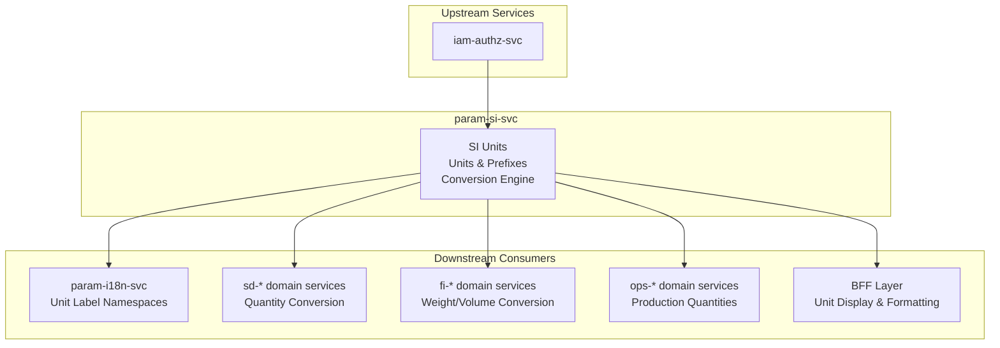
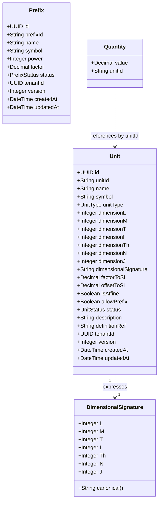
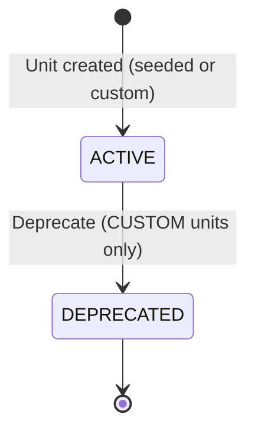
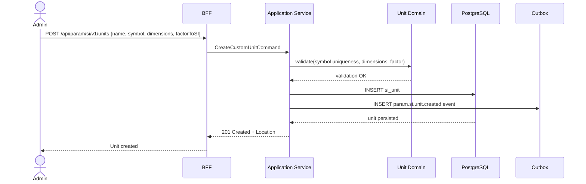
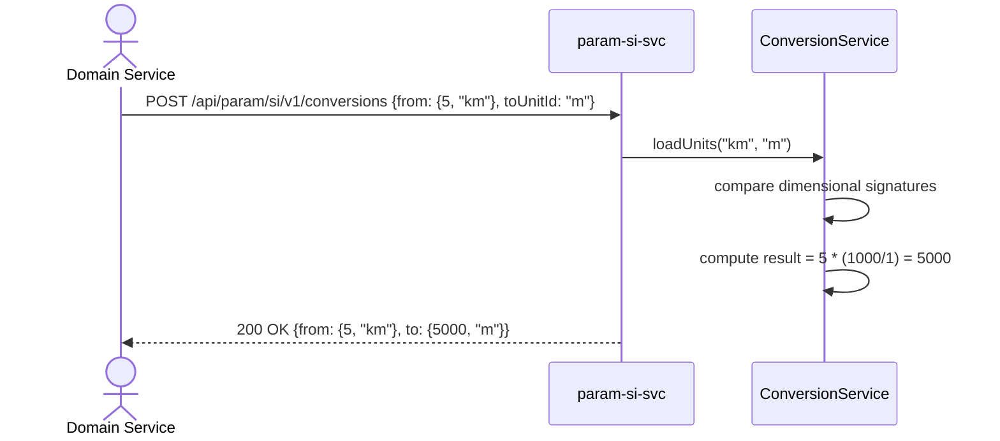
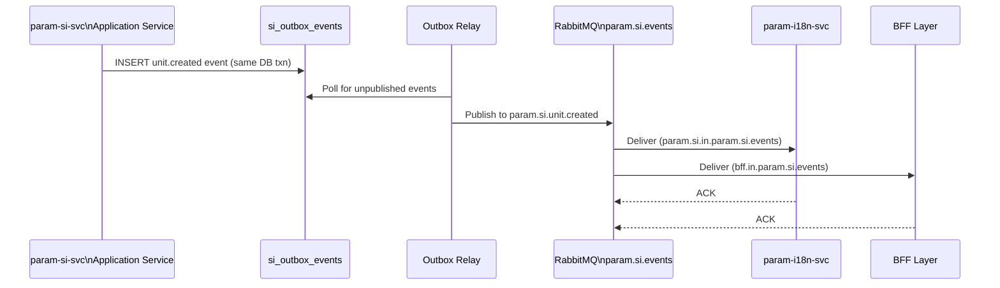
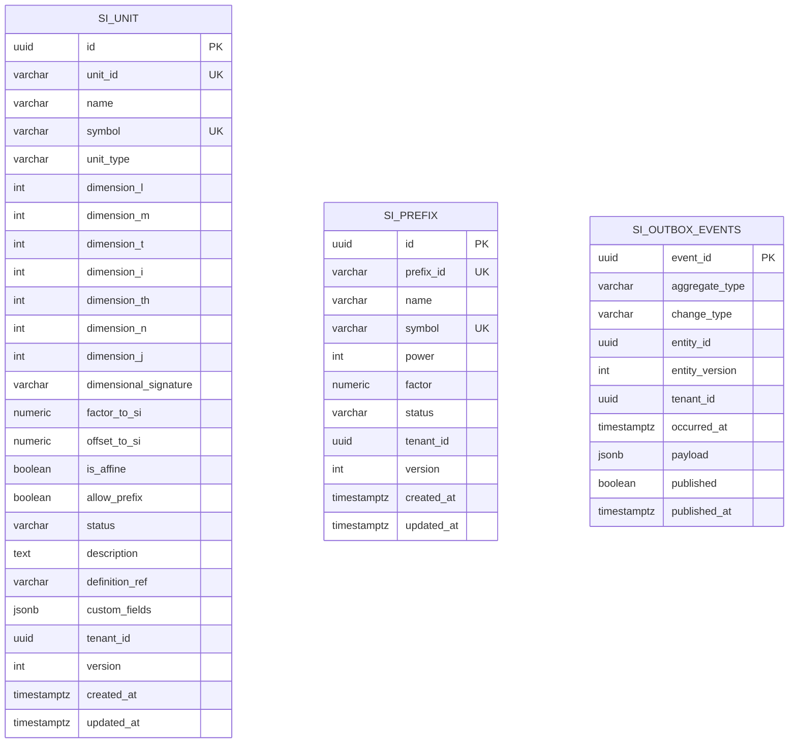

<!-- TEMPLATE COMPLIANCE: ~95%
Template: domain-service-spec.md v1.0.0
Present sections: §0–§15
-->

# param.si — SI Units of Measure Service Domain Specification

> **Conceptual Stack Layer:** Domain / Service
> **Space:** Platform
> **Owner:** Platform Engineering Team
> **Schema alignment:** `service-layer.schema.json`
> **Companion files:** `contracts/http/param/si/openapi.yaml`, `contracts/events/param/si/unit.created.schema.json`, `contracts/events/param/si/unit.updated.schema.json`, `contracts/events/param/si/unit.deprecated.schema.json`
> **Referenced by:** Platform-Feature Spec SS5 (F-PARAM-004-01, F-PARAM-004-02, F-PARAM-004-03), BFF Contract
> **Belongs to:** PARAM Suite Spec

> **Meta Information**
> - **Version:** 2026-04-03
> - **Template:** `domain-service-spec.md` v1.0.0
> - **Template Compliance:** ~95% — fully compliant
> - **Author(s):** OpenLeap Architecture Team
> - **Status:** DRAFT
> - **Suite:** `param` (Platform Parameterization)
> - **Domain:** `si` (Units of Measure / Système International d'unités)
> - **Bounded Context Ref:** `bc:units-of-measure`
> - **Service ID:** `param-si-svc`
> - **basePackage:** `io.openleap.param.si`
> - **API Base Path:** `/api/param/si/v1`
> - **OpenLeap Starter Version:** `v4.1.0`
> - **Port:** `8103`
> - **Repository:** `https://github.com/openleap-io/io.openleap.param.si`
> - **Tags:** `param`, `si`, `units`, `uom`, `conversion`, `dimensional-analysis`, `platform`
> - **Team:**
>   - Name: `team-param`
>   - Email: `platform-core@openleap.io`
>   - Slack: `#platform-core`

---

## Specification Guidelines Compliance

> ### Non-Negotiables
> - Never invent facts. If required info is missing, add an **OPEN QUESTION** entry.
> - Preserve intent and decisions. Only change meaning when explicitly requested.
> - Do not remove normative constraints unless they are explicitly replaced.
> - Keep the spec **self-contained**: no "see chat", no implicit context.
>
> ### Source of Truth Priority
> When sources conflict:
> 1. Spec (explicit) wins
> 2. Starter specs (implementation constraints) next
> 3. Guidelines (best practices) last
>
> Record conflicts in the **Decisions & Conflicts** section (see Section 14).
>
> ### Style Guide
> - Prefer short sentences and lists.
> - Use MUST/SHOULD/MAY for normative statements.
> - Keep terminology consistent (Aggregate, Domain Service, Application Service, Command, Event).
> - Avoid ambiguous words ("often", "maybe") unless explicitly noting uncertainty.
> - Keep examples minimal and clearly marked as examples.
> - Do not add implementation code unless the chapter explicitly requires it.

---

## 0. Document Purpose & Scope

### 0.1 Purpose

This specification defines the `param-si-svc` domain service within the Platform Parameterization suite. The service is the **authoritative source for all units of measure** across the OpenLeap platform. It manages the SI base unit catalog, derived units, SI prefixes, and custom (non-SI) units registered by platform administrators. It exposes a dimensional-analysis-based conversion API that domain services invoke to transform physical quantities, and it publishes lifecycle events so that consumers can react to unit catalog changes without redeployment.

### 0.2 Target Audience

- Platform Administrators (unit catalog lifecycle management, custom unit creation)
- Domain Engineers (browsing available units, verifying conversion correctness)
- System Architects & Technical Leads
- Integration Engineers consuming unit-change events
- Domain service developers needing to convert quantities at runtime

### 0.3 Scope

**In Scope:**
- Business domain model for SI base units, derived units, custom units, and SI prefixes
- Business rules governing unit immutability, symbol uniqueness, dimensional compatibility, and affine conversion constraints
- REST API contracts for reading, creating, updating, and deleting units and prefixes
- Conversion API for transforming physical quantities between compatible units
- Event contracts for `param.si.unit.created`, `param.si.unit.updated`, `param.si.unit.deprecated`, `param.si.prefix.created`, `param.si.prefix.deprecated`
- Multi-tenant data isolation via RLS
- Extension points for product-level customisation of the Unit aggregate

**Out of Scope:**
- Authentication and authorisation enforcement — delegated to IAM (`iam-authz-svc`)
- Human-readable unit label resolution — handled by `param-i18n-svc` (downstream consumer)
- Reference code catalogs (country codes, currency codes) — handled by `param-ref-svc`
- Runtime configuration (feature flags, runtime parameters) — handled by `param-cfg-svc`
- Currency exchange rate conversion — owned by individual domain services
- Physical simulation or multi-step derived quantity calculations beyond single-step unit conversion

### 0.4 Related Documents

- `spec/T1_Platform/param/_param_suite.md` — PARAM Suite Architecture
- `spec/T1_Platform/param/domain-specs/param_ref-spec.md` — Reference Data Service (upstream for type catalogs)
- `spec/T1_Platform/param/domain-specs/param_i18n-spec.md` — Internationalization Service (downstream: resolves unit labels)
- `spec/T1_Platform/param/features/compositions/F-PARAM-004.md` — Unit Management feature composition
- `spec/T1_Platform/param/features/leaves/F-PARAM-004-01/feature-spec.md` — Browse Units & Prefixes
- `spec/T1_Platform/param/features/leaves/F-PARAM-004-02/feature-spec.md` — Manage Custom Units
- `spec/T1_Platform/param/features/leaves/F-PARAM-004-03/feature-spec.md` — Unit Conversion Tool
- `concepts/governance/bff-guideline.md` (GOV-BFF-001) — BFF pattern governance
- `spec/T1_Platform/iam/domain-specs/iam_authz-spec.md` — Authorisation service

---

## 1. Business Context

### 1.1 Domain Purpose

The Units of Measure domain solves the problem of inconsistent physical quantity handling across a multi-tenant ERP platform. Without a centralised unit service, every domain service (SD for order quantities, FI for weight-based freight costs, HR for anthropometric measurements, OPS for production yield tracking) would maintain its own unit tables, conversion logic, and validation rules — with no consistency, no shared dimensional safety, and no audit trail.

`param-si-svc` provides a structured, SI-compliant catalog of all units of measure — base units, derived units, and custom industry-specific units — together with a dimensional-analysis-based conversion API. Domain services that need to convert quantities (e.g., from inches to centimetres, from tonnes to kilograms, from Celsius to Kelvin) delegate this computation to `param-si-svc`, which guarantees dimensional safety: conversions between physically incompatible units (e.g., metres to kilograms) are rejected at the API level.

### 1.2 Business Value

- **Single source of truth:** All unit definitions live in one place — eliminates duplication and drift between domain services.
- **Dimensional safety:** Conversions are validated against dimensional signatures — physically meaningless conversions (kg → m) are rejected at the API boundary.
- **SI compliance:** The 7 SI base units and all BIPM-defined derived units are seeded as immutable system data, ensuring standards compliance without configuration.
- **No-code extensibility:** Custom units (imperial, industry-specific) can be registered without service redeployment — no code changes required.
- **Affine conversion support:** Celsius ↔ Kelvin ↔ Fahrenheit conversions are supported via factor + offset (affine transformation), covering the full range of physical quantities.
- **SAP equivalent:** Replaces SAP's unit of measure infrastructure (T006 unit catalog, T006A language-specific descriptions, CUNI transaction for unit management) and the unit conversion logic embedded in MM/SD pricing procedures.

### 1.3 Key Stakeholders

| Role | Responsibility | Primary Use Cases |
|------|----------------|-------------------|
| Platform Administrator | Manages full unit catalog; seeds SI data; registers custom units | Browse units; create/edit/delete custom units; manage prefixes |
| Domain Engineer | Inspects unit catalog; verifies conversions during development | Browse units; use Unit Conversion Tool |
| Domain Service (machine) | Converts physical quantities at runtime | `POST /api/param/si/v1/conversions` |
| BFF Engineer | Formats quantity display with correct unit symbols and labels | GET units for UI rendering |
| Integration Engineer | Synchronises unit catalog with external systems | Subscribe to unit events for cache invalidation |

### 1.4 Strategic Positioning

The Units of Measure domain is **independent within the PARAM suite** — it has no intra-suite dependencies on `param-ref-svc`, `param-i18n-svc`, or `param-cfg-svc`. It bootstraps from SI standard seed data and requires only `iam-authz-svc` for permission checks (ADR-001).

`param-si-svc` is a **low-write, high-read** service: unit mutations are rare (initial seeding, occasional custom unit registration), but conversion reads can be frequent in domains that process physical quantities. This asymmetry drives the architecture: deterministic conversion algorithms, aggressive downstream caching, and thin events for cache invalidation.

Architecturally, this service corresponds to SAP's **Unit of Measure customising** (transaction CUNI, tables T006/T006A/T006D for unit definitions, T006B for unit conversions) and the **quantity/unit validation logic** embedded in SD and MM modules.

### 1.5 Service Context

| Property | Value |
|----------|-------|
| **Suite** | `param` |
| **Domain** | `si` |
| **Bounded Context** | `bc:units-of-measure` |
| **Service ID** | `param-si-svc` |
| **Base Package** | `io.openleap.param.si` |

**Responsibilities:**
- Authoritative store for SI base units, derived units, custom units, and SI prefixes
- Dimensional-analysis-based quantity conversion API
- Lifecycle governance: custom unit creation, update, deprecation, and deletion
- Event publishing for downstream cache invalidation and label namespace creation

**Authoritative Sources:**
| Source Type | Description | Access Pattern |
|-------------|-------------|----------------|
| REST API | Unit and prefix CRUD; conversion endpoint | Synchronous |
| Database | Owned tables: `si_unit`, `si_prefix` | Direct (owner) |
| Events | `unit.created`, `unit.updated`, `unit.deprecated`, `prefix.created`, `prefix.deprecated` | Asynchronous |



---

## 2. Service Identity

| Property | Value | Schema Field |
|----------|-------|-------------|
| **Service ID** | `param-si-svc` | `metadata.id` |
| **Display Name** | `Platform SI Units of Measure Service` | `metadata.name` |
| **Suite** | `param` | `metadata.suite` |
| **Domain** | `si` | `metadata.domain` |
| **Bounded Context** | `bc:units-of-measure` | `metadata.bounded_context_ref` |
| **Version** | `1.0.0` | `metadata.version` |
| **Status** | DRAFT | `metadata.status` |
| **API Base Path** | `/api/param/si/v1` | `metadata.api_base_path` |
| **Repository** | `https://github.com/openleap-io/io.openleap.param.si` | `metadata.repository` |
| **Tags** | `param`, `si`, `units`, `uom`, `conversion`, `platform` | `metadata.tags` |

**Team:**
| Property | Value |
|----------|-------|
| **Name** | `team-param` |
| **Email** | `platform-core@openleap.io` |
| **Slack Channel** | `#platform-core` |

---

## 3. Domain Model

### 3.1 Conceptual Overview

The Units of Measure domain manages two aggregates: **Unit** and **Prefix**.

A **Unit** is a named unit of measurement with a dimensional signature encoding its physical quantity type as a vector of 7 integer exponents (one per SI base dimension: L, M, T, I, Θ, N, J). Units are typed: `BASE` units correspond to the 7 fundamental SI units (immutable seed data), `DERIVED` units are defined in terms of base units (e.g., Newton = kg·m/s², immutable seed data), and `CUSTOM` units are platform-operator-registered non-SI units (e.g., imperial units, industry-specific units).

A **Prefix** is an SI decimal multiplier (kilo = 10³, milli = 10⁻³) applicable to units that allow prefix composition (flagged via `allowPrefix = true`). Prefixes are themselves immutable seed data.

The **Conversion Engine** is a stateless Domain Service (not an aggregate) that applies `factorToSI` and `offsetToSI` to transform a `Quantity` from a source unit to a target unit, after validating dimensional signature equality.

### 3.2 Core Concepts



### 3.3 Aggregate Definitions

#### 3.3.1 Unit

| Property | Value |
|----------|-------|
| **Aggregate ID** | `agg:unit` |
| **Name** | `Unit` |

**Business Purpose:**
A Unit represents a named unit of measurement with a fully specified dimensional signature and SI conversion parameters. It is the authoritative definition of what can be measured, how it compares to other units, and how to convert between compatible units. BASE and DERIVED units are immutable system-seeded SI data; CUSTOM units are mutable platform-managed entries. Corresponds to SAP table T006 (unit of measure definitions).

##### Aggregate Root

**Key Attributes:**
| Attribute | Type | Format | Description | Constraints | Required | Read-Only |
|-----------|------|--------|-------------|-------------|----------|-----------|
| id | string | uuid | Surrogate primary key, system-generated via `OlUuid.create()` | Immutable | Yes | Yes |
| unitId | string | — | Business key — stable identifier used in all domain references (e.g., `m`, `kg`, `N`, `inch`) | max_length: 50; pattern: `^[a-zA-Z][a-zA-Z0-9/_·\-]*$`; Immutable | Yes | Yes |
| name | string | — | Human-readable display name (e.g., "Metre", "Kilogram", "Newton") | max_length: 200 | Yes | No |
| symbol | string | — | Standard unit symbol, NFC-normalized Unicode (e.g., "m", "kg", "N", "°C") | max_length: 20; globally unique (NFC-normalized); Immutable for BASE/DERIVED | Yes | No (CUSTOM only) |
| unitType | string | — | Classification of the unit | enum_ref: `UnitType`; Immutable | Yes | Yes |
| dimensionL | integer | int32 | Length (metre) exponent in the dimensional signature | — | Yes | Yes (BASE/DERIVED); No (CUSTOM) |
| dimensionM | integer | int32 | Mass (kilogram) exponent in the dimensional signature | — | Yes | Yes (BASE/DERIVED); No (CUSTOM) |
| dimensionT | integer | int32 | Time (second) exponent in the dimensional signature | — | Yes | Yes (BASE/DERIVED); No (CUSTOM) |
| dimensionI | integer | int32 | Electric current (ampere) exponent in the dimensional signature | — | Yes | Yes (BASE/DERIVED); No (CUSTOM) |
| dimensionTh | integer | int32 | Thermodynamic temperature (kelvin) exponent | — | Yes | Yes (BASE/DERIVED); No (CUSTOM) |
| dimensionN | integer | int32 | Amount of substance (mole) exponent | — | Yes | Yes (BASE/DERIVED); No (CUSTOM) |
| dimensionJ | integer | int32 | Luminous intensity (candela) exponent | — | Yes | Yes (BASE/DERIVED); No (CUSTOM) |
| dimensionalSignature | string | — | Derived canonical string encoding all 7 dimension exponents (e.g., `L^1;M^0;T^0;I^0;Th^0;N^0;J^0`) | Read-only; system-derived from dimension fields | Yes | Yes |
| factorToSI | number | decimal | Multiplicative factor to convert this unit to its SI base representation (e.g., km → m: factor = 1000) | exclusive_minimum: 0; precision: 38,18 | Yes | Yes (BASE/DERIVED); No (CUSTOM) |
| offsetToSI | number | decimal | Additive offset applied after factorToSI for affine units (e.g., °C → K: offset = 273.15); 0 for non-affine units | precision: 38,18; default: 0 | No | Yes (BASE/DERIVED); No (CUSTOM) |
| isAffine | boolean | — | True when offsetToSI ≠ 0 (affine transformation required); affine units MUST NOT appear in compound dimensional expressions | — | Yes | Yes |
| allowPrefix | boolean | — | True when SI prefixes may be composed with this unit (e.g., metre: true; kelvin: false; radian: false) | — | Yes | Yes (BASE/DERIVED); No (CUSTOM) |
| status | string | — | Lifecycle state of this unit | enum_ref: `UnitStatus`; default: ACTIVE | Yes | No |
| description | string | — | Optional narrative description, including the BIPM definition reference | max_length: 2000 | No | No |
| definitionRef | string | uri | URI to the authoritative BIPM or NIST definition (for BASE and DERIVED units) | format: uri; max_length: 500 | No | No |
| version | integer | int64 | Optimistic locking version, incremented on every mutation | — | Yes | Yes |
| tenantId | string | uuid | Tenant ownership for multi-tenant data isolation (RLS) | Immutable | Yes | Yes |
| createdAt | string | date-time | ISO 8601 timestamp of creation | Immutable | Yes | Yes |
| updatedAt | string | date-time | ISO 8601 timestamp of last mutation | Updated on every write | Yes | Yes |
| customFields | object | — | Product-defined extension fields (JSONB storage) | Validated per registered schema | No | No |

**Lifecycle States:**

| Property | Value |
|----------|-------|
| **Initial State** | `ACTIVE` |
| **Terminal States** | `DEPRECATED` |



**State Descriptions:**
| State | Description | Business Meaning |
|-------|-------------|------------------|
| ACTIVE | Unit is in operational use | Available for conversions and domain references |
| DEPRECATED | Unit is retired | No longer available in new conversion requests; historical records preserved |

**Allowed Transitions:**
| From State | To State | Trigger | Guard / Business Preconditions |
|------------|----------|---------|-------------------------------|
| ACTIVE | DEPRECATED | Platform administrator deprecates unit | Unit MUST be of type CUSTOM; BASE and DERIVED units cannot be deprecated |

**Invariants:**
| Rule ID | Description |
|---------|-------------|
| BR-SI-001 | Unit symbol must be globally unique (NFC-normalized) |
| BR-SI-002 | BASE and DERIVED units are immutable — no field updates or deletions permitted |
| BR-SI-005 | factorToSI must be strictly positive (> 0) |
| BR-SI-006 | CUSTOM units must specify all 7 dimension exponents |

**Domain Events Emitted:**
- `param.si.unit.created`
- `param.si.unit.updated`
- `param.si.unit.deprecated`

##### Child Entities

No child entities. The Unit aggregate has no child entities — all state is carried on the aggregate root.

##### Value Objects

###### Value Object: DimensionalSignature

| Property | Value |
|----------|-------|
| **VO ID** | `vo:dimensional-signature` |
| **Name** | `DimensionalSignature` |

**Description:**
Encodes the physical dimension of a unit as a vector of 7 integer exponents, one per SI base dimension (L=length, M=mass, T=time, I=electric current, Θ=temperature, N=amount of substance, J=luminous intensity). Two units are dimensionally compatible (convertible) if and only if their canonical strings are equal. This value object is derived from the Unit's 7 `dimension*` fields and is never independently persisted.

**Attributes:**
| Attribute | Type | Format | Description | Constraints |
|-----------|------|--------|-------------|-------------|
| L | integer | int32 | Length (metre) exponent | — |
| M | integer | int32 | Mass (kilogram) exponent | — |
| T | integer | int32 | Time (second) exponent | — |
| I | integer | int32 | Electric current (ampere) exponent | — |
| Th | integer | int32 | Thermodynamic temperature (kelvin) exponent | — |
| N | integer | int32 | Amount of substance (mole) exponent | — |
| J | integer | int32 | Luminous intensity (candela) exponent | — |
| canonical | string | — | Derived string `L^{L};M^{M};T^{T};I^{I};Th^{Th};N^{N};J^{J}` | Read-only |

**Validation Rules:**
- All 7 exponent fields MUST be specified (no null values).
- The canonical string MUST exactly follow the format `L^{n};M^{n};T^{n};I^{n};Th^{n};N^{n};J^{n}` where each `{n}` is a signed integer.

###### Value Object: Quantity

| Property | Value |
|----------|-------|
| **VO ID** | `vo:quantity` |
| **Name** | `Quantity` |

**Description:**
A transient value object pairing a numeric measurement value with a unit identifier. Used exclusively in conversion API request and response bodies — never persisted by `param-si-svc`.

**Attributes:**
| Attribute | Type | Format | Description | Constraints |
|-----------|------|--------|-------------|-------------|
| value | number | decimal | The numeric magnitude of the measurement | precision: 38,18 |
| unitId | string | — | The business key of the unit (e.g., `km`, `°C`) | max_length: 50; must reference an existing ACTIVE unit |

**Validation Rules:**
- `value` MUST be a finite decimal number (not NaN, not infinite).
- `unitId` MUST reference an ACTIVE unit in the unit catalog.

---

#### 3.3.2 Prefix

| Property | Value |
|----------|-------|
| **Aggregate ID** | `agg:prefix` |
| **Name** | `Prefix` |

**Business Purpose:**
A Prefix is an SI decimal multiplier that can be composed with units that allow prefix composition (e.g., kilo + metre = kilometre, milli + gram = milligram). Prefixes are system-seeded immutable data corresponding to BIPM-defined SI prefixes. They cannot be created, modified, or deleted by operators. Corresponds to entries in SAP table T006D (dimension text for unit of measure) and SI prefix definitions from the BIPM.

##### Aggregate Root

**Key Attributes:**
| Attribute | Type | Format | Description | Constraints | Required | Read-Only |
|-----------|------|--------|-------------|-------------|----------|-----------|
| id | string | uuid | Surrogate primary key, system-generated | Immutable | Yes | Yes |
| prefixId | string | — | Business key — stable lowercase identifier (e.g., `kilo`, `milli`, `mega`, `nano`) | max_length: 20; pattern: `^[a-z]+$`; Immutable | Yes | Yes |
| name | string | — | Standard prefix name (e.g., "kilo", "milli", "mega") | max_length: 50 | Yes | Yes |
| symbol | string | — | Standard prefix symbol, NFC-normalized (e.g., "k", "m", "M") | max_length: 5; globally unique; Immutable | Yes | Yes |
| power | integer | int32 | Base-10 exponent (e.g., kilo=3, milli=-3, mega=6, nano=-9) | — | Yes | Yes |
| factor | number | decimal | Derived factor = 10^power (e.g., kilo: 1000.0); system-computed | Read-only | Yes | Yes |
| status | string | — | Lifecycle state | enum_ref: `PrefixStatus`; default: ACTIVE | Yes | No |
| version | integer | int64 | Optimistic locking version | — | Yes | Yes |
| tenantId | string | uuid | Tenant ownership (RLS) | Immutable | Yes | Yes |
| createdAt | string | date-time | ISO 8601 creation timestamp | Immutable | Yes | Yes |
| updatedAt | string | date-time | ISO 8601 last-mutation timestamp | — | Yes | Yes |

**Lifecycle States:**

| Property | Value |
|----------|-------|
| **Initial State** | `ACTIVE` |
| **Terminal States** | `DEPRECATED` |

**State Descriptions:**
| State | Description | Business Meaning |
|-------|-------------|------------------|
| ACTIVE | Prefix is in operational use | Available for unit composition and display |
| DEPRECATED | Prefix retired (non-standard) | No new unit compositions; historical records preserved |

**Invariants:**
| Rule ID | Description |
|---------|-------------|
| BR-SI-008 | Prefix symbols must be globally unique (NFC-normalized) |
| BR-SI-009 | Prefix symbols MUST NOT conflict with any unit symbol |

**Domain Events Emitted:**
- `param.si.prefix.created`
- `param.si.prefix.deprecated`

##### Child Entities
No child entities.

##### Value Objects
No value objects beyond those shared from Unit aggregate.

---

### 3.4 Enumerations

#### UnitType

**Description:** Classifies a unit as a fundamental SI base unit, a derived unit defined in terms of base units, or a custom non-SI unit registered by a platform operator.

| Value | Description | Deprecated |
|-------|-------------|------------|
| `BASE` | One of the 7 fundamental SI base units: metre (m), kilogram (kg), second (s), ampere (A), kelvin (K), mole (mol), candela (cd). Seeded as immutable system data. | No |
| `DERIVED` | A unit defined in terms of base units via dimensional exponents and a conversion factor to the SI base representation (e.g., Newton = kg·m/s², hertz = 1/s). Seeded as immutable system data. | No |
| `CUSTOM` | A non-SI unit registered by a platform administrator (e.g., inch, pound, barrel, knot, psi). Mutable and deletable (unless referenced). | No |

#### UnitStatus

**Description:** Lifecycle state of a unit of measure.

| Value | Description | Deprecated |
|-------|-------------|------------|
| `ACTIVE` | Unit is available for use in conversions and domain references. | No |
| `DEPRECATED` | Unit has been retired. Not available in new conversion requests. Historical records that reference this unit remain valid. Only CUSTOM units may be deprecated. | No |

#### PrefixStatus

**Description:** Lifecycle state of an SI prefix.

| Value | Description | Deprecated |
|-------|-------------|------------|
| `ACTIVE` | Prefix is available for unit composition and display formatting. | No |
| `DEPRECATED` | Prefix has been retired (applicable to any non-standard prefixes added in future; none currently deprecated). | No |

---

### 3.5 Shared Types

#### Quantity

See §3.3.1 Value Objects — `Quantity` is the primary shared type used in the conversion API request and response.

---

## 4. Business Rules & Constraints

### 4.1 Business Rules Catalog

| ID | Rule Name | Description | Scope | Enforcement | Error Code |
|----|-----------|-------------|-------|-------------|------------|
| BR-SI-001 | Unit Symbol Uniqueness | No two units may share the same NFC-normalized symbol | Unit | Create | `SI_SYMBOL_DUPLICATE` |
| BR-SI-002 | Base/Derived Unit Immutability | BASE and DERIVED units cannot be modified or deleted | Unit | Update, Delete | `SI_UNIT_IMMUTABLE` |
| BR-SI-003 | Conversion Dimensional Compatibility | Source and target units must have identical dimensional signatures for a conversion to proceed | Conversion | Convert | `SI_DIMENSION_MISMATCH` |
| BR-SI-004 | Affine Unit Compound Restriction | Affine units (isAffine=true) MUST NOT appear as operands in compound dimensional expressions | Conversion | Convert | `SI_AFFINE_COMPOUND_FORBIDDEN` |
| BR-SI-005 | Positive Conversion Factor | factorToSI must be strictly positive (> 0) | Unit | Create, Update | `SI_FACTOR_NON_POSITIVE` |
| BR-SI-006 | Custom Unit Dimension Completeness | All 7 dimension exponents (L, M, T, I, Th, N, J) must be specified when creating a CUSTOM unit | Unit | Create | `SI_DIMENSION_INCOMPLETE` |
| BR-SI-007 | Deprecated Unit Conversion Rejected | Deprecated units cannot be used as source or target in a conversion request | Conversion | Convert | `SI_UNIT_DEPRECATED` |
| BR-SI-008 | Prefix Symbol Uniqueness | No two prefixes may share the same NFC-normalized symbol | Prefix | Create | `SI_PREFIX_SYMBOL_DUPLICATE` |
| BR-SI-009 | Prefix-Unit Symbol Conflict | A prefix symbol MUST NOT duplicate any existing unit symbol | Prefix | Create | `SI_PREFIX_UNIT_SYMBOL_CONFLICT` |

### 4.2 Detailed Rule Definitions

#### BR-SI-001: Unit Symbol Uniqueness

**Business Context:**
Unit symbols are the primary machine-readable key used by domain services to reference units (e.g., `kg`, `m`, `°C`). Duplicate symbols would make it impossible to resolve which unit a domain record's quantity refers to.

**Rule Statement:**
The NFC-normalized form of a new unit's `symbol` must be unique across all existing units regardless of `unitType` or `status`.

**Applies To:**
- Aggregate: Unit
- Operations: Create

**Enforcement:**
Unique index on `LOWER(symbol)` (or NFC-normalized form) in the `si_unit` table. Application-level pre-check returns 409 before DB constraint fires.

**Validation Logic:**
`SELECT COUNT(*) FROM si_unit WHERE nfc_normalize(symbol) = nfc_normalize(:symbol) AND id != :id` must return 0.

**Error Handling:**
- **Error Code:** `SI_SYMBOL_DUPLICATE`
- **Error Message:** "A unit with symbol '{symbol}' already exists."
- **User action:** Choose a distinct symbol for the new unit.

**Examples:**
- **Valid:** Creating unit `inch` with symbol `in` when no existing unit has symbol `in`.
- **Invalid:** Creating unit `international inch` with symbol `in` when `in` is already registered.

---

#### BR-SI-002: Base/Derived Unit Immutability

**Business Context:**
SI base and derived units are defined by international standards (BIPM). Allowing modification would break backward compatibility for all domain records that reference these units and violate SI compliance.

**Rule Statement:**
Units with `unitType` = `BASE` or `DERIVED` MUST NOT be modified (name, symbol, factor, offset, dimensions, allowPrefix) or deleted by any API operation.

**Applies To:**
- Aggregate: Unit
- Operations: Update, Delete

**Enforcement:**
Application Service check before command dispatch: if `unit.unitType != CUSTOM`, reject with 422.

**Validation Logic:**
`unit.unitType == CUSTOM` must be true for any mutating operation.

**Error Handling:**
- **Error Code:** `SI_UNIT_IMMUTABLE`
- **Error Message:** "SI {unitType} units cannot be modified or deleted."
- **User action:** No action possible. To override a standard unit, create a CUSTOM unit with a distinct symbol.

**Examples:**
- **Valid:** Deleting custom unit `barrel`.
- **Invalid:** Attempting to change `m` (BASE) to symbol `mt`.

---

#### BR-SI-003: Conversion Dimensional Compatibility

**Business Context:**
Dimensional analysis is the fundamental safety check of physical quantity conversion. Converting kg to metres would produce a result that is physically meaningless.

**Rule Statement:**
A conversion request MUST be rejected if the dimensional signature of the `fromUnit` differs from the dimensional signature of the `toUnit`.

**Applies To:**
- Domain Service: ConversionService
- Operations: Convert

**Enforcement:**
ConversionService Domain Service computes dimensional signatures for both units before performing any arithmetic. Signatures are compared as canonical strings.

**Validation Logic:**
`fromUnit.dimensionalSignature == toUnit.dimensionalSignature` must be true.

**Error Handling:**
- **Error Code:** `SI_DIMENSION_MISMATCH`
- **Error Message:** "Cannot convert '{fromUnit}' to '{toUnit}': dimensional mismatch ({fromSignature} vs {toSignature})."
- **User action:** Verify that the intended conversion is physically valid (e.g., mass to mass, length to length).

**Examples:**
- **Valid:** Converting 100 km → m (both have signature `L^1;M^0;T^0;I^0;Th^0;N^0;J^0`).
- **Invalid:** Converting 5 kg → m (signatures differ: `L^0;M^1;...` vs `L^1;M^0;...`).

---

#### BR-SI-004: Affine Unit Compound Restriction

**Business Context:**
Affine units (those requiring an additive offset, like Celsius) behave differently from linear units under multiplication or division. Including °C in a compound expression (e.g., "m/°C") produces a result that depends on the reference temperature chosen, which is physically ambiguous.

**Rule Statement:**
A unit with `isAffine = true` MUST NOT be used as a component in a compound dimensional expression or multi-step chained conversion.

**Applies To:**
- Domain Service: ConversionService
- Operations: Convert (compound expressions)

**Enforcement:**
ConversionService Domain Service rejects requests where either unit `isAffine = true` and the conversion involves a product or quotient of quantities.

**Validation Logic:**
For simple scalar conversion: allowed if both units have matching signatures. For compound expressions: `fromUnit.isAffine == false AND toUnit.isAffine == false`.

**Error Handling:**
- **Error Code:** `SI_AFFINE_COMPOUND_FORBIDDEN`
- **Error Message:** "Affine unit '{unit}' cannot appear in compound dimensional expressions."
- **User action:** Perform simple scalar conversion only. Convert to Kelvin first before using in compound expressions.

**Examples:**
- **Valid:** Converting 25 °C → K (simple scalar affine conversion).
- **Invalid:** Using °C in a compound expression such as "thermal conductivity = W/(m·°C)".

---

#### BR-SI-005: Positive Conversion Factor

**Business Context:**
A zero or negative conversion factor would produce physically nonsensical results (zero output regardless of input, or reversed signs for all quantities).

**Rule Statement:**
The `factorToSI` of any unit MUST be strictly greater than zero.

**Applies To:**
- Aggregate: Unit
- Operations: Create, Update (CUSTOM only)

**Enforcement:**
Application-level validation before persistence. Database constraint: `CHECK (factor_to_si > 0)`.

**Validation Logic:**
`factorToSI > 0` must evaluate to true.

**Error Handling:**
- **Error Code:** `SI_FACTOR_NON_POSITIVE`
- **Error Message:** "factorToSI must be strictly positive (> 0); received '{value}'."
- **User action:** Provide a positive decimal value for the conversion factor.

**Examples:**
- **Valid:** `factorToSI = 0.0254` (inch → metre).
- **Invalid:** `factorToSI = 0` or `factorToSI = -1`.

---

#### BR-SI-006: Custom Unit Dimension Completeness

**Business Context:**
All 7 dimension exponents are required to compute the dimensional signature used for conversion compatibility checks. A missing exponent makes the signature ambiguous.

**Rule Statement:**
When creating a CUSTOM unit, all 7 dimension exponent fields (dimensionL, dimensionM, dimensionT, dimensionI, dimensionTh, dimensionN, dimensionJ) MUST be provided as explicit integer values (including 0).

**Applies To:**
- Aggregate: Unit
- Operations: Create (CUSTOM only)

**Enforcement:**
Request body validation: all 7 dimension fields are required when `unitType = CUSTOM`.

**Validation Logic:**
`dimensionL != null AND dimensionM != null AND ... AND dimensionJ != null`.

**Error Handling:**
- **Error Code:** `SI_DIMENSION_INCOMPLETE`
- **Error Message:** "Custom unit must specify all 7 dimension exponents (L, M, T, I, Th, N, J)."
- **User action:** Provide all 7 dimension exponent values in the request body.

**Examples:**
- **Valid:** Creating `inch` with `{L:1, M:0, T:0, I:0, Th:0, N:0, J:0}`.
- **Invalid:** Creating a unit with only `{L:1}` (missing M, T, I, Th, N, J).

---

#### BR-SI-007: Deprecated Unit Conversion Rejected

**Business Context:**
Deprecated units signal that the platform has retired them. Allowing conversions using deprecated units would propagate potentially incorrect factor values into live domain records.

**Rule Statement:**
A conversion request MUST be rejected if either `fromUnit.status = DEPRECATED` or `toUnit.status = DEPRECATED`.

**Applies To:**
- Domain Service: ConversionService
- Operations: Convert

**Enforcement:**
ConversionService Domain Service checks unit status after loading from repository.

**Validation Logic:**
`fromUnit.status == ACTIVE AND toUnit.status == ACTIVE` must be true.

**Error Handling:**
- **Error Code:** `SI_UNIT_DEPRECATED`
- **Error Message:** "Unit '{unitId}' is deprecated and cannot be used in conversions."
- **User action:** Use the recommended replacement unit. Review unit catalog for alternatives.

**Examples:**
- **Valid:** Converting 100 `km` → `m` (both ACTIVE).
- **Invalid:** Converting `old_barrel` (DEPRECATED) → `m³`.

---

#### BR-SI-008: Prefix Symbol Uniqueness

**Business Context:**
Prefix symbols are used in unit display formatting (e.g., "km", "mg"). Duplicate prefix symbols would create ambiguity in symbol-based unit resolution.

**Rule Statement:**
The NFC-normalized form of a new prefix's `symbol` must be unique across all existing prefixes.

**Applies To:**
- Aggregate: Prefix
- Operations: Create

**Enforcement:**
Unique index on NFC-normalized `symbol` in `si_prefix` table.

**Error Handling:**
- **Error Code:** `SI_PREFIX_SYMBOL_DUPLICATE`
- **Error Message:** "A prefix with symbol '{symbol}' already exists."

---

#### BR-SI-009: Prefix-Unit Symbol Conflict

**Business Context:**
The compound unit resolution algorithm (e.g., "km" → kilo + metre) assumes prefix symbols and unit symbols are drawn from disjoint sets. If a prefix symbol equals a unit symbol, resolution is ambiguous.

**Rule Statement:**
A prefix symbol MUST NOT equal any existing unit symbol (NFC-normalized comparison).

**Applies To:**
- Aggregate: Prefix
- Operations: Create

**Enforcement:**
Application-level cross-table uniqueness check: `si_unit.symbol` must not contain the new prefix symbol.

**Error Handling:**
- **Error Code:** `SI_PREFIX_UNIT_SYMBOL_CONFLICT`
- **Error Message:** "Prefix symbol '{symbol}' conflicts with existing unit symbol '{unitSymbol}'."

---

### 4.3 Data Validation Rules

**Field-Level Validations:**

| Field | Validation Rule | Error Message |
|-------|----------------|---------------|
| Unit.unitId | Required; max 50 chars; pattern `^[a-zA-Z][a-zA-Z0-9/_·\-]*$` | "unitId is required and must be 1–50 chars, starting with a letter." |
| Unit.name | Required; max 200 chars | "name is required (max 200 chars)." |
| Unit.symbol | Required; max 20 chars; globally unique (NFC-normalized) | "symbol is required, max 20 chars, and must be globally unique." |
| Unit.unitType | Required; must be CUSTOM for operator-created units | "unitType must be CUSTOM for operator-managed units." |
| Unit.factorToSI | Required; > 0; precision max 38,18 | "factorToSI must be a positive decimal (precision max 38,18)." |
| Unit.offsetToSI | Optional; default 0; precision max 38,18 | "offsetToSI must be a decimal (precision max 38,18)." |
| Unit.dimensionL/M/T/I/Th/N/J | Required (all 7) for CUSTOM units | "All 7 dimension exponents are required for CUSTOM units." |
| Prefix.prefixId | Required; max 20 chars; lowercase letters only | "prefixId must be lowercase letters, max 20 chars." |
| Prefix.symbol | Required; max 5 chars; globally unique | "Prefix symbol is required, max 5 chars, globally unique." |
| Prefix.power | Required; integer | "power must be an integer." |
| Quantity.value | Required; finite decimal | "value must be a finite decimal number." |
| Quantity.unitId | Required; must reference ACTIVE unit | "unitId must reference an existing ACTIVE unit." |

**Cross-Field Validations:**
- If `offsetToSI != 0`, then `isAffine` MUST be `true`.
- If `allowPrefix = false`, the unit MUST NOT be referenced in prefix-composed unit requests.
- For CUSTOM units, `factorToSI` and all 7 dimension exponents are required together.

### 4.4 Reference Data Dependencies

| Catalog | Source Service | Fields Referencing | Validation |
|---------|----------------|-------------------|------------|
| `unit-type` | `param-ref-svc` (OPEN QUESTION: see Q-SI-001) | Unit.unitType | Runtime validation via ref code validation endpoint |
| `unit-status` | `param-ref-svc` (OPEN QUESTION: see Q-SI-001) | Unit.status | Runtime validation via ref code validation endpoint |

> OPEN QUESTION: See Q-SI-001 in §14.3 — whether UnitType/UnitStatus are managed as param-ref catalogs or as internal enumerations.

---

## 5. Application Use Cases

### 5.1 Business Logic Placement

| Logic Type | Placement | Examples |
|------------|-----------|----------|
| Aggregate invariants | Domain Object (Unit, Prefix) | Symbol uniqueness check, immutability guard, dimension completeness |
| Conversion algorithm | Domain Service (ConversionService) | Dimensional signature comparison, factor/offset arithmetic |
| Cross-aggregate logic | Domain Service | Prefix-unit symbol conflict check |
| Orchestration & transactions | Application Service | Use case coordination, event publishing via outbox |

### 5.2 Use Cases

#### UC-SI-001: Browse Units Catalog

| Property | Value |
|----------|-------|
| **Use Case ID** | UC-SI-001 |
| **Name** | Browse Units Catalog |
| **Type** | READ |
| **Feature** | F-PARAM-004-01 |
| **Trigger** | REST GET |
| **Command** | — (query) |

**Actor:** Platform Administrator, Domain Engineer, any authenticated user

**Preconditions:**
- User is authenticated.
- At least the 7 SI base units have been seeded.

**Main Flow:**
1. Actor requests `GET /api/param/si/v1/units` (optionally with filters: `unitType`, `status`, `search`, `page`, `size`).
2. System applies filters and returns paginated list of units with `unitId`, `name`, `symbol`, `unitType`, `dimensionalSignature`, `status`.
3. Actor browses the result set.

**Postconditions:**
- Read-only; no state changes.

**Business Rules Applied:**
- None (read operation).

**Alternative Flows:**
- **Alt-1:** `unitType=BASE` filter returns only the 7 SI base units.
- **Alt-2:** `search=metre` filter returns units whose name or symbol contains the search term.

**Exception Flows:**
- **Exc-1:** If the service is unavailable, return 503 Service Unavailable.

---

#### UC-SI-002: Get Unit Detail

| Property | Value |
|----------|-------|
| **Use Case ID** | UC-SI-002 |
| **Name** | Get Unit Detail |
| **Type** | READ |
| **Feature** | F-PARAM-004-01 |
| **Trigger** | REST GET |
| **Command** | — (query) |

**Actor:** Any authenticated user

**Preconditions:**
- Unit with given `id` exists.

**Main Flow:**
1. Actor requests `GET /api/param/si/v1/units/{id}`.
2. System loads unit by ID and returns full detail including dimensional signature, conversion factor, offset, and all dimension exponents.

**Postconditions:**
- Read-only; no state changes.

---

#### UC-SI-003: Create Custom Unit

| Property | Value |
|----------|-------|
| **Use Case ID** | UC-SI-003 |
| **Name** | Create Custom Unit |
| **Type** | WRITE |
| **Feature** | F-PARAM-004-02 |
| **Trigger** | REST POST |
| **Command** | `CreateCustomUnitCommand` |

**Actor:** Platform Administrator

**Preconditions:**
- Actor has `PLATFORM_ADMIN` role.
- `unitType` in request body must be `CUSTOM`.
- All 7 dimension exponents must be provided.
- `factorToSI` must be > 0.
- `symbol` must not already exist (NFC-normalized).

**Main Flow:**
1. Actor submits `POST /api/param/si/v1/units` with request body containing name, symbol, dimensions, factorToSI, offsetToSI, allowPrefix.
2. System validates BR-SI-001, BR-SI-005, BR-SI-006.
3. System generates UUID via `OlUuid.create()`, computes `dimensionalSignature` from dimension exponents, sets `isAffine = (offsetToSI != 0)`.
4. System persists unit with status `ACTIVE`.
5. System publishes `param.si.unit.created` event via outbox (ADR-013).
6. System returns 201 Created with the new unit resource and `Location` header.

**Postconditions:**
- Unit exists with status ACTIVE.
- `param.si.unit.created` event is in outbox.

**Business Rules Applied:**
- BR-SI-001: Symbol uniqueness
- BR-SI-005: Positive conversion factor
- BR-SI-006: Dimension completeness

**Alternative Flows:**
- **Alt-1:** If `offsetToSI` is not provided, defaults to 0 (non-affine unit).

**Exception Flows:**
- **Exc-1:** If symbol already exists → 409 Conflict (`SI_SYMBOL_DUPLICATE`).
- **Exc-2:** If factorToSI ≤ 0 → 422 Unprocessable Entity (`SI_FACTOR_NON_POSITIVE`).
- **Exc-3:** If any dimension exponent missing → 422 Unprocessable Entity (`SI_DIMENSION_INCOMPLETE`).

---

#### UC-SI-004: Update Custom Unit

| Property | Value |
|----------|-------|
| **Use Case ID** | UC-SI-004 |
| **Name** | Update Custom Unit |
| **Type** | WRITE |
| **Feature** | F-PARAM-004-02 |
| **Trigger** | REST PUT |
| **Command** | `UpdateCustomUnitCommand` |

**Actor:** Platform Administrator

**Preconditions:**
- Actor has `PLATFORM_ADMIN` role.
- Unit exists and `unitType = CUSTOM`.
- ETag in `If-Match` header matches current version.

**Main Flow:**
1. Actor submits `PUT /api/param/si/v1/units/{id}` with updated fields.
2. System validates ETag (optimistic lock check).
3. System validates BR-SI-002 (unit must be CUSTOM).
4. System applies changes, recomputes `dimensionalSignature`, updates `version` and `updatedAt`.
5. System publishes `param.si.unit.updated` event via outbox.
6. System returns 200 OK with updated unit.

**Postconditions:**
- Unit reflects updated values; version incremented.
- `param.si.unit.updated` event is in outbox.

**Exception Flows:**
- **Exc-1:** If `unitType = BASE or DERIVED` → 422 (`SI_UNIT_IMMUTABLE`).
- **Exc-2:** ETag mismatch → 412 Precondition Failed.

---

#### UC-SI-005: Delete Custom Unit

| Property | Value |
|----------|-------|
| **Use Case ID** | UC-SI-005 |
| **Name** | Delete Custom Unit |
| **Type** | WRITE |
| **Feature** | F-PARAM-004-02 |
| **Trigger** | REST DELETE |
| **Command** | `DeleteCustomUnitCommand` |

**Actor:** Platform Administrator

**Preconditions:**
- Actor has `PLATFORM_ADMIN` role.
- Unit exists and `unitType = CUSTOM`.

**Main Flow:**
1. Actor submits `DELETE /api/param/si/v1/units/{id}`.
2. System validates BR-SI-002 (unit must be CUSTOM).
3. System performs soft-delete (sets status = DEPRECATED) or hard-delete depending on configuration. See Q-SI-002 in §14.3.
4. System publishes `param.si.unit.deprecated` event via outbox.
5. System returns 204 No Content.

**Postconditions:**
- Unit is no longer available for conversions.
- Event published.

**Exception Flows:**
- **Exc-1:** If `unitType != CUSTOM` → 422 (`SI_UNIT_IMMUTABLE`).

> OPEN QUESTION: See Q-SI-002 in §14.3 — hard delete vs. soft delete for custom units.

---

#### UC-SI-006: Browse Prefixes

| Property | Value |
|----------|-------|
| **Use Case ID** | UC-SI-006 |
| **Name** | Browse Prefixes |
| **Type** | READ |
| **Feature** | F-PARAM-004-01 |
| **Trigger** | REST GET |
| **Command** | — (query) |

**Actor:** Any authenticated user

**Main Flow:**
1. Actor requests `GET /api/param/si/v1/prefixes`.
2. System returns all active SI prefixes with name, symbol, power, and factor.

---

#### UC-SI-007: Convert Quantity

| Property | Value |
|----------|-------|
| **Use Case ID** | UC-SI-007 |
| **Name** | Convert Quantity |
| **Type** | READ (stateless computation) |
| **Feature** | F-PARAM-004-03 |
| **Trigger** | REST POST |
| **Command** | `ConvertQuantityCommand` |

**Actor:** Domain Engineer (interactive); Domain Service (machine-to-machine)

**Preconditions:**
- Both `fromUnit` and `toUnit` must be ACTIVE.
- Both units must have identical dimensional signatures (BR-SI-003).
- If either unit is affine (isAffine=true), only simple scalar conversion is allowed (BR-SI-004).

**Main Flow:**
1. Actor/service submits `POST /api/param/si/v1/conversions` with `{ from: { value, unitId }, toUnitId }`.
2. System loads both units. Validates status (BR-SI-007) and dimensional signatures (BR-SI-003).
3. If non-affine: `result = from.value * (from.factorToSI / to.factorToSI)`.
4. If affine (e.g., °C → K): `result = (from.value * from.factorToSI + from.offsetToSI) / to.factorToSI - to.offsetToSI`.
5. System returns 200 OK with `{ from: { value, unitId }, to: { value: result, unitId: toUnitId } }`.

**Postconditions:**
- No state changes (pure computation).

**Business Rules Applied:**
- BR-SI-003: Dimensional compatibility
- BR-SI-004: Affine compound restriction
- BR-SI-007: Deprecated unit rejection

**Exception Flows:**
- **Exc-1:** Dimensional mismatch → 422 (`SI_DIMENSION_MISMATCH`).
- **Exc-2:** Deprecated unit → 422 (`SI_UNIT_DEPRECATED`).
- **Exc-3:** Affine in compound expression → 422 (`SI_AFFINE_COMPOUND_FORBIDDEN`).

---

### 5.3 Process Flow Diagrams





### 5.4 Cross-Domain Workflows

`param-si-svc` has no cross-domain saga involvement. It is a low-level platform service consumed synchronously. The only integration pattern is direct REST call for conversions and event subscription for cache invalidation. No choreography or orchestration sagas apply.

---

## 6. REST API

### 6.1 API Overview

| Method | Path | Description | Type |
|--------|------|-------------|------|
| GET | `/api/param/si/v1/units` | List units (paginated, filterable) | READ |
| GET | `/api/param/si/v1/units/{id}` | Get unit detail | READ |
| POST | `/api/param/si/v1/units` | Create custom unit | WRITE |
| PUT | `/api/param/si/v1/units/{id}` | Update custom unit | WRITE |
| DELETE | `/api/param/si/v1/units/{id}` | Delete/deprecate custom unit | WRITE |
| GET | `/api/param/si/v1/prefixes` | List all prefixes | READ |
| GET | `/api/param/si/v1/prefixes/{id}` | Get prefix detail | READ |
| POST | `/api/param/si/v1/conversions` | Convert a quantity | READ (computation) |

All endpoints require `Authorization: Bearer {token}`. Mutation endpoints additionally require `Content-Type: application/json`.

### 6.2 Resource Operations

#### 6.2.1 Units — List

```http
GET /api/param/si/v1/units?unitType=CUSTOM&status=ACTIVE&search=inch&page=0&size=25
Authorization: Bearer {token}
```

**Query Parameters:**
| Parameter | Type | Description | Default |
|-----------|------|-------------|---------|
| `unitType` | string | Filter by UnitType (BASE, DERIVED, CUSTOM) | — |
| `status` | string | Filter by UnitStatus (ACTIVE, DEPRECATED) | ACTIVE |
| `search` | string | Search term against name and symbol (min 2 chars) | — |
| `page` | integer | 0-based page index | 0 |
| `size` | integer | Page size (10, 25, 50, 100) | 25 |

**Success Response:** `200 OK`
```json
{
  "content": [
    {
      "id": "3fa85f64-5717-4562-b3fc-2c963f66afa6",
      "unitId": "inch",
      "name": "International Inch",
      "symbol": "in",
      "unitType": "CUSTOM",
      "dimensionalSignature": "L^1;M^0;T^0;I^0;Th^0;N^0;J^0",
      "factorToSI": 0.0254,
      "offsetToSI": 0,
      "isAffine": false,
      "allowPrefix": false,
      "status": "ACTIVE",
      "version": 1
    }
  ],
  "page": { "number": 0, "size": 25, "totalElements": 1, "totalPages": 1 },
  "_links": {
    "self": { "href": "/api/param/si/v1/units?page=0&size=25" }
  }
}
```

---

#### 6.2.2 Units — Get Detail

```http
GET /api/param/si/v1/units/{id}
Authorization: Bearer {token}
```

**Success Response:** `200 OK`
```json
{
  "id": "3fa85f64-5717-4562-b3fc-2c963f66afa6",
  "unitId": "inch",
  "name": "International Inch",
  "symbol": "in",
  "unitType": "CUSTOM",
  "dimensionL": 1,
  "dimensionM": 0,
  "dimensionT": 0,
  "dimensionI": 0,
  "dimensionTh": 0,
  "dimensionN": 0,
  "dimensionJ": 0,
  "dimensionalSignature": "L^1;M^0;T^0;I^0;Th^0;N^0;J^0",
  "factorToSI": 0.0254,
  "offsetToSI": 0,
  "isAffine": false,
  "allowPrefix": false,
  "status": "ACTIVE",
  "description": "The international inch is 25.4 mm.",
  "definitionRef": null,
  "customFields": {},
  "version": 1,
  "tenantId": "00000000-0000-0000-0000-000000000001",
  "createdAt": "2026-01-15T10:00:00Z",
  "updatedAt": "2026-01-15T10:00:00Z",
  "_links": {
    "self": { "href": "/api/param/si/v1/units/3fa85f64-5717-4562-b3fc-2c963f66afa6" }
  }
}
```

**Error Responses:**
- `404 Not Found` — Unit does not exist.

---

#### 6.2.3 Units — Create Custom Unit

```http
POST /api/param/si/v1/units
Authorization: Bearer {token}
Content-Type: application/json
```

**Request Body:**
```json
{
  "unitId": "inch",
  "name": "International Inch",
  "symbol": "in",
  "unitType": "CUSTOM",
  "dimensionL": 1,
  "dimensionM": 0,
  "dimensionT": 0,
  "dimensionI": 0,
  "dimensionTh": 0,
  "dimensionN": 0,
  "dimensionJ": 0,
  "factorToSI": 0.0254,
  "offsetToSI": 0,
  "allowPrefix": false,
  "description": "The international inch is 25.4 mm."
}
```

**Success Response:** `201 Created`
```json
{
  "id": "3fa85f64-5717-4562-b3fc-2c963f66afa6",
  "unitId": "inch",
  "name": "International Inch",
  "symbol": "in",
  "unitType": "CUSTOM",
  "dimensionalSignature": "L^1;M^0;T^0;I^0;Th^0;N^0;J^0",
  "factorToSI": 0.0254,
  "offsetToSI": 0,
  "isAffine": false,
  "allowPrefix": false,
  "status": "ACTIVE",
  "version": 1,
  "_links": {
    "self": { "href": "/api/param/si/v1/units/3fa85f64-5717-4562-b3fc-2c963f66afa6" }
  }
}
```

**Response Headers:**
- `Location: /api/param/si/v1/units/3fa85f64-5717-4562-b3fc-2c963f66afa6`
- `ETag: "1"`

**Business Rules Checked:**
- BR-SI-001: Symbol uniqueness
- BR-SI-005: Positive conversion factor
- BR-SI-006: Dimension completeness

**Events Published:**
- `param.si.unit.created`

**Error Responses:**
- `400 Bad Request` — Malformed request body.
- `409 Conflict` — Symbol already exists (`SI_SYMBOL_DUPLICATE`).
- `422 Unprocessable Entity` — Business rule violation (e.g., `SI_FACTOR_NON_POSITIVE`, `SI_DIMENSION_INCOMPLETE`).

---

#### 6.2.4 Units — Update Custom Unit

```http
PUT /api/param/si/v1/units/{id}
Authorization: Bearer {token}
Content-Type: application/json
If-Match: "1"
```

**Request Body:**
```json
{
  "name": "International Inch (revised)",
  "factorToSI": 0.0254000,
  "description": "Updated description."
}
```

**Success Response:** `200 OK`
```json
{
  "id": "3fa85f64-5717-4562-b3fc-2c963f66afa6",
  "unitId": "inch",
  "name": "International Inch (revised)",
  "version": 2,
  "_links": { "self": { "href": "/api/param/si/v1/units/3fa85f64-5717-4562-b3fc-2c963f66afa6" } }
}
```

**Response Headers:**
- `ETag: "2"`

**Business Rules Checked:**
- BR-SI-002: BASE/DERIVED immutability

**Events Published:**
- `param.si.unit.updated`

**Error Responses:**
- `404 Not Found` — Unit does not exist.
- `412 Precondition Failed` — ETag mismatch (optimistic lock conflict).
- `422 Unprocessable Entity` — Attempt to modify BASE/DERIVED unit (`SI_UNIT_IMMUTABLE`).

---

#### 6.2.5 Units — Delete Custom Unit

```http
DELETE /api/param/si/v1/units/{id}
Authorization: Bearer {token}
```

**Success Response:** `204 No Content`

**Business Rules Checked:**
- BR-SI-002: BASE/DERIVED immutability

**Events Published:**
- `param.si.unit.deprecated`

**Error Responses:**
- `404 Not Found` — Unit does not exist.
- `422 Unprocessable Entity` — Unit is BASE or DERIVED (`SI_UNIT_IMMUTABLE`).

---

#### 6.2.6 Prefixes — List

```http
GET /api/param/si/v1/prefixes
Authorization: Bearer {token}
```

**Success Response:** `200 OK`
```json
{
  "content": [
    { "id": "...", "prefixId": "kilo", "name": "kilo", "symbol": "k", "power": 3, "factor": 1000, "status": "ACTIVE" },
    { "id": "...", "prefixId": "milli", "name": "milli", "symbol": "m", "power": -3, "factor": 0.001, "status": "ACTIVE" }
  ],
  "_links": { "self": { "href": "/api/param/si/v1/prefixes" } }
}
```

---

#### 6.2.7 Prefixes — Get Detail

```http
GET /api/param/si/v1/prefixes/{id}
Authorization: Bearer {token}
```

**Success Response:** `200 OK` with full prefix object including all fields.

---

### 6.3 Business Operations

#### 6.3.1 Conversion — Convert Quantity

```http
POST /api/param/si/v1/conversions
Authorization: Bearer {token}
Content-Type: application/json
```

**Request Body:**
```json
{
  "from": {
    "value": 100,
    "unitId": "km"
  },
  "toUnitId": "m"
}
```

**Success Response:** `200 OK`
```json
{
  "from": {
    "value": 100,
    "unitId": "km"
  },
  "to": {
    "value": 100000,
    "unitId": "m"
  },
  "dimensionalSignature": "L^1;M^0;T^0;I^0;Th^0;N^0;J^0"
}
```

**Business Rules Checked:**
- BR-SI-003: Dimensional compatibility
- BR-SI-004: Affine compound restriction
- BR-SI-007: Deprecated unit rejection

**Error Responses:**
- `400 Bad Request` — Malformed request.
- `404 Not Found` — Unit not found.
- `422 Unprocessable Entity` — `SI_DIMENSION_MISMATCH`, `SI_UNIT_DEPRECATED`, or `SI_AFFINE_COMPOUND_FORBIDDEN`.

---

### 6.4 OpenAPI Specification

| Property | Value |
|----------|-------|
| **Location** | `contracts/http/param/si/openapi.yaml` |
| **Version** | OpenAPI 3.1 |
| **Docs URL** | `/api/param/si/v1/swagger-ui` (development only) |

---

## 7. Integration & Events

### 7.1 Architecture Pattern

| Property | Value |
|----------|-------|
| **Pattern** | Event-driven (publish-only; no consumed events) |
| **Message Broker** | RabbitMQ (PARAM suite default, per PARAM suite spec §SS4) |
| **Exchange** | `param.si.events` (topic exchange) |
| **Outbox** | `si_outbox_events` per ADR-013 |
| **Delivery Guarantee** | At-least-once (ADR-014) |
| **Event Payload Style** | Thin events (ADR-011): entity IDs + changeType, no full entity payload |

### 7.2 Published Events

#### Event: Unit.Created

**Routing Key:** `param.si.unit.created`

**Business Purpose:** Notifies downstream consumers (param-i18n-svc, BFF caches) that a new unit has been added to the catalog.

**When Published:** After successful `CreateCustomUnitCommand` execution and persistence.

**Payload Structure:**
```json
{
  "aggregateType": "param.si.unit",
  "changeType": "created",
  "entityIds": ["3fa85f64-5717-4562-b3fc-2c963f66afa6"],
  "version": 1,
  "occurredAt": "2026-01-15T10:00:00Z"
}
```

**Event Envelope:**
```json
{
  "eventId": "7b3a9c01-1234-4abc-9def-000000000001",
  "traceId": "abc-trace-id",
  "tenantId": "00000000-0000-0000-0000-000000000001",
  "occurredAt": "2026-01-15T10:00:00Z",
  "producer": "param.si",
  "schemaRef": "https://schemas.openleap.io/param/si/unit.created.v1.json",
  "payload": {
    "aggregateType": "param.si.unit",
    "changeType": "created",
    "entityIds": ["3fa85f64-5717-4562-b3fc-2c963f66afa6"],
    "version": 1,
    "occurredAt": "2026-01-15T10:00:00Z"
  }
}
```

**Known Consumers:**
| Consumer Service | Handler | Purpose | Processing Type |
|-----------------|---------|---------|-----------------|
| `param-i18n-svc` | `UnitCreatedEventHandler` | Register unit label namespace | Asynchronous |
| BFF Layer | Cache invalidation handler | Flush unit catalog cache | Asynchronous |

---

#### Event: Unit.Updated

**Routing Key:** `param.si.unit.updated`

**Business Purpose:** Notifies downstream consumers of a change to a custom unit's metadata (name, description, factor). Triggers cache invalidation.

**When Published:** After successful `UpdateCustomUnitCommand` execution.

**Payload Structure:**
```json
{
  "aggregateType": "param.si.unit",
  "changeType": "updated",
  "entityIds": ["3fa85f64-5717-4562-b3fc-2c963f66afa6"],
  "version": 2,
  "occurredAt": "2026-01-15T11:00:00Z"
}
```

**Known Consumers:**
| Consumer Service | Handler | Purpose | Processing Type |
|-----------------|---------|---------|-----------------|
| BFF Layer | Cache invalidation handler | Flush unit catalog cache | Asynchronous |

---

#### Event: Unit.Deprecated

**Routing Key:** `param.si.unit.deprecated`

**Business Purpose:** Notifies downstream consumers that a custom unit has been deprecated and must no longer be used in new conversion requests.

**When Published:** After successful `DeleteCustomUnitCommand` or explicit deprecation of a custom unit.

**Payload Structure:**
```json
{
  "aggregateType": "param.si.unit",
  "changeType": "deprecated",
  "entityIds": ["3fa85f64-5717-4562-b3fc-2c963f66afa6"],
  "version": 3,
  "occurredAt": "2026-01-15T12:00:00Z"
}
```

**Known Consumers:**
| Consumer Service | Handler | Purpose | Processing Type |
|-----------------|---------|---------|-----------------|
| All domain services using this unit | Deprecation alert handler | Warn consuming services | Asynchronous |
| BFF Layer | Cache invalidation | Flush unit cache | Asynchronous |

---

#### Event: Prefix.Created

**Routing Key:** `param.si.prefix.created`

**Business Purpose:** Notifies BFF caches that a new prefix is available (relevant only if custom prefixes are ever added beyond SI standard).

**When Published:** After new prefix creation (primarily during initial seeding).

**Payload Structure:**
```json
{
  "aggregateType": "param.si.prefix",
  "changeType": "created",
  "entityIds": ["prefix-uuid"],
  "version": 1,
  "occurredAt": "2026-01-15T10:00:00Z"
}
```

---

#### Event: Prefix.Deprecated

**Routing Key:** `param.si.prefix.deprecated`

**Business Purpose:** Notifies BFF caches that a prefix is no longer available.

**When Published:** After prefix deprecation.

**Payload Structure:**
```json
{
  "aggregateType": "param.si.prefix",
  "changeType": "deprecated",
  "entityIds": ["prefix-uuid"],
  "version": 2,
  "occurredAt": "2026-01-15T10:00:00Z"
}
```

---

### 7.3 Consumed Events

`param-si-svc` does **not consume any events**. The `bc:units-of-measure` bounded context is independent within the PARAM suite (see suite spec §2.4 Bounded Context Map). All input arrives via synchronous REST API calls.

### 7.4 Event Flow Diagrams



### 7.5 Integration Points Summary

**Upstream Dependencies:**
| Service | Purpose | Integration Type | Criticality | Endpoints Used | Fallback |
|---------|---------|----------------|-------------|----------------|---------|
| `iam-authz-svc` | Permission checking for WRITE operations | REST (synchronous) | High | `POST /api/iam/authz/v1/check` | Deny on timeout |

**Downstream Consumers:**
| Service | Purpose | Integration Type | Criticality | Fallback |
|---------|---------|----------------|-------------|---------|
| `param-i18n-svc` | Registers unit label namespaces on unit creation | Event (async) | Low | Eventual consistency; labels can be registered manually |
| BFF Layer | Cache invalidation for unit catalog | Event (async) | Medium | BFF re-fetches on next request |
| Any domain service needing conversion | Converts physical quantities at runtime | REST (synchronous) | Medium | Caller caches recently-used conversion factors |

---

## 8. Data Model

### 8.1 Storage Technology

| Property | Value |
|----------|-------|
| **Database** | PostgreSQL (ADR-016) |
| **Schema** | `param_si` |
| **Isolation** | Row-Level Security (RLS) by `tenant_id` |
| **UUID Generation** | `OlUuid.create()` (ADR-021) |
| **Dual-Key Pattern** | UUID PK + business key UK on `unit_id` / `prefix_id` (ADR-020) |

### 8.2 Conceptual Data Model



### 8.3 Table Definitions

#### Table: si_unit

**Business Description:** Stores all unit of measure definitions: SI base units (immutable seed), SI derived units (immutable seed), and custom non-SI units (mutable operator data). This table is the authoritative source for all unit catalog queries and conversion computations.

**Columns:**
| Column | Type | Nullable | PK | UK | Description |
|--------|------|----------|----|----|-------------|
| id | UUID | NOT NULL | ✓ | — | Surrogate primary key, generated via `OlUuid.create()` |
| unit_id | VARCHAR(50) | NOT NULL | — | ✓ | Business key (e.g., `m`, `kg`, `inch`). Immutable after creation. |
| name | VARCHAR(200) | NOT NULL | — | — | Human-readable name (e.g., "Metre") |
| symbol | VARCHAR(20) | NOT NULL | — | ✓ | NFC-normalized unit symbol (e.g., `m`, `kg`, `in`) |
| unit_type | VARCHAR(20) | NOT NULL | — | — | Enum: `BASE`, `DERIVED`, `CUSTOM` |
| dimension_l | INTEGER | NOT NULL | — | — | Length (metre) exponent |
| dimension_m | INTEGER | NOT NULL | — | — | Mass (kilogram) exponent |
| dimension_t | INTEGER | NOT NULL | — | — | Time (second) exponent |
| dimension_i | INTEGER | NOT NULL | — | — | Electric current (ampere) exponent |
| dimension_th | INTEGER | NOT NULL | — | — | Thermodynamic temperature (kelvin) exponent |
| dimension_n | INTEGER | NOT NULL | — | — | Amount of substance (mole) exponent |
| dimension_j | INTEGER | NOT NULL | — | — | Luminous intensity (candela) exponent |
| dimensional_signature | VARCHAR(100) | NOT NULL | — | — | Derived canonical string; computed on write; indexed for conversion lookups |
| factor_to_si | NUMERIC(38,18) | NOT NULL | — | — | Multiplicative conversion factor to SI base; CHECK > 0 |
| offset_to_si | NUMERIC(38,18) | NOT NULL | — | — | Additive offset for affine conversions; DEFAULT 0 |
| is_affine | BOOLEAN | NOT NULL | — | — | True when offset_to_si ≠ 0; computed on write |
| allow_prefix | BOOLEAN | NOT NULL | — | — | Whether SI prefixes may be composed |
| status | VARCHAR(20) | NOT NULL | — | — | Enum: `ACTIVE`, `DEPRECATED`; DEFAULT `ACTIVE` |
| description | TEXT | NULL | — | — | Optional narrative description |
| definition_ref | VARCHAR(500) | NULL | — | — | URI to authoritative definition (BIPM/NIST) |
| custom_fields | JSONB | NOT NULL | — | — | Product extension fields; DEFAULT `'{}'` |
| tenant_id | UUID | NOT NULL | — | — | RLS isolation key |
| version | INTEGER | NOT NULL | — | — | Optimistic locking version; DEFAULT 1 |
| created_at | TIMESTAMPTZ | NOT NULL | — | — | Creation timestamp; DEFAULT `NOW()` |
| updated_at | TIMESTAMPTZ | NOT NULL | — | — | Last-mutation timestamp; updated on every write |

**Indexes:**
| Index Name | Columns | Unique |
|------------|---------|--------|
| `si_unit_pkey` | `id` | Yes |
| `si_unit_unit_id_uk` | `unit_id` | Yes |
| `si_unit_symbol_uk` | `LOWER(symbol)` | Yes |
| `si_unit_dimensional_signature_idx` | `dimensional_signature` | No |
| `si_unit_unit_type_status_idx` | `unit_type, status` | No |
| `si_unit_tenant_id_idx` | `tenant_id` | No |
| `si_unit_custom_fields_gin` | `custom_fields` (GIN) | No |

**Relationships:**
- No foreign keys to other tables (self-contained unit catalog).
- Referenced by `si_outbox_events.entity_id` (logical reference, no FK constraint).

**Data Retention:**
- CUSTOM units: soft-deleted (status = DEPRECATED). Hard-delete permitted if no domain records reference the unit (OPEN QUESTION: see Q-SI-002).
- BASE/DERIVED units: never deleted; immutable.
- Row-level security: `tenant_id = current_setting('app.tenant_id')::uuid`.

---

#### Table: si_prefix

**Business Description:** Stores SI prefix definitions (kilo, milli, mega, nano, etc.). All rows are immutable seed data seeded at service startup from the BIPM SI prefix table. Platform operators cannot create custom prefixes via the API (OPEN QUESTION: see Q-SI-003).

**Columns:**
| Column | Type | Nullable | PK | UK | Description |
|--------|------|----------|----|----|-------------|
| id | UUID | NOT NULL | ✓ | — | Surrogate primary key |
| prefix_id | VARCHAR(20) | NOT NULL | — | ✓ | Business key (e.g., `kilo`, `milli`, `mega`) |
| name | VARCHAR(50) | NOT NULL | — | — | Human-readable name |
| symbol | VARCHAR(5) | NOT NULL | — | ✓ | NFC-normalized prefix symbol |
| power | INTEGER | NOT NULL | — | — | Base-10 exponent |
| factor | NUMERIC(38,18) | NOT NULL | — | — | Derived factor = 10^power |
| status | VARCHAR(20) | NOT NULL | — | — | `ACTIVE` or `DEPRECATED` |
| tenant_id | UUID | NOT NULL | — | — | RLS isolation key |
| version | INTEGER | NOT NULL | — | — | Optimistic locking version |
| created_at | TIMESTAMPTZ | NOT NULL | — | — | Creation timestamp |
| updated_at | TIMESTAMPTZ | NOT NULL | — | — | Last-mutation timestamp |

**Indexes:**
| Index Name | Columns | Unique |
|------------|---------|--------|
| `si_prefix_pkey` | `id` | Yes |
| `si_prefix_prefix_id_uk` | `prefix_id` | Yes |
| `si_prefix_symbol_uk` | `LOWER(symbol)` | Yes |
| `si_prefix_tenant_id_idx` | `tenant_id` | No |

**Data Retention:**
- Prefixes are permanent seed data; never deleted.

---

#### Table: si_outbox_events

**Business Description:** Transactional outbox table per ADR-013. Stores events to be published to RabbitMQ as part of the same database transaction that mutates the domain aggregate. The outbox relay polls this table and publishes to the broker.

**Columns:**
| Column | Type | Nullable | PK | Description |
|--------|------|----------|----|-------------|
| event_id | UUID | NOT NULL | ✓ | Unique event identifier |
| aggregate_type | VARCHAR(100) | NOT NULL | — | e.g., `param.si.unit` |
| change_type | VARCHAR(50) | NOT NULL | — | e.g., `created`, `updated`, `deprecated` |
| entity_id | UUID | NOT NULL | — | ID of the mutated aggregate |
| entity_version | INTEGER | NOT NULL | — | Version of the aggregate after mutation |
| tenant_id | UUID | NOT NULL | — | Tenant context |
| occurred_at | TIMESTAMPTZ | NOT NULL | — | When the event occurred |
| payload | JSONB | NOT NULL | — | Full event envelope |
| published | BOOLEAN | NOT NULL | — | Whether the relay has published this event; DEFAULT false |
| published_at | TIMESTAMPTZ | NULL | — | When the relay published this event |

**Indexes:**
| Index Name | Columns | Unique |
|------------|---------|--------|
| `si_outbox_events_pkey` | `event_id` | Yes |
| `si_outbox_events_unpublished_idx` | `published, occurred_at` (WHERE `published = false`) | No |

**Data Retention:**
- Published events: retained for 30 days, then purged by a scheduled cleanup job.
- Unpublished events: retained indefinitely until published (relay retries).

### 8.4 Reference Data Dependencies

| Catalog | Source Service | Fields Referencing | Notes |
|---------|----------------|-------------------|-------|
| Unit type classification | Internal enumeration (`UnitType`) | `si_unit.unit_type` | Not from param-ref; managed internally |
| Dimensional notation | BIPM SI standard (seed data) | `si_unit.dimension_*` | No runtime dependency; seeded at startup |

---

## 9. Security

### 9.1 Data Classification

| Data Element | Classification | Rationale | Protection Measures |
|--------------|----------------|-----------|---------------------|
| Unit catalog (BASE, DERIVED) | Public | SI standard data — no sensitivity | No special protection required |
| Custom units | Internal | May reveal industry-specific unit choices | Tenant RLS; not exposed cross-tenant |
| Conversion results | Internal | Transient; no PII | No persistence; HTTPS in transit |
| Audit trail / outbox events | Internal | Operational data | Encrypted at rest; 30-day retention |

Overall data classification: **Internal** (not personal data, not business-critical secrets, but tenant-scoped operational data).

### 9.2 Access Control

**Roles & Permissions:**
| Role | Unit Catalog | Custom Unit Mutations | Prefix Catalog | Conversion |
|------|-------------|----------------------|----------------|-----------|
| `PLATFORM_ADMIN` | Read, Write | Create, Update, Delete | Read | Execute |
| `PARAM_ADMIN` | Read | — | Read | Execute |
| `TENANT_ADMIN` | Read | — | Read | Execute |
| `ANY_AUTHENTICATED` | Read (ACTIVE only) | — | Read | Execute |

**Permission Matrix (endpoint-level):**
| Endpoint | Required Role |
|----------|--------------|
| `GET /units` | `ANY_AUTHENTICATED` |
| `GET /units/{id}` | `ANY_AUTHENTICATED` |
| `POST /units` | `PLATFORM_ADMIN` |
| `PUT /units/{id}` | `PLATFORM_ADMIN` |
| `DELETE /units/{id}` | `PLATFORM_ADMIN` |
| `GET /prefixes` | `ANY_AUTHENTICATED` |
| `GET /prefixes/{id}` | `ANY_AUTHENTICATED` |
| `POST /conversions` | `ANY_AUTHENTICATED` |

**Data Isolation:**
All queries are scoped by `tenant_id` via PostgreSQL Row-Level Security. The `tenant_id` is extracted from the JWT claim and propagated via `X-Tenant-ID` HTTP header. No cross-tenant data access is permitted.

### 9.3 Compliance Requirements

| Regulation | Applicability | Controls |
|-----------|--------------|---------|
| GDPR | Not applicable — no personal data | N/A |
| SOX | Partial — unit of measure definitions may affect financial quantity calculations | Audit trail via outbox events; no direct SOX controls required |
| Tenant data isolation | Always applicable | RLS via `tenant_id`; JWT-bound tenant context |

Compliance controls:
- **Audit trail:** All custom unit mutations produce outbox events with tenant context and timestamps.
- **No PII:** This service does not process or store personal data.

---

## 10. Quality Attributes

### 10.1 Performance

| Metric | Target |
|--------|--------|
| Unit catalog read p95 latency | < 10ms (with BFF cache); < 50ms (uncached) |
| Conversion API p95 latency | < 20ms (both units cached); < 100ms (cold) |
| Write operation p95 latency | < 200ms (including outbox write) |
| Peak read throughput | 2,000 req/sec (unit catalog reads, BFF-level caching expected) |
| Peak conversion throughput | 500 req/sec (domain service to service calls) |
| Peak write throughput | 10 req/sec (unit catalog mutations are infrequent) |
| Concurrent users | 50 simultaneous admin users |
| Concurrent domain service requests | 200 simultaneous conversion calls |

### 10.2 Availability & Reliability

| Property | Target |
|----------|--------|
| RTO (Recovery Time Objective) | < 15 minutes |
| RPO (Recovery Point Objective) | < 5 minutes |
| Availability SLA | 99.5% (platform internal service; not customer-facing) |

**Failure Scenarios:**
| Failure Scenario | Impact | Mitigation |
|-----------------|--------|-----------|
| `param-si-svc` unavailable | Domain services cannot perform live conversions; BFF unit display degrades | Domain services cache recently-used conversion factors locally; BFF caches unit catalog |
| PostgreSQL primary failure | Full write unavailability | PostgreSQL primary failover via managed failover (PgBouncer + failover automation); read replicas continue serving reads |
| RabbitMQ broker outage | Events not delivered to consumers; outbox accumulates | Outbox relay retries when broker recovers; at-least-once delivery guarantees |
| Downstream `iam-authz-svc` unavailable | Permission checks for WRITE operations fail | Fail-closed (deny on timeout); READ operations may proceed with cached permissions |

### 10.3 Scalability

- **Horizontal scaling:** `param-si-svc` is stateless (no in-process state); multiple instances can run behind a load balancer. Outbox relay runs as a single instance (leader-election pattern).
- **Database read replicas:** Read-heavy unit catalog queries (LIST, GET) SHOULD be routed to read replicas. Conversion API reads (unit lookups) SHOULD use read replicas.
- **Event consumer scaling:** No consumed events; not applicable.
- **Capacity planning:**
  - Unit catalog growth: < 10,000 units (7 base + ~100 derived + ~2,000 custom industry units per large deployment). Storage negligible.
  - Prefix catalog: Fixed (~24 SI prefixes + quetta/ronna added 2022). Storage negligible.
  - Outbox: ~1,000 events/day during active catalog management phases; ~10 events/day in steady state. 30-day retention ~ 300KB.

### 10.4 Maintainability

- **API versioning:** `/api/param/si/v1` — breaking changes require new version path. Non-breaking additions (new optional fields) are backward-compatible within v1.
- **Backward compatibility:** Event schema changes require a `schemaRef` version bump and a migration window during which both old and new consumers are supported.
- **Health checks:**
  - Liveness: `GET /actuator/health/liveness` — returns 200 when JVM alive.
  - Readiness: `GET /actuator/health/readiness` — returns 200 when DB connection pool healthy and outbox relay running.
- **Metrics:** Prometheus metrics exposed at `/actuator/prometheus`. Key metrics: `param_si_unit_catalog_size`, `param_si_conversion_request_total`, `param_si_outbox_pending_events`.
- **Alerting thresholds:** Error rate > 1% over 5 minutes; p99 response time > 500ms; outbox pending events > 100.

---

## 11. Feature Dependencies

### 11.1 Purpose

This section maps the domain service endpoints and capabilities to the platform features (leaf feature specs) that expose them to users via BFF and UI. Feature dependencies determine which endpoints must be available for a given product configuration.

### 11.2 Feature Dependency Register

| Feature ID | Feature Name | Type | Dependency |
|-----------|--------------|------|-----------|
| `F-PARAM-004-01` | Browse Units & Prefixes | LEAF | Requires `GET /api/param/si/v1/units`, `GET /api/param/si/v1/prefixes` |
| `F-PARAM-004-02` | Manage Custom Units | LEAF | Requires `POST`, `PUT`, `DELETE /api/param/si/v1/units` |
| `F-PARAM-004-03` | Unit Conversion Tool | LEAF | Requires `POST /api/param/si/v1/conversions`, `GET /api/param/si/v1/units` |

All three features are children of composition `F-PARAM-004` (Unit Management). `F-PARAM-004-01` is mandatory; `F-PARAM-004-02` and `F-PARAM-004-03` are optional.

### 11.3 Endpoints per Feature

| Feature | Endpoints Used | isMutation |
|---------|---------------|-----------|
| F-PARAM-004-01 | `GET /units`, `GET /units/{id}`, `GET /prefixes`, `GET /prefixes/{id}` | No |
| F-PARAM-004-02 | `POST /units`, `PUT /units/{id}`, `DELETE /units/{id}`, `GET /units` (list for context) | Yes |
| F-PARAM-004-03 | `POST /conversions`, `GET /units` (for unit picker) | No |

### 11.4 BFF Aggregation Hints

- **F-PARAM-004-01:** BFF should cache the full unit catalog (TTL: 5 minutes; invalidate on `param.si.unit.*` events). The unit detail view combines unit attributes and dimensional signature for display.
- **F-PARAM-004-02:** BFF applies field-level security: `PLATFORM_ADMIN` role required for mutation actions; non-admin roles see read-only view.
- **F-PARAM-004-03:** BFF should pre-load the unit list for the `from/to` unit pickers. Conversion results are displayed inline; no caching.

### 11.5 Impact Assessment

| Change Type | Impact | Affected Features |
|-------------|--------|------------------|
| New CUSTOM unit created | BFF unit catalog cache invalidated | F-PARAM-004-01, F-PARAM-004-03 |
| CUSTOM unit deprecated | BFF cache invalidated; deprecation warning in UI | F-PARAM-004-01, F-PARAM-004-02 |
| Conversion factor updated | Cached conversion results may be stale; BFF should not cache conversion results | F-PARAM-004-03 |

---

## 12. Extensibility

### 12.1 Purpose

The `param-si-svc` follows the Open-Closed Principle: the platform core is closed for modification but open for extension. Products can extend the Unit aggregate with custom fields, register custom validation rules, define extension actions, and hook into aggregate lifecycle events — without modifying the platform service.

Implementation of extension points uses the `core-extension` module from `io.openleap.starter`. See ADR-067 (extensibility architecture) and ADR-011 (implementation guide) in `io.openleap.dev.guidelines`.

### 12.2 Custom Fields (extension-field)

#### Custom Fields: Unit

**Extensible:** Yes

**Rationale:** The `Unit` aggregate has known variance across deployment contexts. Industrial deployments may tag units with industry classification (e.g., `SI`, `Imperial`, `Petroleum`), geographic applicability, or internal cost-system codes. These are product-specific additions that MUST NOT pollute the platform core schema.

**Storage:** `custom_fields JSONB NOT NULL DEFAULT '{}'` on `si_unit` table. GIN index on `custom_fields`.

**API Contract:**
- Custom fields included in unit REST responses under `customFields: { ... }`
- Custom fields accepted in create/update request bodies under `customFields: { ... }`
- Validation failures return HTTP 422

**Field-Level Security:** Custom field definitions carry `readPermission` and `writePermission`. The BFF MUST filter custom fields based on the user's permissions.

**Event Propagation:** Custom field values are included in event payload under `customFields` when changed.

**Extension Candidates:**
- `industryClassification`: Classification of the unit by industry domain (e.g., `PETROLEUM`, `TEXTILE`, `CONSTRUCTION`)
- `geographicApplicability`: Countries or regions where this unit is legally required (e.g., `["US", "GB"]` for imperial units)
- `internalCode`: Internal ERP legacy system code for migration mapping (e.g., SAP MSEHI/MSEHA field)
- `deprecated_replacedBy`: Business-level pointer to a replacement unit ID

#### Custom Fields: Prefix

**Extensible:** No

**Rationale:** SI prefixes are fixed international standards (BIPM). There is no legitimate product use case for extending prefix definitions with custom fields.

### 12.3 Extension Events

| Extension Event ID | Aggregate | Lifecycle Trigger | Purpose |
|-------------------|-----------|------------------|---------|
| `ext.param.si.unit.pre-create` | Unit | Before custom unit creation | Product validation hooks (e.g., industry compliance check) |
| `ext.param.si.unit.post-create` | Unit | After custom unit creation | Post-creation enrichment (e.g., auto-assign industry code) |
| `ext.param.si.unit.pre-deprecate` | Unit | Before custom unit deprecation | Guard: check if unit is still referenced in active product configs |
| `ext.param.si.unit.post-deprecate` | Unit | After custom unit deprecation | Notification hooks (e.g., alert owners of dependent domain records) |

Extension events follow fire-and-forget semantics. Failures in extension handlers MUST NOT roll back the primary command.

### 12.4 Extension Rules

| Rule Slot ID | Aggregate | Lifecycle Point | Default Behavior | Product Override |
|-------------|-----------|----------------|-----------------|-----------------|
| `EXT-SI-RULE-001` | Unit | Create (CUSTOM) | Allow all CUSTOM units with valid dimensions | Add industry-specific validation (e.g., require PETROLEUM classification for barrel-class units) |
| `EXT-SI-RULE-002` | Unit | Update (CUSTOM) | Allow all mutations to CUSTOM units | Restrict factor changes if unit referenced in open production orders |
| `EXT-SI-RULE-003` | Unit | Deprecate (CUSTOM) | Allow deprecation of any CUSTOM unit | Block deprecation if unit referenced in active product catalog entries |

### 12.5 Extension Actions

| Action ID | Aggregate | Action Name | Default | Product Use Case |
|-----------|-----------|-------------|---------|-----------------|
| `EXT-SI-ACTION-001` | Unit | Export to Legacy System | Hidden | Export unit definition to legacy TMS/WMS using internal code mappings |
| `EXT-SI-ACTION-002` | Unit | Validate Against Regulatory Standard | Hidden | Cross-check unit against industry regulatory catalogs (e.g., UNECE Rec 20) |

Extension actions surface as extension zones in feature spec AUI screen contracts (e.g., a custom action button in the F-PARAM-004-02 unit management screen).

### 12.6 Aggregate Hooks

**Unit Aggregate Hooks:**

| Hook | Phase | Input | Output | Timeout | Failure Mode |
|------|-------|-------|--------|---------|-------------|
| `pre-create-validation` | Before CreateCustomUnitCommand execution | Draft Unit attributes | Pass / Fail + error message | 500ms | Fail-closed (block creation) |
| `post-create-enrichment` | After unit persisted (async) | Created Unit ID + attributes | Void | 2s | Fail-open (log, continue) |
| `pre-deprecate-gate` | Before unit deprecation | Unit ID + current status | Allow / Block + reason | 500ms | Fail-open (allow deprecation) |
| `post-deprecate-notification` | After unit deprecated (async) | Unit ID | Void | 2s | Fail-open (log, continue) |

### 12.7 Extension API Endpoints

```http
POST /api/param/si/v1/extensions/units/handlers
Authorization: Bearer {token}
Content-Type: application/json
```
Register a custom extension handler for a Unit lifecycle hook.

```http
GET /api/param/si/v1/extensions/units/config
Authorization: Bearer {token}
```
Retrieve the current extension configuration for the Unit aggregate.

> OPEN QUESTION: See Q-SI-004 in §14.3 — whether extension API endpoints are served by `param-si-svc` directly or by a central `core-extension-svc`.

### 12.8 Extension Points Summary & Guidelines

**Quick-Reference Matrix:**
| Extension Type | Supported Aggregates | Implementation |
|---------------|---------------------|----------------|
| extension-field | Unit | JSONB `custom_fields` column |
| extension-event | Unit | Pre/post lifecycle hooks |
| extension-rule | Unit | Rule slots EXT-SI-RULE-001/002/003 |
| extension-action | Unit | Extension zones in AUI contracts |
| aggregate-hook | Unit | Pre/post create, pre/post deprecate |

**Guidelines:**
- Extension fields MUST NOT store business-critical unit definition data (dimensional signature, conversion factor, symbol). These are platform core attributes.
- Extension rules MUST NOT override BR-SI-001 through BR-SI-009. Platform rules are immutable.
- Extension events are fire-and-forget. Extension handlers MUST be idempotent.
- Custom fields MUST be registered with the `core-extension` module before they can be populated.
- Prefix aggregate is NOT extensible. Do not attempt to add custom fields or hooks to Prefix.

---

## 13. Migration & Evolution

### 13.1 Data Migration

When migrating from a legacy ERP system, unit of measure definitions must be mapped to the `param-si-svc` catalog.

**SAP Source Mapping:**
| SAP Table | SAP Field | Target Table | Target Column | Notes |
|-----------|-----------|--------------|--------------|-------|
| T006 (UOM) | MSEHI | si_unit | unit_id | SAP internal unit code |
| T006 | MSEHA | si_unit | symbol | SAP external ISO unit code |
| T006A | MSEH3 | — | (→ param-i18n translation) | SAP language-specific description |
| T006B | UMREZ / UMREN | si_unit | factor_to_si | Numerator/denominator conversion factor |
| T006D | ADDKO | si_unit | offset_to_si | Additive offset (for temperature) |

**Migration Steps:**
1. Load all T006 records into `si_unit` as CUSTOM units where equivalent SI unit does not already exist.
2. Compute `dimensional_signature` from known SI mappings or leave as OPEN QUESTION for domain experts.
3. Set `unit_type = CUSTOM` for all migrated SAP units; `unit_type = BASE/DERIVED` for standard SI units already seeded.
4. Populate `custom_fields.internalCode` with the SAP `MSEHI` value for traceability.
5. Migrate language-specific descriptions to `param-i18n-svc` using the `MSEH3` field.

**Data Quality Issues:**
- SAP stores conversion factors as integer numerator/denominator pairs (UMREZ/UMREN). These must be divided and stored as NUMERIC(38,18).
- Temperature units (T006D) use additive offsets; verify ADDKO values against BIPM standards.
- Non-standard SAP units (industry-specific variants) may lack dimensional information. These require manual dimensional signature specification.

### 13.2 Deprecation & Sunset

**Deprecated Features:**
| Feature | Deprecated Version | Reason | Replacement |
|---------|--------------------|--------|-------------|
| (none currently) | — | — | — |

**Communication Plan:**
1. Announce deprecation via release notes and `#platform-core` Slack channel.
2. Publish `param.si.unit.deprecated` event for programmatic notification.
3. Allow 90-day migration window for consuming services to update unit references.
4. After migration window: unit status set to DEPRECATED; API returns 422 for conversion requests.

**Future Evolution Notes:**
- BIPM adopted new prefixes `quetta` (Q, 10³⁰) and `ronna` (R, 10²⁷) in 2022. Seeding these should be prioritised.
- A `GET /api/param/si/v1/units/{unitId}/conversions` endpoint listing all units compatible with a given unit (same dimensional signature) would be a useful addition for the Conversion Tool UI.

---

## 14. Architecture Notes

### 14.1 Consistency Checks

| Check | Status | Notes |
|-------|--------|-------|
| Every REST WRITE endpoint maps to exactly one WRITE use case | Pass | UC-SI-003 → POST /units; UC-SI-004 → PUT /units/{id}; UC-SI-005 → DELETE /units/{id} |
| Every WRITE use case maps to exactly one domain operation | Pass | Each UC maps to a dedicated Command (CreateCustomUnitCommand, UpdateCustomUnitCommand, DeleteCustomUnitCommand) |
| Events listed in use cases appear in §7 with schema refs | Pass | unit.created, unit.updated, unit.deprecated all in §7.2 with envelope format |
| Persistence and multitenancy assumptions consistent | Pass | All tables include tenant_id; RLS applied throughout §8 |
| No chapter contradicts another | Pass | Dimensional signature defined in §3 and used consistently in §4, §5, §6 |
| Feature dependencies (§11) align with feature spec SS5 refs | Pass | F-PARAM-004-01/02/03 mapped to correct endpoints in §11.3 |
| Extension points (§12) do not duplicate integration events (§7) | Pass | Extension events (ext.param.si.*) are distinct from integration events (param.si.*); different exchange and semantics |

### 14.2 Decisions & Conflicts

**Source of Truth Priority:** Spec (explicit) > Starter specs (implementation constraints) > Guidelines (best practices).

| Decision | Context | Resolution |
|----------|---------|-----------|
| `bc:units-of-measure` is independent within PARAM suite | Suite spec §2.4 explicitly documents this independence | No intra-suite event subscriptions; no ref catalog dependency |
| Conversion API uses POST despite being read-only | Conversion is a computation, not a resource. Using POST avoids encoding complex body (value + two unit IDs) as query parameters | Decision retained as-is |
| BASE and DERIVED units are immutable seed data | Seeded from BIPM SI standard; no operator can modify them | BR-SI-002 enforces immutability at application layer |
| Custom units use soft-delete (deprecation) by default | Preserves referential integrity for existing domain records | Configurable via deployment parameter; see Q-SI-002 |

### 14.3 Open Questions

| ID | Question | Why It Matters | Suggested Options | Owner |
|----|----------|---------------|-------------------|-------|
| Q-SI-001 | Are UnitType and UnitStatus managed as `param-ref` catalog codes or as internal Java enumerations? | Affects whether runtime validation requires a call to `param-ref-svc` and whether the i18n service must register translation namespaces for these types | Option A: Internal enumerations (simpler, no cross-service dep); Option B: param-ref catalog (consistent with other status values in the platform) | TBD |
| Q-SI-002 | Should custom unit deletion be a hard delete (remove row) or a soft delete (set status = DEPRECATED)? | Hard delete saves storage but may break domain records referencing the unit; soft delete preserves integrity but complicates queries | Option A: Soft delete only (deprecated, never removed); Option B: Hard delete permitted after a "no active references" check | TBD |
| Q-SI-003 | Should the API allow operator-created custom Prefix definitions (beyond the 28 standard SI prefixes)? | Some industry standards use non-SI prefixes (e.g., "lakh" = 10⁵ in South Asian markets). Allowing custom prefixes adds complexity | Option A: Prefixes are immutable seed only; Option B: Allow custom prefixes via POST /prefixes (PLATFORM_ADMIN only) | TBD |
| Q-SI-004 | Are extension API endpoints (`POST /extensions/units/handlers`) served by `param-si-svc` or by a central `core-extension-svc`? | Determines which service owns the extension registration API and whether param-si-svc needs an additional module dependency | Option A: Each service exposes its own extension endpoints; Option B: Central core-extension-svc handles all registrations | TBD |
| Q-SI-005 | What is the seeding strategy for SI base and derived units? Are they seeded via Liquibase migrations or via a startup application service? | Affects how updates to derived unit definitions (e.g., a new BIPM redefinition) are applied without data loss | Option A: Liquibase seed migrations (versioned, auditable); Option B: Application startup seeder bean (flexible but less auditable) | TBD |
| Q-SI-006 | Should the conversion API support compound expressions (e.g., convert "5 kg·m/s²" to "N")? | Compound conversions are needed by advanced physics/engineering domains but significantly increase implementation complexity | Option A: Scalar conversions only (single unit to single unit); Option B: Support compound dimensional expressions | TBD |

### 14.4 ADRs

Domain-level ADR decisions specific to `param-si-svc`:

| ADR | Topic | Decision for this Domain |
|-----|-------|-------------------------|
| ADR-002 (CQRS) | Read/write models | READ operations (list, get, convert) use a simplified read model; WRITE operations use the full Unit aggregate |
| ADR-011 (Thin events) | Event payload | All published events carry only `entityIds`, `changeType`, and `version` — no full unit data |
| ADR-013 (Outbox) | Event publishing | `si_outbox_events` table co-located in the same PostgreSQL transaction as domain mutations |
| ADR-016 (PostgreSQL) | Storage | All unit and prefix data stored in PostgreSQL; NUMERIC(38,18) for all conversion factors |
| ADR-020 (Dual-key) | Identity | `id` (UUID PK) + `unit_id` (VARCHAR UK) dual-key pattern applied to `si_unit`; same for `si_prefix` |
| ADR-021 (OlUuid) | UUID generation | All `id` values generated via `OlUuid.create()` |
| ADR-067 (Extensibility) | Custom fields | Unit aggregate supports `custom_fields JSONB`; Prefix aggregate does not |

### 14.5 Suite-Level ADR References

| ADR | Topic | PARAM Suite Decision |
|-----|-------|---------------------|
| ADR-001 (Layering) | Cross-tier deps | `param-si-svc` may not depend on T2/T3 services; only `iam-authz-svc` (T1) is a permitted cross-suite dep |
| ADR-003 (Event-driven) | Integration | publish-only; all input via REST |
| ADR-004 (Hybrid ingress) | REST + messaging | All WRITE commands arrive via REST only; no messaging ingress for this service |

---

## 15. Appendix

### 15.1 Glossary

| Term | Definition |
|------|-----------|
| Base Unit | One of the 7 fundamental SI units: metre (m), kilogram (kg), second (s), ampere (A), kelvin (K), mole (mol), candela (cd). Immutable seed data. |
| Derived Unit | A unit defined in terms of base units via dimensional exponents (e.g., Newton = kg·m/s², hertz = 1/s). Immutable seed data. |
| Custom Unit | A non-SI unit registered by a platform administrator (e.g., inch, barrel, knot). Mutable. |
| Dimensional Signature | Canonical string encoding the 7 SI base dimension exponents of a unit (format: `L^n;M^n;T^n;I^n;Th^n;N^n;J^n`). Two units are convertible iff their signatures are equal. |
| Prefix | An SI decimal multiplier (e.g., kilo = 10³, milli = 10⁻³) applicable to units with `allowPrefix = true`. |
| Affine Conversion | A conversion requiring both a multiplicative factor and an additive offset (e.g., Celsius → Kelvin). Affine units MUST NOT appear in compound expressions. |
| Quantity | A transient value object pairing a `BigDecimal` value with a `unitId`. Used in conversion API requests and responses; never persisted. |
| factorToSI | The multiplicative factor to convert a unit to its SI base representation (e.g., km → m: factorToSI = 1000). |
| offsetToSI | The additive offset applied after factorToSI for affine units (e.g., °C → K: offsetToSI = 273.15). |
| BIPM | Bureau International des Poids et Mesures — the international authority for SI unit definitions. |
| NFC-normalized | Unicode Normalization Form C — the canonical form used for symbol uniqueness comparisons. |

### 15.2 References

| Document | Location | Description |
|----------|----------|-------------|
| PARAM Suite Spec | `spec/T1_Platform/param/_param_suite.md` | Suite architecture and bounded context map |
| F-PARAM-004 Composition | `spec/T1_Platform/param/features/compositions/F-PARAM-004.md` | Unit Management feature composition |
| F-PARAM-004-01 | `spec/T1_Platform/param/features/leaves/F-PARAM-004-01/feature-spec.md` | Browse Units & Prefixes |
| F-PARAM-004-02 | `spec/T1_Platform/param/features/leaves/F-PARAM-004-02/feature-spec.md` | Manage Custom Units |
| F-PARAM-004-03 | `spec/T1_Platform/param/features/leaves/F-PARAM-004-03/feature-spec.md` | Unit Conversion Tool |
| BIPM SI Brochure | https://www.bipm.org/en/publications/si-brochure | Authoritative SI unit definitions (9th edition) |
| ISO 31 / ISO 80000 | ISO standard catalog | Quantities and units standards used in engineering |
| UNECE Recommendation 20 | UN/CEFACT rec. 20 | Units of measure for trade applications |
| ADR-016 (PostgreSQL) | `io.openleap.dev.guidelines` | Storage technology decision |
| ADR-020 (Dual-key) | `io.openleap.dev.guidelines` | UUID PK + business key UK pattern |
| ADR-067 (Extensibility) | `io.openleap.dev.guidelines` | JSONB custom fields implementation |

### 15.3 Status Output Requirements

Spec status files for CI/tooling integration:
- `spec/T1_Platform/param/domain-specs/status/spec-changelog.md` — change log for this spec
- `spec/T1_Platform/param/domain-specs/status/spec-open-questions.md` — tracked open questions

### 15.4 Change Log

| Date | Version | Author | Description |
|------|---------|--------|-------------|
| 2026-04-03 | 1.0.0 | OpenLeap Architecture Team | Initial full spec — upgraded from migration stub to full TPL-SVC v1.0.0 compliance. Built from scratch using domain knowledge from F-PARAM-004-01/02/03 feature specs, PARAM suite spec, and SI units domain expertise. |

---

**END OF SPECIFICATION**
