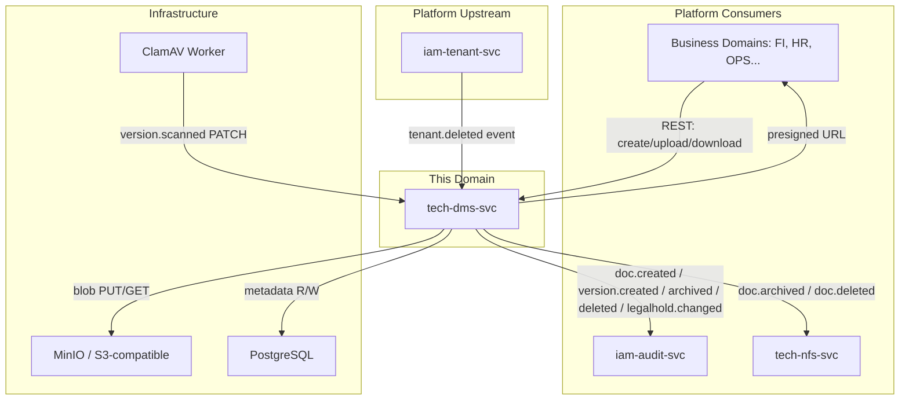
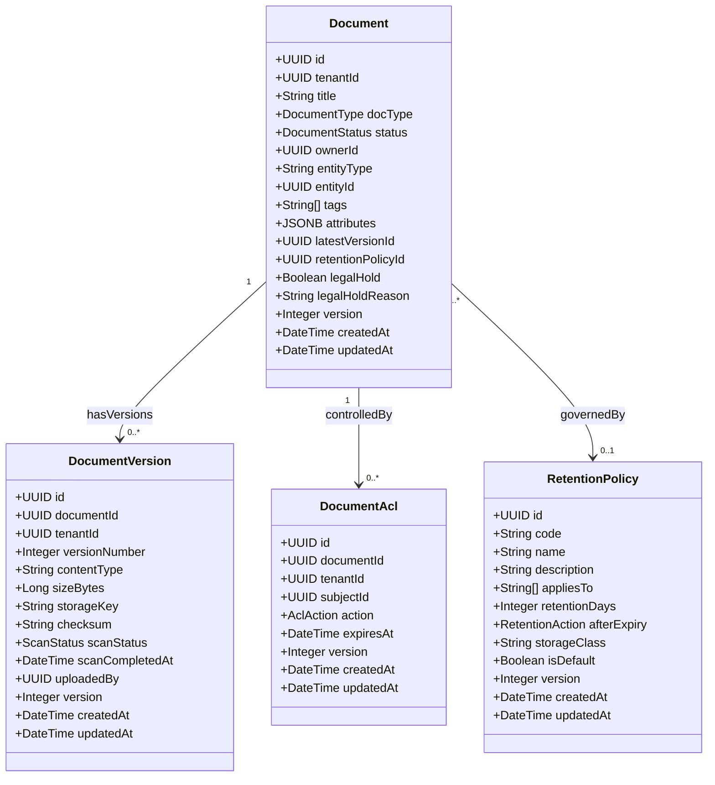
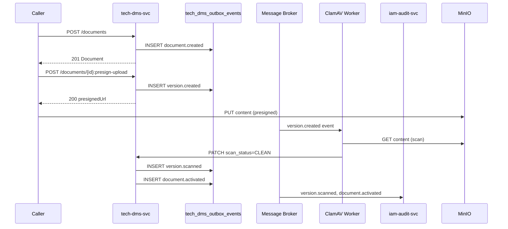
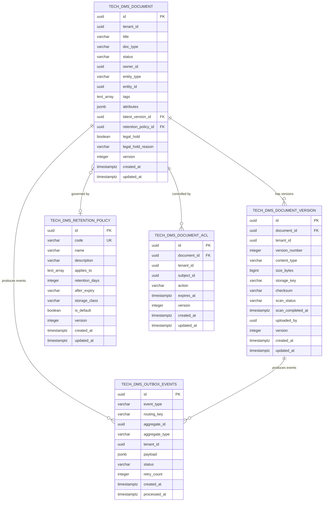

<!-- TEMPLATE COMPLIANCE: ~95%
Template: domain-service-spec.md v1.0.0
Present sections: §0-§15
Gaps: §5.3 process flow diagrams (stub), §12.7 extension API endpoints (stub)
-->

# tech.dms — Document Management Service Domain Specification

> **Conceptual Stack Layer:** Domain / Service
> **Space:** Platform
> **Owner:** Platform Infrastructure Team
> **Schema alignment:** `service-layer.schema.json`
> **Companion files:** `contracts/http/tech/dms/openapi.yaml`, `contracts/events/tech/dms/*.schema.json`
> **Referenced by:** Platform-Feature Specs (F-TECH-001-xx), BFF Contract
> **Belongs to:** Tech Suite Spec

> **Meta Information**
> - **Version:** 2026-04-03
> - **Template:** `domain-service-spec.md` v1.0.0
> - **Template Compliance:** ~95% — remaining gaps: §5.3 process flow diagrams (stub), §12.7 extension API endpoints (stub)
> - **Author(s):** OpenLeap Architecture Team
> - **Status:** DRAFT
> - **Suite:** `tech` (Technical Infrastructure)
> - **Domain:** `dms` (Document Management)
> - **Bounded Context Ref:** `bc:document-management`
> - **Service ID:** `tech-dms-svc`
> - **basePackage:** `io.openleap.tech.dms`
> - **API Base Path:** `/api/tech/dms/v1`
> - **OpenLeap Starter Version:** `v3.0.0`
> - **Port:** `8095`
> - **Repository:** `https://github.com/openleap-io/io.openleap.tech.dms`
> - **Tags:** `tech`, `dms`, `platform`, `document`, `storage`
> - **Team:**
>   - Name: `team-tech`
>   - Email: `platform-infra@openleap.io`
>   - Slack: `#platform-infra`

---

## Specification Guidelines Compliance

> ### Non-Negotiables
> - Never invent facts. If required info is missing, add an **OPEN QUESTION** entry.
> - Preserve intent and decisions. Only change meaning when explicitly requested.
> - Do not remove normative constraints unless they are explicitly replaced.
> - Keep the spec **self-contained**: no "see chat", no implicit context.
>
> ### Source of Truth Priority
> When sources conflict:
> 1. Spec (explicit) wins
> 2. Starter specs (implementation constraints) next
> 3. Guidelines (best practices) last
>
> Record conflicts in the **Decisions & Conflicts** section (see Section 14).
>
> ### Style Guide
> - Prefer short sentences and lists.
> - Use MUST/SHOULD/MAY for normative statements.
> - Keep terminology consistent (Aggregate, Domain Service, Application Service, Command, Event).
> - Avoid ambiguous words ("often", "maybe") unless explicitly noting uncertainty.
> - Keep examples minimal and clearly marked as examples.
> - Do not add implementation code unless the chapter explicitly requires it.

---

## 0. Document Purpose & Scope

### 0.1 Purpose

The Document Management Service (DMS) provides centralized storage, versioning, and lifecycle management for binary documents across the entire OpenLeap ERP platform. It persists binary content as immutable blobs in MinIO (S3-compatible object storage) and manages structured metadata in PostgreSQL. Every module that needs to attach, archive, or retrieve documents interacts exclusively through this service — there is no direct object-storage access from business domains.

### 0.2 Target Audience

- Platform Engineers maintaining infrastructure-level storage services
- Platform Infrastructure Team owning this service
- Integration Engineers from business domains (FI, HR, OPS) that produce or consume documents
- Security & Compliance teams auditing document retention and legal hold status
- DevOps teams configuring MinIO, S3 Object Lock, and ClamAV integrations

### 0.3 Scope

**In Scope:**
- Document record lifecycle (DRAFT → ACTIVE → ARCHIVED → DELETED)
- Immutable document version management (one version per upload)
- Per-tenant bucket isolation in MinIO
- Presigned URL generation for direct browser-to-MinIO upload and download
- Virus scanning integration (ClamAV worker via event-driven scan loop)
- Retention policy definition and enforcement (GoBD-compliant S3 Object Lock)
- Legal hold management (blocks deletion regardless of retention policy)
- Per-document ACL (owner + explicit grant list)
- Entity linking (attach document to any business entity by type + UUID)
- GDPR right-to-erasure support (soft-delete + PII purge on tenant.deleted)
- Events published on all document and version lifecycle transitions

**Out of Scope:**
- Binary content transformation or format conversion (e.g., PDF → image)
- Full-text content indexing and search engine implementation (external Elasticsearch concern)
- Keycloak/IAM authentication and authorization evaluation (`iam-authz-svc`)
- Email or notification delivery for document events (`tech-nfs-svc`)
- Business-domain document approval workflows (HR, FI concerns)
- Infrastructure provisioning of MinIO buckets (handled by platform bootstrap, not this service at runtime)

### 0.4 Related Documents

- `spec/T1_Platform/tech/_tech_suite.md` — Tech Suite Architecture Specification
- `spec/T1_Platform/iam/domain-specs/iam_tenant-spec.md` — Tenant Management (source of tenant.deleted event)
- `spec/T1_Platform/iam/domain-specs/iam_audit-spec.md` — Audit Service (consumes all DMS events)
- `spec/T1_Platform/tech/domain-specs/tech_nfs-spec.md` — Notification Service (downstream consumer)
- `spec/T1_Platform/tech/features/leaves/F-TECH-001-01/feature-spec.md` — Browse Documents
- `spec/T1_Platform/tech/features/leaves/F-TECH-001-02/feature-spec.md` — Manage Retention Policies
- `spec/T1_Platform/tech/features/leaves/F-TECH-001-03/feature-spec.md` — Document Audit Trail
- `contracts/http/tech/dms/openapi.yaml` — REST API contract
- `contracts/events/tech/dms/` — Event schema contracts

---

## 1. Business Context

### 1.1 Domain Purpose

The Document Management domain solves the unstructured-content storage challenge for a multi-tenant ERP: every module (Financials, HR, Procurement, Service) generates documents — invoices, contracts, payslips, attachments — that must be stored reliably, accessed securely, and retained according to legal obligations. Without a centralized DMS, each module would implement its own ad-hoc blob storage, leading to inconsistent retention, no cross-module visibility, and impossible GDPR compliance at scale.

This service is the single authoritative store for all binary documents in OpenLeap. It enforces retention rules automatically, prevents unauthorized deletion during audits, and provides audit-grade immutability through S3 Object Lock.

### 1.2 Business Value

- **Compliance automation:** GoBD and GDPR retention rules are enforced automatically at the storage layer, removing manual compliance burden from individual modules.
- **Legal hold for litigation:** Finance and HR can freeze any document set during audits or disputes without risking accidental deletion.
- **Secure large-file transfer:** Presigned URLs allow browsers to upload and download files of up to 500 MB directly through MinIO, bypassing the API gateway and eliminating gateway timeout issues.
- **Virus protection:** All uploaded content is automatically scanned; infected versions are quarantined before they can be accessed.
- **Unified document search:** A single query endpoint covers all document types across all modules, enabling cross-domain document dashboards.
- **SAP parity:** Replaces SAP ArchiveLink / GOS (Generic Object Services) and KPro Content Management — the standard SAP mechanism for attaching documents to business objects.

### 1.3 Key Stakeholders

| Role | Responsibility | Primary Use Cases |
|------|----------------|-------------------|
| Platform Infrastructure Team | Owns and operates DMS; manages MinIO, ClamAV, retention rules | All operational concerns |
| Tenant Administrator | Configures per-tenant document categories and ACL defaults | UC-DMS-011, UC-DMS-013 |
| Finance Module | Stores and retrieves invoices, contracts (GoBD retention) | UC-DMS-001, UC-DMS-003, UC-DMS-009, UC-DMS-010 |
| HR Module | Stores payslips, employment contracts (GDPR-sensitive) | UC-DMS-001, UC-DMS-006 |
| Legal / Compliance | Applies and releases legal holds during audits or litigation | UC-DMS-007, UC-DMS-008 |
| Security & Audit | Reviews document access events and virus scan outcomes | Consumes published events |
| End Users | Browse and download documents through product UI | UC-DMS-003, UC-DMS-004, UC-DMS-010 |

### 1.4 Strategic Positioning

The Document Management Service is a **T1 Platform Foundation** service (ADR-001, four-tier layering). It depends only on platform infrastructure (MinIO, PostgreSQL, ClamAV) and the IAM suite for tenant context. All T2–T4 business domains depend on it for document storage. It has no dependency on any business-domain service.

Architecturally it parallels **SAP ArchiveLink** (transaction OAC0/OAC2) and **GOS (Generic Object Services)** — the mechanism by which SAP objects (FI documents, MM purchasing documents, HR personnel files) attach binary content. The `entityType` + `entityId` link on the Document aggregate is the OpenLeap equivalent of SAP's `SRGBTBREL` object relationship table.

### 1.5 Service Context

| Property | Value |
|----------|-------|
| **Suite** | `tech` |
| **Domain** | `dms` |
| **Bounded Context** | `bc:document-management` |
| **Service ID** | `tech-dms-svc` |
| **Base Package** | `io.openleap.tech.dms` |

**Responsibilities:**
- Own and enforce the document lifecycle state machine (DRAFT → ACTIVE → ARCHIVED → DELETED)
- Store and serve immutable document versions; never overwrite uploaded content
- Enforce per-tenant bucket isolation in MinIO
- Generate time-limited presigned URLs for secure direct upload and download
- Coordinate virus scan status via ClamAV worker events
- Enforce retention policies using S3 Object Lock (COMPLIANCE and GOVERNANCE modes)
- Enforce legal holds that block deletion regardless of retention policy
- Publish document lifecycle events to the `tech.dms.events` exchange
- Consume `iam.tenant.tenant.deleted` events to execute GDPR tenant purge

**Authoritative Sources:**

| Source Type | Description | Access Pattern |
|-------------|-------------|----------------|
| REST API | Document, DocumentVersion, RetentionPolicy, ACL read/write | Synchronous |
| Database | `tech_dms_document`, `tech_dms_document_version`, `tech_dms_retention_policy`, `tech_dms_document_acl` | Direct (owner) |
| MinIO | Binary content blobs in per-tenant buckets | S3 SDK (owner) |
| Events | Document and version lifecycle events | Asynchronous (outbox, ADR-013) |



---

## 2. Service Identity

| Property | Value | Schema Field |
|----------|-------|-------------|
| **Service ID** | `tech-dms-svc` | `metadata.id` |
| **Display Name** | `Document Management Service` | `metadata.name` |
| **Suite** | `tech` | `metadata.suite` |
| **Domain** | `dms` | `metadata.domain` |
| **Bounded Context** | `bc:document-management` | `metadata.bounded_context_ref` |
| **Version** | `1.0.0` | `metadata.version` |
| **Status** | DRAFT | `metadata.status` |
| **API Base Path** | `/api/tech/dms/v1` | `metadata.api_base_path` |
| **Exchange** | `tech.dms.events` (topic, durable) | `metadata.exchange` |
| **Port** | `8095` | `metadata.port` |
| **Repository** | `https://github.com/openleap-io/io.openleap.tech.dms` | `metadata.repository` |
| **Tags** | `tech`, `dms`, `platform`, `document`, `storage` | `metadata.tags` |

**Team:**

| Property | Value |
|----------|-------|
| **Name** | `team-tech` |
| **Email** | `platform-infra@openleap.io` |
| **Slack Channel** | `#platform-infra` |

---

## 3. Domain Model

### 3.1 Conceptual Overview

The Document Management domain is organized around three aggregates:

1. **Document** — the root aggregate representing a named document record. Owns lifecycle state, entity linking, ACL, and retention policy reference. A document may have zero or more versions.
2. **DocumentVersion** — a child aggregate with weak ownership by Document. Each upload creates a new, immutable version. Versions are never overwritten or deleted from storage during normal operation (only quarantined or purged under GDPR).
3. **RetentionPolicy** — a system-level aggregate (no tenant scoping) defining how long documents of a given type must be retained and what happens at expiry. Platform administrators manage policies; they are applied per document on creation or explicit assignment.

Document is the root aggregate. DocumentVersion is created by uploading content through the Document context. RetentionPolicy is independent and referenced by Document.

### 3.2 Core Concepts



### 3.3 Aggregate Definitions

#### 3.3.1 Document

| Property | Value |
|----------|-------|
| **Aggregate ID** | `agg:document` |
| **Table** | `tech_dms_document` |
| **Root Entity** | `Document` |
| **Identity** | UUID PK + business key: `(tenant_id, title, doc_type, entity_type, entity_id)` unique constraint (soft — documents may share titles, not enforced at DB level) |
| **Ownership** | Tenant-scoped |

**Attributes:**

| Field | Type | Nullable | Description |
|-------|------|----------|-------------|
| `id` | UUID | No | Primary key. Generated via `OlUuid.create()` (ADR-021) |
| `tenant_id` | UUID | No | Owning tenant. FK to `iam_tenant.id`. All queries MUST filter by tenant_id |
| `title` | VARCHAR(500) | No | Human-readable document title |
| `doc_type` | VARCHAR(50) | No | Document category; maps to `DocumentType` enum |
| `status` | VARCHAR(20) | No | Lifecycle state; maps to `DocumentStatus` enum |
| `owner_id` | UUID | No | Principal UUID of the document creator/owner |
| `entity_type` | VARCHAR(100) | Yes | Business entity type (e.g., `invoice`, `purchase_order`) |
| `entity_id` | UUID | Yes | UUID of the linked business entity |
| `tags` | TEXT[] | No | Array of free-form classification tags. Default: `{}` |
| `attributes` | JSONB | No | Extensible key-value metadata. Default: `{}` |
| `latest_version_id` | UUID | Yes | FK to the most recent `DocumentVersion.id` |
| `retention_policy_id` | UUID | Yes | FK to `RetentionPolicy.id`. Resolved on activation |
| `legal_hold` | BOOLEAN | No | If true, document MUST NOT be archived or deleted |
| `legal_hold_reason` | VARCHAR(1000) | Yes | Reason text set when legal hold is applied |
| `version` | INTEGER | No | Optimistic locking counter (ADR-002) |
| `created_at` | TIMESTAMPTZ | No | Record creation timestamp |
| `updated_at` | TIMESTAMPTZ | No | Last modification timestamp |

**Lifecycle State Machine:**

```
DRAFT ──────────────────────────────────────────► ACTIVE
  │                                                  │
  │ (first version uploaded + scan CLEAN)            │ (retention expired OR manual)
  │                                                  ▼
  │                                              ARCHIVED
  │                                                  │
  │                                                  │ (soft-delete, legal hold check)
  └──────────────────────────────────────────────────┼──► DELETED
                                                     │
                                           (legal hold blocks ▲)
```

| Transition | Trigger | Guard | Event Published |
|-----------|---------|-------|----------------|
| → DRAFT | Document created | none | `tech.dms.document.created` |
| DRAFT → ACTIVE | First version scan result = CLEAN | version exists, scan CLEAN | `tech.dms.document.activated` |
| ACTIVE → ARCHIVED | Manual archive command OR retention policy expiry | `legalHold = false` | `tech.dms.document.archived` |
| ACTIVE/ARCHIVED → DELETED | Delete command | `legalHold = false` | `tech.dms.document.deleted` |
| Any → ACTIVE (re-activate) | Not supported. Archived documents cannot be unarchived. | — | — |

**Invariants:**
- A Document MUST have `tenant_id` set at creation and it MUST NOT be changed.
- `legal_hold = true` MUST block all state transitions to ARCHIVED or DELETED (BR-DMS-002).
- `latest_version_id` MUST always point to the highest `versionNumber` version for this document.
- `retention_policy_id` SHOULD be resolved when status transitions to ACTIVE; if not set, the system default RetentionPolicy for the `doc_type` MUST be applied (BR-DMS-009).

**Commands:**
- `CreateDocumentCommand` → produces `DocumentCreatedEvent`
- `ActivateDocumentCommand` → produces `DocumentActivatedEvent`
- `ArchiveDocumentCommand` → produces `DocumentArchivedEvent`
- `DeleteDocumentCommand` → produces `DocumentDeletedEvent`
- `UpdateDocumentMetadataCommand` → no lifecycle event (metadata update only)
- `ApplyLegalHoldCommand` → produces `DocumentLegalHoldChangedEvent`
- `ReleaseLegalHoldCommand` → produces `DocumentLegalHoldChangedEvent`

---

#### 3.3.2 DocumentVersion

| Property | Value |
|----------|-------|
| **Aggregate ID** | `agg:document-version` |
| **Table** | `tech_dms_document_version` |
| **Root Entity** | `DocumentVersion` |
| **Identity** | UUID PK + business key: `(document_id, version_number)` UNIQUE |
| **Ownership** | Tenant-scoped; weakly owned by Document |

**Attributes:**

| Field | Type | Nullable | Description |
|-------|------|----------|-------------|
| `id` | UUID | No | Primary key. Generated via `OlUuid.create()` |
| `document_id` | UUID | No | FK to `tech_dms_document.id` |
| `tenant_id` | UUID | No | Denormalized tenant for partition pruning and access checks |
| `version_number` | INTEGER | No | Monotonically increasing, 1-based, per document |
| `content_type` | VARCHAR(255) | No | MIME type of the uploaded content (e.g., `application/pdf`) |
| `size_bytes` | BIGINT | No | File size in bytes. MUST be ≤ 524,288,000 (500 MB) (BR-DMS-007) |
| `storage_key` | VARCHAR(1000) | No | S3 object key in the tenant bucket: `{tenantId}/documents/{documentId}/{versionId}` |
| `checksum` | VARCHAR(64) | No | SHA-256 hex digest of the uploaded content |
| `scan_status` | VARCHAR(20) | No | Virus scan result; maps to `ScanStatus` enum. Default: `PENDING` |
| `scan_completed_at` | TIMESTAMPTZ | Yes | Timestamp when ClamAV worker completed scan |
| `uploaded_by` | UUID | No | Principal UUID of the uploader |
| `version` | INTEGER | No | Optimistic locking counter |
| `created_at` | TIMESTAMPTZ | No | Upload timestamp |
| `updated_at` | TIMESTAMPTZ | No | Last modification timestamp (scan status update) |

**Scan Status State Machine:**

```
PENDING ──► SCANNING ──► CLEAN
                    │
                    └──► INFECTED (→ quarantined: access blocked)
                    │
                    └──► ERROR (scan failed; SHOULD retry)
```

**Invariants:**
- A DocumentVersion is immutable once created (BR-DMS-001). `content_type`, `size_bytes`, `storage_key`, `checksum`, `version_number`, `uploaded_by` MUST NOT be modified after creation.
- The only mutable fields are `scan_status`, `scan_completed_at`, `version`, and `updated_at`.
- `version_number` MUST be exactly `MAX(version_number) + 1` for the given `document_id` at creation time.
- A version with `scan_status = INFECTED` MUST NOT be served for download and MUST NOT become `latest_version_id` on the parent Document (BR-DMS-003).
- `size_bytes` MUST be validated on presigned URL request; uploads exceeding 500 MB MUST be rejected (BR-DMS-007).

**Commands:**
- `CreateDocumentVersionCommand` → produces `DocumentVersionCreatedEvent`
- `UpdateScanStatusCommand` (internal, ClamAV worker only) → produces `DocumentVersionScannedEvent`

---

#### 3.3.3 RetentionPolicy

| Property | Value |
|----------|-------|
| **Aggregate ID** | `agg:retention-policy` |
| **Table** | `tech_dms_retention_policy` |
| **Root Entity** | `RetentionPolicy` |
| **Identity** | UUID PK + business key: `code` UNIQUE |
| **Ownership** | System-level — no `tenant_id` column. Platform administrators only |

**Attributes:**

| Field | Type | Nullable | Description |
|-------|------|----------|-------------|
| `id` | UUID | No | Primary key. Generated via `OlUuid.create()` |
| `code` | VARCHAR(50) | No | Machine-readable code (e.g., `GOBD_10Y`, `STANDARD_3Y`). UNIQUE |
| `name` | VARCHAR(200) | No | Human-readable policy name |
| `description` | VARCHAR(2000) | Yes | Extended description of the policy rationale |
| `applies_to` | TEXT[] | No | List of `DocumentType` values this policy applies to |
| `retention_days` | INTEGER | No | Number of days from document ACTIVE date before expiry action fires |
| `after_expiry` | VARCHAR(20) | No | Action at expiry; maps to `RetentionAction` enum |
| `storage_class` | VARCHAR(20) | No | S3 Object Lock mode: `COMPLIANCE` or `GOVERNANCE` |
| `is_default` | BOOLEAN | No | If true, this policy is auto-applied when no explicit policy is selected for the given `doc_type` |
| `version` | INTEGER | No | Optimistic locking counter |
| `created_at` | TIMESTAMPTZ | No | Record creation timestamp |
| `updated_at` | TIMESTAMPTZ | No | Last modification timestamp |

**Invariants:**
- Exactly one RetentionPolicy with `is_default = true` MUST exist for each `DocumentType` value (BR-DMS-009).
- A RetentionPolicy with `storage_class = COMPLIANCE` MUST NOT have `retention_days` reduced after being applied to any document (BR-DMS-010).
- `code` MUST be unique across all retention policies.
- `retention_days` MUST be a positive integer (≥ 1).

**Commands:**
- `CreateRetentionPolicyCommand`
- `UpdateRetentionPolicyCommand`

---

### 3.4 Enumerations

#### DocumentStatus

| Value | Description |
|-------|-------------|
| `DRAFT` | Document record created; no clean version yet |
| `ACTIVE` | Document is live; at least one clean version exists |
| `ARCHIVED` | Document is read-only; retention policy applied |
| `DELETED` | Soft-deleted; content may be purged; not visible in normal queries |

#### DocumentType

| Value | Description | Typical Retention |
|-------|-------------|-------------------|
| `INVOICE` | Tax-relevant financial invoice | 10 years (GoBD) |
| `CONTRACT` | Legal contract or agreement | 10 years (GoBD) |
| `REPORT` | Generated business report | 3 years |
| `ATTACHMENT` | Generic attachment to a business object | 3 years |
| `LEGAL` | Legal correspondence, court documents | 10 years |
| `IMAGE` | Images (photos, scans) | 3 years |
| `OTHER` | Uncategorized documents | 3 years |

#### ScanStatus

| Value | Description |
|-------|-------------|
| `PENDING` | Version created; scan not yet started |
| `SCANNING` | ClamAV worker is actively scanning |
| `CLEAN` | No threats detected; version is accessible |
| `INFECTED` | Malware detected; version is quarantined and inaccessible |
| `ERROR` | Scan failed due to technical error; SHOULD be retried |

#### RetentionAction

| Value | Description |
|-------|-------------|
| `ARCHIVE` | Move document to ARCHIVED state on expiry |
| `DELETE` | Soft-delete document on expiry |
| `MANUAL_REVIEW` | Flag for manual compliance review; do not auto-transition |

#### AclAction

| Value | Description |
|-------|-------------|
| `READ` | Subject may download versions and read metadata |
| `WRITE` | Subject may upload new versions and update metadata |
| `ADMIN` | Subject may modify ACL, apply/release legal hold, delete document |

### 3.5 Shared Types

#### EntityLink
Represents a link to a business entity in another bounded context.

| Field | Type | Description |
|-------|------|-------------|
| `entityType` | String | Lowercase domain entity type (e.g., `invoice`, `purchase_order`, `employee`) |
| `entityId` | UUID | UUID of the linked entity in the owning domain's database |

#### PresignedUrlResponse

| Field | Type | Description |
|-------|------|-------------|
| `url` | String | Time-limited presigned URL |
| `expiresAt` | DateTime | Absolute expiry timestamp |
| `method` | String | HTTP method: `PUT` (upload) or `GET` (download) |

---

## 4. Business Rules

### 4.1 Rule Catalog

| Rule ID | Category | Name | Severity |
|---------|----------|------|----------|
| BR-DMS-001 | Immutability | Document version is immutable once created | MUST |
| BR-DMS-002 | Legal Hold | Legal hold blocks deletion and archiving | MUST |
| BR-DMS-003 | Virus Scan | Infected versions are quarantined | MUST |
| BR-DMS-004 | Retention | Retention policy applies from ACTIVE date | MUST |
| BR-DMS-005 | Tenancy | Document access requires valid tenant context | MUST |
| BR-DMS-006 | Presigned URL | Presigned URL maximum TTL | MUST |
| BR-DMS-007 | Size Limit | Maximum document size per version | MUST |
| BR-DMS-008 | Ownership | Metadata modification requires owner or ADMIN | MUST |
| BR-DMS-009 | Retention Default | Default RetentionPolicy must exist per DocumentType | MUST |
| BR-DMS-010 | COMPLIANCE Lock | COMPLIANCE retention cannot be shortened | MUST |

### 4.2 Detailed Business Rule Definitions

#### BR-DMS-001 — Document Version Immutability

**Rule:** A DocumentVersion MUST NOT have any of its content-describing fields modified after initial creation.

**Immutable fields:** `version_number`, `content_type`, `size_bytes`, `storage_key`, `checksum`, `uploaded_by`, `created_at`.

**Mutable fields (allowed):** `scan_status`, `scan_completed_at`, `updated_at`, `version` (optimistic lock).

**Rationale:** Immutability guarantees audit integrity and supports GoBD WORM (Write Once Read Many) requirements. Any change to file content MUST be represented as a new version, not an overwrite.

**Enforcement:** Application Service MUST reject any command that attempts to modify an immutable field. Database columns are NOT individually locked (enforcement is at application layer); the storage_key in MinIO is protected by S3 Object Lock on applicable policies.

---

#### BR-DMS-002 — Legal Hold Blocks Deletion and Archiving

**Rule:** Any document with `legalHold = true` MUST NOT be transitioned to ARCHIVED or DELETED state, regardless of retention policy expiry.

**Applies to:** `ArchiveDocumentCommand`, `DeleteDocumentCommand`, retention policy expiry batch job.

**Exception:** Only a principal with role `PLATFORM_ADMIN` or `LEGAL_COUNSEL` may release a legal hold (UC-DMS-008).

**Rationale:** Legal holds are required during litigation discovery and regulatory audits. Inadvertent deletion during a hold constitutes evidence tampering.

**Enforcement:** Guard check at Application Service layer before state transition. Returns HTTP 409 Conflict with error code `DMS_LEGAL_HOLD_ACTIVE`.

---

#### BR-DMS-003 — Infected Versions Are Quarantined

**Rule:** A DocumentVersion with `scan_status = INFECTED` MUST NOT be served for download. It MUST NOT be set as `latest_version_id` on the parent Document. Access MUST return HTTP 403 with error code `DMS_VERSION_INFECTED`.

**Quarantine:** The S3 object key remains in MinIO but is flagged with an object tag `quarantine=true`. The parent Document's `latest_version_id` MUST revert to the previous CLEAN version (or NULL if no prior clean version exists).

**Notification:** The `tech.dms.document.version.scanned` event MUST be published with `scanStatus = INFECTED`. The `tech-nfs-svc` MAY notify the document owner.

**Rationale:** Serving malware from the platform creates legal liability and can harm tenant end-users.

---

#### BR-DMS-004 — Retention Policy Applies from ACTIVE Date

**Rule:** The retention expiry date for a document is calculated as: `retentionExpiresAt = document.activatedAt + retentionPolicy.retentionDays * 24h`.

**Trigger:** The retention enforcement job MUST evaluate all ACTIVE documents daily. When `now() >= retentionExpiresAt` and `legalHold = false`, the configured `afterExpiry` action MUST be executed.

**Rationale:** Retention is measured from the document being confirmed clean and usable (ACTIVE), not from creation (DRAFT), which may be hours or days earlier.

---

#### BR-DMS-005 — Tenant Context Required for All Document Access

**Rule:** Every API request accessing documents MUST supply a valid `tenantId` in the JWT or request context. All database queries MUST include a `WHERE tenant_id = :tenantId` predicate.

**Per-tenant bucket:** Storage keys MUST follow the pattern `{tenantId}/documents/{documentId}/{versionId}`. Cross-tenant bucket access MUST be impossible by construction (MinIO bucket policies enforce this).

**Rationale:** Per-tenant data isolation is a platform-level security guarantee (ADR-001). A breach of tenant isolation is a critical security incident.

---

#### BR-DMS-006 — Presigned URL Maximum TTL

**Rule:**
- Presigned **upload** URLs MUST expire within **15 minutes** of generation.
- Presigned **download** URLs MUST expire within **1 hour** of generation.
- Shorter TTLs MAY be requested by the caller; longer TTLs MUST be rejected with HTTP 400.

**Rationale:** Presigned URLs bypass the API gateway and IAM checks. A long-lived URL is equivalent to unauthenticated access. Short TTLs minimize the window for URL interception or misuse.

---

#### BR-DMS-007 — Maximum Document Version Size

**Rule:** Each DocumentVersion MUST have `size_bytes ≤ 524,288,000` (500 MiB).

**Enforcement:** The presigned upload URL request MUST include the expected `sizeBytes`. If `sizeBytes > 524,288,000`, the request MUST be rejected with HTTP 400 and error code `DMS_SIZE_EXCEEDED`. MinIO bucket policy MUST enforce a maximum object size of 500 MiB to prevent circumvention via direct upload.

---

#### BR-DMS-008 — Metadata Modification Requires Owner or ADMIN

**Rule:** A principal MAY update document metadata (`title`, `tags`, `attributes`, `entityType`, `entityId`) only if:
- the principal is the document's `ownerId`, OR
- the principal has an ACL grant with `action = ADMIN` for this document, OR
- the principal has platform role `PLATFORM_ADMIN`.

**Enforcement:** Application Service MUST evaluate ACL before executing `UpdateDocumentMetadataCommand`. Returns HTTP 403 if the check fails.

---

#### BR-DMS-009 — Default RetentionPolicy Must Exist per DocumentType

**Rule:** At all times, exactly one RetentionPolicy with `is_default = true` MUST exist for each `DocumentType` value.

**Enforcement:** `CreateRetentionPolicyCommand` MUST be rejected if setting `is_default = true` for a `DocumentType` that already has a default, unless the existing default is explicitly unset in the same command. The system MUST NOT allow a state where a `DocumentType` has no default policy.

**Bootstrap:** Platform bootstrap scripts MUST seed one default RetentionPolicy per DocumentType during initial installation.

---

#### BR-DMS-010 — COMPLIANCE-Mode Retention Cannot Be Shortened

**Rule:** A RetentionPolicy with `storage_class = COMPLIANCE` MUST NOT have its `retention_days` value decreased after it has been applied to at least one document.

**Detection:** Before allowing an `UpdateRetentionPolicyCommand` that reduces `retention_days`, the Application Service MUST verify that no document references this policy with `status IN (DRAFT, ACTIVE)`. If any documents reference it, the update MUST be rejected with HTTP 409 and error code `DMS_COMPLIANCE_LOCK`.

**Rationale:** S3 Object Lock in COMPLIANCE mode is irreversible at the storage level. Reducing the policy definition without the storage being reducible creates an inconsistency and violates GoBD guarantees.

---

### 4.3 Data Validation Rules

| Field | Rule |
|-------|------|
| `title` | REQUIRED; 1–500 characters; MUST NOT be blank |
| `docType` | REQUIRED; MUST be a valid `DocumentType` enum value |
| `contentType` | REQUIRED on version upload; MUST be a valid MIME type (RFC 2045) |
| `sizeBytes` | REQUIRED on version upload; MUST be > 0 and ≤ 524,288,000 |
| `checksum` | REQUIRED; MUST be a 64-character lowercase hex SHA-256 digest |
| `retentionDays` | REQUIRED for RetentionPolicy; MUST be ≥ 1 |
| `expiresAt` (ACL) | OPTIONAL; if provided, MUST be a future timestamp |
| `presignedUrlTtlSeconds` | OPTIONAL; upload: max 900s; download: max 3600s |
| `tags` | OPTIONAL; each tag MUST be ≤ 100 characters; max 50 tags per document |
| `attributes` | OPTIONAL; JSONB; MUST be valid JSON object; max depth 5; max 200 keys |

### 4.4 Reference Data Dependencies

| Dependency | Type | Impact |
|-----------|------|--------|
| `DocumentType` enum | Internal enum (code) | Document creation fails if unknown type |
| `RetentionPolicy` (default per type) | System reference data | Must be bootstrapped before first document |
| Tenant record in `iam_tenant` | Foreign key (soft) | `tenant_id` is validated via JWT; no DB FK (cross-service) |
| MinIO bucket `{tenantId}-documents` | Infrastructure | Bucket MUST exist before first upload; created on tenant provisioning |

---

## 5. Use Cases & Business Logic

### 5.1 Use Case Catalog

| Use Case ID | Name | Type | Actor | Complexity |
|-------------|------|------|-------|-----------|
| UC-DMS-001 | Create Document | WRITE | Business Domain Service, End User | Medium |
| UC-DMS-002 | Upload New Version | WRITE | Business Domain Service, End User | Medium |
| UC-DMS-003 | Get Document | READ | Any authenticated principal | Low |
| UC-DMS-004 | List Documents | READ | Any authenticated principal | Low |
| UC-DMS-005 | Archive Document | WRITE | System (retention job), Tenant Admin | Low |
| UC-DMS-006 | Delete Document | WRITE | Document Owner, Tenant Admin | Low |
| UC-DMS-007 | Apply Legal Hold | WRITE | Legal Counsel, Platform Admin | Low |
| UC-DMS-008 | Release Legal Hold | WRITE | Platform Admin (elevated) | Low |
| UC-DMS-009 | Get Presigned Upload URL | WRITE | Business Domain Service, End User | Low |
| UC-DMS-010 | Get Presigned Download URL | READ | Any authorized principal | Low |
| UC-DMS-011 | Register Retention Policy | WRITE | Platform Admin | Medium |
| UC-DMS-012 | Search Documents | READ | Any authenticated principal | Medium |
| UC-DMS-013 | Manage Document ACL | WRITE | Document Owner, ACL Admin | Medium |

### 5.2 Use Case Details

#### UC-DMS-001 — Create Document

**Actor:** Business Domain Service (e.g., `fi-invoice-svc`) or End User via product UI
**Preconditions:**
- Caller has a valid JWT with `tenant_id` claim.
- Caller has role `DOCUMENT_CREATOR` or platform role.
- The MinIO bucket `{tenantId}-documents` exists.

**Main Flow:**
1. Caller submits `POST /api/tech/dms/v1/documents` with `title`, `docType`, optional `entityType`, `entityId`, `tags`, `attributes`.
2. Application Service validates input (§4.3).
3. Application Service creates a Document record with `status = DRAFT`, generates UUID via `OlUuid.create()`.
4. If `retentionPolicyId` is not provided, the default RetentionPolicy for `docType` is resolved and set.
5. Document is persisted to `tech_dms_document`.
6. `DocumentCreatedEvent` is written to `tech_dms_outbox_events` (ADR-013).
7. Response: HTTP 201 with the created Document DTO.

**Postconditions:**
- Document exists in DRAFT state.
- `tech.dms.document.created` event is published asynchronously via outbox.
- No MinIO object yet (content upload is a separate step via presigned URL or `POST /versions`).

**Alternative Flow — Presigned Upload:**
1. Caller follows UC-DMS-001 to create the document record.
2. Caller calls UC-DMS-009 to get a presigned PUT URL.
3. Caller PUTs binary content directly to MinIO using the presigned URL.
4. ClamAV worker detects new object via `tech.dms.document.version.created` event, scans content.
5. On CLEAN scan, Application Service transitions document to ACTIVE.

---

#### UC-DMS-002 — Upload New Version

**Actor:** Document Owner, principal with WRITE ACL grant
**Preconditions:**
- Document exists and is in ACTIVE or DRAFT state.
- Caller owns the document or has ACL WRITE grant.
- `sizeBytes` ≤ 500 MiB (BR-DMS-007).

**Main Flow:**
1. Caller submits `POST /api/tech/dms/v1/documents/{id}/versions` with `contentType`, `sizeBytes`, `checksum`, `uploadedBy`.
2. Application Service validates caller has WRITE permission.
3. Application Service calculates `versionNumber = currentLatest + 1`.
4. DocumentVersion record is created with `scan_status = PENDING`.
5. Storage key is computed: `{tenantId}/documents/{documentId}/{versionId}`.
6. A presigned PUT URL is generated for the computed storage key (15-minute TTL).
7. `DocumentVersionCreatedEvent` is written to outbox.
8. Response: HTTP 201 with version DTO including `presignedUploadUrl`.

**Postconditions:**
- New DocumentVersion exists with `scan_status = PENDING`.
- ClamAV worker will process the `version.created` event and scan the object.
- Parent Document's `latest_version_id` is NOT updated until scan is CLEAN.

---

#### UC-DMS-007 — Apply Legal Hold

**Actor:** Legal Counsel, Platform Admin
**Preconditions:**
- Document exists and is not in DELETED state.
- Caller has role `LEGAL_COUNSEL` or `PLATFORM_ADMIN`.

**Main Flow:**
1. Caller submits `POST /api/tech/dms/v1/documents/{id}:apply-legal-hold` with `reason`.
2. Application Service validates caller role.
3. `legalHold` is set to `true`, `legalHoldReason` is recorded.
4. `DocumentLegalHoldChangedEvent` (held=true) is written to outbox.
5. Response: HTTP 200 with updated Document DTO.

**Postconditions:**
- Document cannot be archived or deleted until legal hold is released.
- Retention policy expiry is bypassed for this document.

---

#### UC-DMS-008 — Release Legal Hold

**Actor:** Platform Admin (elevated role only)
**Preconditions:**
- Document has `legalHold = true`.
- Caller has role `PLATFORM_ADMIN` (stricter than apply — intentional: release requires higher privilege).

**Main Flow:**
1. Caller submits `POST /api/tech/dms/v1/documents/{id}:release-legal-hold`.
2. Application Service validates caller has `PLATFORM_ADMIN` role.
3. `legalHold` is set to `false`, `legalHoldReason` is cleared.
4. `DocumentLegalHoldChangedEvent` (held=false) is written to outbox.
5. Response: HTTP 200 with updated Document DTO.

**Postconditions:**
- Document may now be archived or deleted by the retention policy job or manual command.

---

#### UC-DMS-009 — Get Presigned Upload URL

**Actor:** Business Domain Service, End User
**Preconditions:**
- Document exists in DRAFT or ACTIVE state.
- Caller owns the document or has ACL WRITE grant.
- `sizeBytes` is provided and ≤ 500 MiB.

**Main Flow:**
1. Caller submits `POST /api/tech/dms/v1/documents/{id}:presign-upload` with `contentType`, `sizeBytes`.
2. Application Service validates permission and size limit.
3. A new DocumentVersion record is created with `scan_status = PENDING` and `storageKey` computed.
4. MinIO SDK generates a presigned PUT URL for the storage key with TTL = 900s (15 min).
5. Response: HTTP 200 with `{ url, expiresAt, versionId }`.

**Postconditions:**
- Caller uses the presigned URL to PUT content directly to MinIO.
- The DocumentVersion record exists but content is not yet confirmed clean.

---

#### UC-DMS-011 — Register Retention Policy

**Actor:** Platform Admin
**Preconditions:**
- Caller has role `PLATFORM_ADMIN`.
- If `isDefault = true`, no existing default exists for the given `appliesTo` types (or the command explicitly replaces the existing default).

**Main Flow:**
1. Caller submits `POST /api/tech/dms/v1/retention-policies` with full policy definition.
2. Application Service validates BR-DMS-009 (default uniqueness) and BR-DMS-010 (COMPLIANCE lock).
3. RetentionPolicy record is created.
4. Response: HTTP 201 with created policy DTO.

**Alternative — Update:**
1. Caller submits `PUT /api/tech/dms/v1/retention-policies/{id}`.
2. If reducing `retentionDays` on a COMPLIANCE policy that has active documents, MUST reject (BR-DMS-010).

---

#### UC-DMS-013 — Manage Document ACL

**Actor:** Document Owner, principal with ACL ADMIN grant
**Preconditions:**
- Document exists and is not DELETED.
- Caller owns the document or has ACL ADMIN grant (BR-DMS-008).

**Main Flow (add grant):**
1. Caller submits `POST /api/tech/dms/v1/documents/{id}/acl` with `{ subjectId, action, expiresAt }`.
2. Application Service validates caller permission.
3. `DocumentAcl` record is created.
4. Response: HTTP 201 with grant DTO.

**Main Flow (remove grant):**
1. Caller submits `DELETE /api/tech/dms/v1/documents/{id}/acl/{grantId}`.
2. Application Service validates caller permission.
3. ACL record is deleted.
4. Response: HTTP 204.

---

### 5.3 Process Flows

> **STUB:** Detailed BPMN-style sequence diagrams for the virus scan loop and retention expiry batch job are planned for a future spec revision.

**High-Level Virus Scan Flow:**
```
Browser/Caller          tech-dms-svc          MinIO           ClamAV Worker
     │                       │                  │                   │
     │──POST /versions───────►│                  │                   │
     │                       │──create version──►│                   │
     │◄──presignedUrl─────────│                  │                   │
     │──PUT content──────────────────────────────►                   │
     │                       │──publish version.created──────────────►
     │                       │                  │◄──scan content─────│
     │                       │◄──PATCH scan_status=CLEAN──────────────│
     │                       │──update latest_version_id             │
     │                       │──publish document.activated           │
```

### 5.4 Cross-Domain Workflows

| Workflow | Trigger | Participants | Description |
|---------|---------|-------------|-------------|
| Tenant GDPR Purge | `iam.tenant.tenant.deleted` event | `iam-tenant-svc` → `tech-dms-svc` | DMS soft-deletes all tenant documents, schedules MinIO bucket purge |
| Invoice Attachment (FI) | `fi-invoice-svc` calls DMS REST | `fi-invoice-svc`, `tech-dms-svc`, MinIO | FI creates document record, links `entityType=invoice`, uploads via presigned URL |
| HR Payslip Storage | HR module calls DMS REST | `hr-payroll-svc`, `tech-dms-svc` | HR stores GDPR-sensitive payslips; DMS applies 3-year default retention |
| Audit Trail Query | Audit UI calls `iam-audit-svc` | `tech-dms-svc` → outbox → `iam-audit-svc` | All document events flow to audit via event bus |

---

## 6. REST API

### 6.1 API Overview

| Endpoint | Method | Description | Auth Roles |
|---------|--------|-------------|-----------|
| `/api/tech/dms/v1/documents` | POST | Create document | `DOCUMENT_CREATOR` |
| `/api/tech/dms/v1/documents` | GET | List documents (paginated) | `DOCUMENT_VIEWER` |
| `/api/tech/dms/v1/documents/{id}` | GET | Get document metadata | `DOCUMENT_VIEWER` |
| `/api/tech/dms/v1/documents/{id}` | PATCH | Update document metadata | `DOCUMENT_EDITOR` + owner/ACL check |
| `/api/tech/dms/v1/documents/{id}` | DELETE | Soft-delete document | `DOCUMENT_ADMIN` + owner/ACL check |
| `/api/tech/dms/v1/documents/{id}/versions` | POST | Upload new version | `DOCUMENT_EDITOR` + owner/ACL check |
| `/api/tech/dms/v1/documents/{id}/versions` | GET | List versions | `DOCUMENT_VIEWER` |
| `/api/tech/dms/v1/documents/{id}/versions/{versionNo}` | GET | Get version metadata | `DOCUMENT_VIEWER` |
| `/api/tech/dms/v1/documents/{id}:presign-upload` | POST | Get presigned upload URL | `DOCUMENT_EDITOR` + owner/ACL check |
| `/api/tech/dms/v1/documents/{id}/versions/{versionNo}:presign-download` | POST | Get presigned download URL | `DOCUMENT_VIEWER` + ACL check |
| `/api/tech/dms/v1/documents/{id}:apply-legal-hold` | POST | Apply legal hold | `LEGAL_COUNSEL`, `PLATFORM_ADMIN` |
| `/api/tech/dms/v1/documents/{id}:release-legal-hold` | POST | Release legal hold | `PLATFORM_ADMIN` |
| `/api/tech/dms/v1/documents/{id}/acl` | GET | List ACL grants | `DOCUMENT_ADMIN` + owner/ACL check |
| `/api/tech/dms/v1/documents/{id}/acl` | POST | Add ACL grant | `DOCUMENT_ADMIN` + owner/ACL check |
| `/api/tech/dms/v1/documents/{id}/acl/{grantId}` | DELETE | Remove ACL grant | `DOCUMENT_ADMIN` + owner/ACL check |
| `/api/tech/dms/v1/retention-policies` | GET | List retention policies | `DOCUMENT_VIEWER` |
| `/api/tech/dms/v1/retention-policies` | POST | Create retention policy | `PLATFORM_ADMIN` |
| `/api/tech/dms/v1/retention-policies/{id}` | GET | Get retention policy | `DOCUMENT_VIEWER` |
| `/api/tech/dms/v1/retention-policies/{id}` | PUT | Update retention policy | `PLATFORM_ADMIN` |

### 6.2 Request / Response Examples

#### POST /api/tech/dms/v1/documents — Create Document

**Request:**
```json
{
  "title": "Invoice INV-2026-00142",
  "docType": "INVOICE",
  "entityType": "invoice",
  "entityId": "3fa85f64-5717-4562-b3fc-2c963f66afa6",
  "tags": ["accounts-payable", "2026-q1"],
  "attributes": {
    "costCenter": "CC-100",
    "projectCode": "P-2026-ERP"
  }
}
```

**Response (HTTP 201):**
```json
{
  "_meta": {
    "requestId": "req-abc-123",
    "timestamp": "2026-04-03T10:00:00Z"
  },
  "id": "d1e2f3a4-0000-4000-8000-000000000001",
  "tenantId": "tenant-uuid-here",
  "title": "Invoice INV-2026-00142",
  "docType": "INVOICE",
  "status": "DRAFT",
  "ownerId": "user-uuid-here",
  "entityType": "invoice",
  "entityId": "3fa85f64-5717-4562-b3fc-2c963f66afa6",
  "tags": ["accounts-payable", "2026-q1"],
  "attributes": {
    "costCenter": "CC-100",
    "projectCode": "P-2026-ERP"
  },
  "latestVersionId": null,
  "retentionPolicyId": "rp-gobd-10y-uuid",
  "legalHold": false,
  "legalHoldReason": null,
  "version": 1,
  "createdAt": "2026-04-03T10:00:00Z",
  "updatedAt": "2026-04-03T10:00:00Z"
}
```

---

#### POST /api/tech/dms/v1/documents/{id}:presign-upload — Get Presigned Upload URL

**Request:**
```json
{
  "contentType": "application/pdf",
  "sizeBytes": 204800
}
```

**Response (HTTP 200):**
```json
{
  "_meta": {
    "requestId": "req-abc-124",
    "timestamp": "2026-04-03T10:01:00Z"
  },
  "versionId": "v1-uuid-here",
  "versionNumber": 1,
  "url": "https://minio.internal/tenant-uuid-here-documents/tenant-uuid/documents/d1e2f3a4/v1-uuid?X-Amz-Signature=...",
  "method": "PUT",
  "expiresAt": "2026-04-03T10:16:00Z"
}
```

---

#### POST /api/tech/dms/v1/documents/{id}/versions/{versionNo}:presign-download

**Request:** (empty body)

**Response (HTTP 200):**
```json
{
  "_meta": {
    "requestId": "req-abc-125",
    "timestamp": "2026-04-03T10:05:00Z"
  },
  "url": "https://minio.internal/tenant-uuid-here-documents/tenant-uuid/documents/d1e2f3a4/v1-uuid?X-Amz-Signature=...",
  "method": "GET",
  "expiresAt": "2026-04-03T11:05:00Z"
}
```

---

#### POST /api/tech/dms/v1/documents/{id}:apply-legal-hold

**Request:**
```json
{
  "reason": "Litigation hold: case ref LIT-2026-007 — do not delete pending court order"
}
```

**Response (HTTP 200):**
```json
{
  "_meta": { "requestId": "req-abc-200", "timestamp": "2026-04-03T14:00:00Z" },
  "id": "d1e2f3a4-0000-4000-8000-000000000001",
  "legalHold": true,
  "legalHoldReason": "Litigation hold: case ref LIT-2026-007 — do not delete pending court order",
  "updatedAt": "2026-04-03T14:00:00Z",
  "version": 3
}
```

---

#### POST /api/tech/dms/v1/retention-policies — Create Retention Policy

**Request:**
```json
{
  "code": "GOBD_10Y",
  "name": "GoBD 10-Year Tax Document Retention",
  "description": "Mandatory 10-year retention for tax-relevant documents per GoBD §147 AO.",
  "appliesTo": ["INVOICE", "CONTRACT"],
  "retentionDays": 3650,
  "afterExpiry": "MANUAL_REVIEW",
  "storageClass": "COMPLIANCE",
  "isDefault": true
}
```

**Response (HTTP 201):**
```json
{
  "_meta": { "requestId": "req-abc-300", "timestamp": "2026-04-03T09:00:00Z" },
  "id": "rp-gobd-10y-uuid",
  "code": "GOBD_10Y",
  "name": "GoBD 10-Year Tax Document Retention",
  "description": "Mandatory 10-year retention for tax-relevant documents per GoBD §147 AO.",
  "appliesTo": ["INVOICE", "CONTRACT"],
  "retentionDays": 3650,
  "afterExpiry": "MANUAL_REVIEW",
  "storageClass": "COMPLIANCE",
  "isDefault": true,
  "version": 1,
  "createdAt": "2026-04-03T09:00:00Z",
  "updatedAt": "2026-04-03T09:00:00Z"
}
```

---

### 6.3 Business Operations (Custom Actions)

Custom actions use the `:verb` suffix pattern (Google AIP-136):

| Endpoint | Description | HTTP Status |
|---------|-------------|-------------|
| `POST /documents/{id}:presign-upload` | Generate presigned PUT URL for content upload | 200 |
| `POST /documents/{id}/versions/{no}:presign-download` | Generate presigned GET URL for content download | 200 |
| `POST /documents/{id}:apply-legal-hold` | Set legalHold = true | 200 |
| `POST /documents/{id}:release-legal-hold` | Set legalHold = false | 200 |

### 6.4 OpenAPI Reference

Full OpenAPI 3.1 specification: `contracts/http/tech/dms/openapi.yaml`

**Pagination:** All list endpoints support `page` (0-based), `size` (default 20, max 200), `sort` (field:ASC|DESC).

**Error Envelope:**
```json
{
  "errorCode": "DMS_LEGAL_HOLD_ACTIVE",
  "message": "Document d1e2f3a4 is under legal hold and cannot be archived.",
  "details": {},
  "traceId": "trace-uuid"
}
```

**Error Codes:**

| Code | HTTP | Description |
|------|------|-------------|
| `DMS_LEGAL_HOLD_ACTIVE` | 409 | Operation blocked by active legal hold |
| `DMS_VERSION_INFECTED` | 403 | Requested version is quarantined (virus detected) |
| `DMS_SIZE_EXCEEDED` | 400 | `sizeBytes` exceeds 500 MiB limit |
| `DMS_COMPLIANCE_LOCK` | 409 | Cannot shorten COMPLIANCE retention with active documents |
| `DMS_DOCUMENT_NOT_FOUND` | 404 | Document not found for tenant |
| `DMS_VERSION_NOT_FOUND` | 404 | Version not found for document |
| `DMS_ACCESS_DENIED` | 403 | Caller lacks owner or ACL permission |
| `DMS_INVALID_SCAN_STATUS` | 409 | Operation requires CLEAN scan status |

---

## 7. Integration & Events

### 7.1 Architecture Pattern

The DMS uses **event-driven integration** (ADR-003) with the following patterns:
- **Outbox publishing** (ADR-013): All events are written transactionally to `tech_dms_outbox_events` before being forwarded to the message broker. This guarantees at-least-once delivery (ADR-014).
- **Thin events** (ADR-011): Event payloads carry only IDs and the `changeType`. Consumers that need full state MUST query the DMS REST API.
- **Exchange:** `tech.dms.events` (topic type, durable, no auto-delete)
- **Routing key pattern:** `tech.dms.<aggregate>.<event>`

### 7.2 Published Events

#### `tech.dms.document.created`
**Routing key:** `tech.dms.document.created`
**Trigger:** Document record created (status = DRAFT)

```json
{
  "eventId": "evt-uuid",
  "eventType": "tech.dms.document.created",
  "aggregateId": "document-uuid",
  "aggregateType": "Document",
  "tenantId": "tenant-uuid",
  "occurredAt": "2026-04-03T10:00:00Z",
  "payload": {
    "documentId": "document-uuid",
    "tenantId": "tenant-uuid",
    "docType": "INVOICE",
    "ownerId": "user-uuid",
    "entityType": "invoice",
    "entityId": "entity-uuid"
  }
}
```

---

#### `tech.dms.document.activated`
**Routing key:** `tech.dms.document.activated`
**Trigger:** Document transitions from DRAFT to ACTIVE (first clean version confirmed)

```json
{
  "eventId": "evt-uuid",
  "eventType": "tech.dms.document.activated",
  "aggregateId": "document-uuid",
  "aggregateType": "Document",
  "tenantId": "tenant-uuid",
  "occurredAt": "2026-04-03T10:02:00Z",
  "payload": {
    "documentId": "document-uuid",
    "tenantId": "tenant-uuid",
    "latestVersionId": "version-uuid",
    "retentionPolicyId": "rp-uuid"
  }
}
```

---

#### `tech.dms.document.version.created`
**Routing key:** `tech.dms.document.version.created`
**Trigger:** New DocumentVersion record created (upload initiated)
**Primary consumer:** ClamAV worker (triggers virus scan)

```json
{
  "eventId": "evt-uuid",
  "eventType": "tech.dms.document.version.created",
  "aggregateId": "version-uuid",
  "aggregateType": "DocumentVersion",
  "tenantId": "tenant-uuid",
  "occurredAt": "2026-04-03T10:01:00Z",
  "payload": {
    "versionId": "version-uuid",
    "documentId": "document-uuid",
    "tenantId": "tenant-uuid",
    "storageKey": "tenant-uuid/documents/document-uuid/version-uuid",
    "versionNumber": 1
  }
}
```

---

#### `tech.dms.document.version.scanned`
**Routing key:** `tech.dms.document.version.scanned`
**Trigger:** ClamAV worker completes virus scan

```json
{
  "eventId": "evt-uuid",
  "eventType": "tech.dms.document.version.scanned",
  "aggregateId": "version-uuid",
  "aggregateType": "DocumentVersion",
  "tenantId": "tenant-uuid",
  "occurredAt": "2026-04-03T10:02:00Z",
  "payload": {
    "versionId": "version-uuid",
    "documentId": "document-uuid",
    "tenantId": "tenant-uuid",
    "scanStatus": "CLEAN",
    "scanCompletedAt": "2026-04-03T10:02:00Z"
  }
}
```

---

#### `tech.dms.document.archived`
**Routing key:** `tech.dms.document.archived`
**Trigger:** Document transitions to ARCHIVED (manual or retention policy)

```json
{
  "eventId": "evt-uuid",
  "eventType": "tech.dms.document.archived",
  "aggregateId": "document-uuid",
  "aggregateType": "Document",
  "tenantId": "tenant-uuid",
  "occurredAt": "2026-04-03T10:00:00Z",
  "payload": {
    "documentId": "document-uuid",
    "tenantId": "tenant-uuid",
    "reason": "RETENTION_EXPIRED"
  }
}
```

---

#### `tech.dms.document.deleted`
**Routing key:** `tech.dms.document.deleted`
**Trigger:** Document soft-deleted

```json
{
  "eventId": "evt-uuid",
  "eventType": "tech.dms.document.deleted",
  "aggregateId": "document-uuid",
  "aggregateType": "Document",
  "tenantId": "tenant-uuid",
  "occurredAt": "2026-04-03T10:00:00Z",
  "payload": {
    "documentId": "document-uuid",
    "tenantId": "tenant-uuid",
    "deletedBy": "user-uuid"
  }
}
```

---

#### `tech.dms.document.legalhold.changed`
**Routing key:** `tech.dms.document.legalhold.changed`
**Trigger:** Legal hold applied or released

```json
{
  "eventId": "evt-uuid",
  "eventType": "tech.dms.document.legalhold.changed",
  "aggregateId": "document-uuid",
  "aggregateType": "Document",
  "tenantId": "tenant-uuid",
  "occurredAt": "2026-04-03T14:00:00Z",
  "payload": {
    "documentId": "document-uuid",
    "tenantId": "tenant-uuid",
    "legalHold": true,
    "changedBy": "user-uuid"
  }
}
```

---

### 7.3 Consumed Events

#### `iam.tenant.tenant.deleted`
**Routing key:** `iam.tenant.tenant.deleted`
**Source:** `iam-tenant-svc`
**Exchange:** `iam.tenant.events`

**Action:**
1. DMS receives `tenant.deleted` event with `tenantId`.
2. All documents for the tenant are soft-deleted (status → DELETED).
3. GDPR PII purge job is scheduled: MinIO bucket `{tenantId}-documents` is flagged for deletion. Note: COMPLIANCE-locked objects in S3 Object Lock MUST NOT be force-deleted; they expire naturally (GDPR/GoBD conflict; see Open Question Q-DMS-001).
4. `tech.dms.document.deleted` events are published for each affected document.

**Idempotency:** Handler MUST be idempotent. Re-processing a `tenant.deleted` event for an already-purged tenant MUST be a no-op.

---

### 7.4 Event Flow Diagram



### 7.5 Integration Points Summary

| System | Direction | Protocol | Purpose |
|--------|-----------|----------|---------|
| `iam-tenant-svc` | Inbound (event) | AMQP | Tenant deleted → GDPR purge |
| `iam-audit-svc` | Outbound (event) | AMQP | All document lifecycle events |
| `tech-nfs-svc` | Outbound (event) | AMQP | Notify owner on virus infection |
| ClamAV Worker | Inbound (event+REST) | AMQP + HTTP PATCH | Scan trigger and result reporting |
| MinIO | Outbound (S3 API) | HTTPS/S3 | Binary blob storage and presigned URL generation |
| Business Domains (FI, HR, OPS) | Inbound (REST) | HTTP | Document create, upload, download, search |

---

## 8. Data Model

### 8.1 Storage Technologies

| Store | Technology | Purpose |
|-------|-----------|---------|
| Relational DB | PostgreSQL 16 | Document metadata, version records, retention policies, ACL, outbox |
| Object Storage | MinIO (S3-compatible) | Binary document content blobs |
| Schema prefix | `tech_dms_` | All tables use this prefix |

### 8.2 Entity-Relationship Diagram



### 8.3 Table Definitions

#### tech_dms_document

```sql
CREATE TABLE tech_dms_document (
    id                   UUID         NOT NULL DEFAULT gen_random_uuid() PRIMARY KEY,
    tenant_id            UUID         NOT NULL,
    title                VARCHAR(500) NOT NULL,
    doc_type             VARCHAR(50)  NOT NULL,
    status               VARCHAR(20)  NOT NULL DEFAULT 'DRAFT',
    owner_id             UUID         NOT NULL,
    entity_type          VARCHAR(100),
    entity_id            UUID,
    tags                 TEXT[]       NOT NULL DEFAULT '{}',
    attributes           JSONB        NOT NULL DEFAULT '{}',
    latest_version_id    UUID,
    retention_policy_id  UUID,
    legal_hold           BOOLEAN      NOT NULL DEFAULT FALSE,
    legal_hold_reason    VARCHAR(1000),
    version              INTEGER      NOT NULL DEFAULT 1,
    created_at           TIMESTAMPTZ  NOT NULL DEFAULT now(),
    updated_at           TIMESTAMPTZ  NOT NULL DEFAULT now(),

    CONSTRAINT fk_doc_retention FOREIGN KEY (retention_policy_id)
        REFERENCES tech_dms_retention_policy(id) ON DELETE SET NULL
);

-- Indexes
CREATE INDEX idx_doc_tenant_status      ON tech_dms_document(tenant_id, status);
CREATE INDEX idx_doc_tenant_owner       ON tech_dms_document(tenant_id, owner_id);
CREATE INDEX idx_doc_entity_link        ON tech_dms_document(tenant_id, entity_type, entity_id)
    WHERE entity_type IS NOT NULL;
CREATE INDEX idx_doc_legal_hold         ON tech_dms_document(tenant_id, legal_hold)
    WHERE legal_hold = TRUE;
CREATE INDEX idx_doc_retention_expiry   ON tech_dms_document(retention_policy_id, status, updated_at)
    WHERE status = 'ACTIVE';
CREATE INDEX idx_doc_tags               ON tech_dms_document USING GIN(tags);
CREATE INDEX idx_doc_attributes         ON tech_dms_document USING GIN(attributes);
```

---

#### tech_dms_document_version

```sql
CREATE TABLE tech_dms_document_version (
    id                UUID         NOT NULL DEFAULT gen_random_uuid() PRIMARY KEY,
    document_id       UUID         NOT NULL,
    tenant_id         UUID         NOT NULL,
    version_number    INTEGER      NOT NULL,
    content_type      VARCHAR(255) NOT NULL,
    size_bytes        BIGINT       NOT NULL,
    storage_key       VARCHAR(1000) NOT NULL,
    checksum          VARCHAR(64)  NOT NULL,
    scan_status       VARCHAR(20)  NOT NULL DEFAULT 'PENDING',
    scan_completed_at TIMESTAMPTZ,
    uploaded_by       UUID         NOT NULL,
    version           INTEGER      NOT NULL DEFAULT 1,
    created_at        TIMESTAMPTZ  NOT NULL DEFAULT now(),
    updated_at        TIMESTAMPTZ  NOT NULL DEFAULT now(),

    CONSTRAINT fk_version_document FOREIGN KEY (document_id)
        REFERENCES tech_dms_document(id) ON DELETE CASCADE,
    CONSTRAINT uq_version_number UNIQUE (document_id, version_number),
    CONSTRAINT chk_size_bytes CHECK (size_bytes > 0 AND size_bytes <= 524288000)
);

-- Indexes
CREATE INDEX idx_version_document_id    ON tech_dms_document_version(document_id);
CREATE INDEX idx_version_tenant         ON tech_dms_document_version(tenant_id);
CREATE INDEX idx_version_scan_pending   ON tech_dms_document_version(scan_status, created_at)
    WHERE scan_status IN ('PENDING', 'SCANNING');
```

---

#### tech_dms_retention_policy

```sql
CREATE TABLE tech_dms_retention_policy (
    id             UUID          NOT NULL DEFAULT gen_random_uuid() PRIMARY KEY,
    code           VARCHAR(50)   NOT NULL,
    name           VARCHAR(200)  NOT NULL,
    description    VARCHAR(2000),
    applies_to     TEXT[]        NOT NULL DEFAULT '{}',
    retention_days INTEGER       NOT NULL,
    after_expiry   VARCHAR(20)   NOT NULL,
    storage_class  VARCHAR(20)   NOT NULL,
    is_default     BOOLEAN       NOT NULL DEFAULT FALSE,
    version        INTEGER       NOT NULL DEFAULT 1,
    created_at     TIMESTAMPTZ   NOT NULL DEFAULT now(),
    updated_at     TIMESTAMPTZ   NOT NULL DEFAULT now(),

    CONSTRAINT uq_policy_code UNIQUE (code),
    CONSTRAINT chk_retention_days CHECK (retention_days >= 1)
);

-- Indexes
CREATE INDEX idx_policy_applies_to ON tech_dms_retention_policy USING GIN(applies_to);
CREATE INDEX idx_policy_default    ON tech_dms_retention_policy(is_default)
    WHERE is_default = TRUE;
```

---

#### tech_dms_document_acl

```sql
CREATE TABLE tech_dms_document_acl (
    id          UUID        NOT NULL DEFAULT gen_random_uuid() PRIMARY KEY,
    document_id UUID        NOT NULL,
    tenant_id   UUID        NOT NULL,
    subject_id  UUID        NOT NULL,
    action      VARCHAR(10) NOT NULL,
    expires_at  TIMESTAMPTZ,
    version     INTEGER     NOT NULL DEFAULT 1,
    created_at  TIMESTAMPTZ NOT NULL DEFAULT now(),
    updated_at  TIMESTAMPTZ NOT NULL DEFAULT now(),

    CONSTRAINT fk_acl_document FOREIGN KEY (document_id)
        REFERENCES tech_dms_document(id) ON DELETE CASCADE,
    CONSTRAINT uq_acl_subject_action UNIQUE (document_id, subject_id, action)
);

-- Indexes
CREATE INDEX idx_acl_document_id  ON tech_dms_document_acl(document_id);
CREATE INDEX idx_acl_subject       ON tech_dms_document_acl(tenant_id, subject_id);
CREATE INDEX idx_acl_expires       ON tech_dms_document_acl(expires_at)
    WHERE expires_at IS NOT NULL;
```

---

#### tech_dms_outbox_events

```sql
CREATE TABLE tech_dms_outbox_events (
    id             UUID         NOT NULL DEFAULT gen_random_uuid() PRIMARY KEY,
    event_type     VARCHAR(200) NOT NULL,
    routing_key    VARCHAR(300) NOT NULL,
    aggregate_id   UUID         NOT NULL,
    aggregate_type VARCHAR(100) NOT NULL,
    tenant_id      UUID,
    payload        JSONB        NOT NULL,
    status         VARCHAR(20)  NOT NULL DEFAULT 'PENDING',
    retry_count    INTEGER      NOT NULL DEFAULT 0,
    created_at     TIMESTAMPTZ  NOT NULL DEFAULT now(),
    processed_at   TIMESTAMPTZ
);

-- Indexes
CREATE INDEX idx_outbox_status_created ON tech_dms_outbox_events(status, created_at)
    WHERE status = 'PENDING';
```

### 8.4 Reference Data Dependencies

| Reference | Source | Dependency Type |
|-----------|--------|----------------|
| `tenant_id` values | `iam_tenant` (external service) | Soft: validated via JWT only (no FK across services) |
| `owner_id`, `subject_id` values | `iam_principal` (external service) | Soft: validated via JWT only |
| MinIO bucket `{tenantId}-documents` | Platform bootstrap / `iam-tenant-svc` provisioning hook | Infrastructure: bucket MUST exist before first upload |
| RetentionPolicy seed data | Platform bootstrap scripts | Application: one default policy per `DocumentType` MUST be seeded |

---

## 9. Security

### 9.1 Data Classification

| Data Element | Classification | GDPR Relevance | Notes |
|-------------|---------------|----------------|-------|
| Document content blobs | Varies by `docType` | HIGH (may contain PII) | HR documents (payslips, contracts) are highly sensitive |
| `title` | INTERNAL | MEDIUM | May contain person names or reference numbers |
| `attributes` | INTERNAL–CONFIDENTIAL | HIGH | Customer-specific metadata may contain PII |
| `ownerId`, `uploadedBy` | INTERNAL | HIGH | Personal identifiers — GDPR data subjects |
| `storageKey` | INTERNAL | LOW | Object storage path — not PII but security-sensitive |
| `checksum` | INTERNAL | LOW | Cryptographic digest — not PII |
| `legalHoldReason` | CONFIDENTIAL | MEDIUM | Legal strategy information |
| RetentionPolicy definitions | INTERNAL | LOW | System configuration — not PII |

### 9.2 Access Control — RBAC Matrix

| Role | List Docs | Get Doc | Create Doc | Update Metadata | Delete Doc | Upload Version | Download | Legal Hold | Manage ACL | Manage Retention |
|------|-----------|---------|-----------|-----------------|-----------|----------------|----------|------------|-----------|-----------------|
| `DOCUMENT_VIEWER` | ✓ (own tenant) | ✓ (ACL check) | — | — | — | — | ✓ (ACL check) | — | — | — |
| `DOCUMENT_CREATOR` | ✓ | ✓ | ✓ | ✓ (own docs) | — | ✓ (own docs) | ✓ | — | — | — |
| `DOCUMENT_EDITOR` | ✓ | ✓ | ✓ | ✓ (owner/ACL) | — | ✓ (owner/ACL) | ✓ | — | — | — |
| `DOCUMENT_ADMIN` | ✓ | ✓ | ✓ | ✓ | ✓ (legal hold check) | ✓ | ✓ | — | ✓ | — |
| `LEGAL_COUNSEL` | ✓ | ✓ | — | — | — | — | ✓ | Apply only | — | — |
| `PLATFORM_ADMIN` | ✓ | ✓ | ✓ | ✓ | ✓ | ✓ | ✓ | Apply + Release | ✓ | ✓ |

**Additional ACL checks (beyond RBAC):**
- Tenant isolation: All queries MUST be scoped to the caller's `tenantId` from JWT.
- Owner check: `DOCUMENT_EDITOR` and `DOCUMENT_CREATOR` MUST own the document OR have an unexpired ACL grant for the requested action.
- ACL expiry: Grants with a past `expires_at` MUST be treated as if they do not exist.
- Infected versions: MUST NOT be served even if the caller has download permission.

### 9.3 Compliance

| Regulation | Requirement | DMS Implementation |
|-----------|------------|-------------------|
| **GoBD** (§147 AO, Germany) | 10-year immutable retention for tax documents | S3 Object Lock COMPLIANCE mode on INVOICE/CONTRACT documents; `retentionDays = 3650` |
| **GoBD** | WORM storage (Write Once Read Many) | S3 Object Lock prevents overwrites and premature deletion at storage layer |
| **GDPR Art. 17** | Right to erasure | Soft-delete + async MinIO bucket purge on `tenant.deleted`. Exception: COMPLIANCE-locked objects cannot be force-deleted (see Q-DMS-001) |
| **GDPR Art. 32** | Security of processing | TLS in transit; MinIO server-side encryption (SSE-S3 or SSE-KMS); RBAC; per-tenant bucket isolation |
| **Audit trail** | Immutable audit log | All document events published to `iam-audit-svc` via outbox; cannot be modified by DMS |
| **Legal hold** | Evidence preservation | `legalHold = true` blocks all deletion commands and retention expiry processing |

---

## 10. Quality Attributes

### 10.1 Performance

| Metric | Target | Notes |
|--------|--------|-------|
| Document metadata read (GET /documents/{id}) | p99 < 50ms | In-memory read from PostgreSQL with index |
| Document list (paginated, 20 items) | p99 < 100ms | Index scan on `tenant_id, status` |
| Presigned URL generation | p99 < 200ms | MinIO SDK call; no DB write for URL itself |
| Virus scan latency | p95 < 30s | ClamAV worker; async; does not block upload response |
| Retention expiry batch | < 10 min for 1M documents | Partitioned batch job; runs daily off-peak |

### 10.2 Scalability

- DMS is **stateless** at the API layer. Multiple replicas can run concurrently.
- **Optimistic locking** (ADR-002) on all aggregates prevents concurrent modification conflicts.
- MinIO scales independently. Presigned URL generation offloads file transfer from the service.
- The outbox table (`tech_dms_outbox_events`) SHOULD be partitioned by `created_at` for high-volume deployments.
- **CQRS** (ADR-017): Read models (list, search) SHOULD use a separate read replica or dedicated read model (e.g., Elasticsearch for full-text search).

### 10.3 Reliability

- **At-least-once delivery** (ADR-014): Outbox relay guarantees events are published even if the broker is temporarily unavailable.
- **Idempotent handlers**: The `iam.tenant.tenant.deleted` consumer MUST be idempotent.
- **ClamAV retry**: Versions with `scan_status = ERROR` SHOULD be retried up to 3 times with exponential backoff before alerting.
- **Presigned URL TTL enforcement**: Expired URLs are rejected by MinIO; no DMS action required.

### 10.4 Observability

| Signal | Implementation |
|--------|---------------|
| Structured logging | JSON logs per OpenLeap logging standard; include `tenantId`, `documentId`, `traceId` |
| Metrics | Expose `/actuator/prometheus`; key metrics: `dms.documents.created`, `dms.versions.scanned`, `dms.legal_hold.active`, `dms.retention.expired` |
| Tracing | OpenTelemetry spans on all REST handlers and outbox processing |
| Health | `/actuator/health` with MinIO connectivity check and DB connectivity check |
| Alerting | Alert on: `scan_status = ERROR` count > 10/min; outbox `retry_count > 5`; MinIO connectivity failure |

---

## 11. Feature Dependencies

### 11.1 Feature Overview

| Feature ID | Name | Type | Depends on Endpoints |
|-----------|------|------|---------------------|
| F-TECH-001-01 | Browse Documents | READ | `GET /documents`, `GET /documents/{id}`, `GET /documents/{id}/versions`, `POST /{id}/versions/{no}:presign-download` |
| F-TECH-001-02 | Manage Retention Policies | WRITE | `GET /retention-policies`, `POST /retention-policies`, `GET /retention-policies/{id}`, `PUT /retention-policies/{id}` |
| F-TECH-001-03 | Document Audit Trail | READ (via events) | No direct REST endpoint; consumes `tech.dms.*` events via `iam-audit-svc` |

### 11.2 Feature F-TECH-001-01 — Browse Documents

**Description:** Users can browse, filter, and download documents for their tenant. Supports filtering by `docType`, `status`, `entityType`, `entityId`, `tags`, and free-text search on `title`.

**Required endpoints:**
- `GET /api/tech/dms/v1/documents` — paginated list with filter parameters
- `GET /api/tech/dms/v1/documents/{id}` — document detail
- `GET /api/tech/dms/v1/documents/{id}/versions` — version history
- `POST /api/tech/dms/v1/documents/{id}/versions/{versionNo}:presign-download` — download content

**Access:** `DOCUMENT_VIEWER` role required. ACL grants are checked on per-document GET.

### 11.3 Feature F-TECH-001-02 — Manage Retention Policies

**Description:** Platform administrators can define, view, and update retention policies. Business domain admins can assign policies to document types.

**Required endpoints:**
- `GET /api/tech/dms/v1/retention-policies` — list all policies
- `POST /api/tech/dms/v1/retention-policies` — create policy
- `GET /api/tech/dms/v1/retention-policies/{id}` — get policy detail
- `PUT /api/tech/dms/v1/retention-policies/{id}` — update policy

**Access:** Viewing requires `DOCUMENT_VIEWER`. Create/update requires `PLATFORM_ADMIN`.

### 11.4 Feature F-TECH-001-03 — Document Audit Trail

**Description:** Security and compliance users can query an audit trail of all document lifecycle events (created, activated, archived, deleted, legal hold changes, scan results). The audit trail is read from `iam-audit-svc`, not directly from DMS.

**Event dependencies:**
- `tech.dms.document.created`
- `tech.dms.document.activated`
- `tech.dms.document.version.created`
- `tech.dms.document.version.scanned`
- `tech.dms.document.archived`
- `tech.dms.document.deleted`
- `tech.dms.document.legalhold.changed`

### 11.5 BFF Considerations

Product UIs that include DMS features MUST implement a BFF layer (GOV-BFF-001) that:
- Validates presigned URL requests using Zod schemas
- Gates feature access based on `DOCUMENT_VIEWER` / `DOCUMENT_CREATOR` roles
- Transforms DMS responses to the `_meta` envelope format
- MUST NOT proxy binary file content (browsers connect directly to MinIO via presigned URLs)

---

## 12. Extension Points

### 12.1 Overview

| Extension Point | Type | Scope | Who May Extend |
|----------------|------|-------|---------------|
| Document `attributes` | JSONB field | Per-tenant content | Any business domain |
| `DocumentType` enum | Code extension | System-wide | Platform Admin (deploy-time) |
| RetentionPolicy data | Reference data rows | System-wide | Platform Admin via API |
| ClamAV scan worker | Worker plugin | System-wide | Platform Infra Team |
| Event consumer hooks | Event-driven | Per-consumer | Any consuming service |

### 12.2 Document Attribute Extension

The `attributes` JSONB field on the Document aggregate is the primary extensibility point for domain-specific metadata. Business domains MAY write arbitrary key-value pairs.

**Convention:** Domain attributes SHOULD be namespaced using a prefix matching the suite code:
```json
{
  "fi:costCenter": "CC-100",
  "fi:projectCode": "P-2026-ERP",
  "hr:employeeId": "EMP-12345"
}
```

**Constraints:** See §4.3 — max 200 keys, max depth 5, valid JSON object.

### 12.3 DocumentType Extension

New document types MAY be added to the `DocumentType` enum at deploy-time. When adding a new type:
1. Add the value to the `DocumentType` enum in the DMS codebase.
2. Create a default `RetentionPolicy` record for the new type (BR-DMS-009).
3. Update `appliesTo` arrays on existing policies if the new type shares a retention class.

### 12.4 RetentionPolicy Extension

New retention policies are first-class data objects — they do not require code changes. Platform Admins create them via `POST /api/tech/dms/v1/retention-policies`. Business domains reference them by `code` when creating documents.

### 12.5 ClamAV Worker Extension

The virus scanning pipeline is decoupled via events. An alternative scanner MAY be implemented by:
1. Subscribing to `tech.dms.document.version.created` events.
2. Scanning the object at the `storageKey`.
3. PATCHing the scan status via the internal scan-result endpoint.

The DMS service itself has no direct dependency on ClamAV — it only consumes scan status updates.

### 12.6 Entity Type Registry

The `entityType` field accepts any lowercase string. There is no server-side validation of entity type values against a registry. Consumers MUST document the entity types they use.

**Known entity types (informational):**

| Entity Type | Owning Domain | Example entityId |
|------------|--------------|-----------------|
| `invoice` | `fi-invoice-svc` | Invoice UUID |
| `purchase_order` | `ops-po-svc` | PO UUID |
| `employee` | `hr-employee-svc` | Employee UUID |
| `contract` | `com-contract-svc` | Contract UUID |
| `service_order` | `srv-order-svc` | Service Order UUID |

### 12.7 Extension API Endpoints

> **STUB:** Per-tenant configuration endpoints for customizing document type labels and attribute schemas are planned. See Open Question Q-DMS-003.

### 12.8 Non-Extensible Elements

| Element | Reason |
|---------|--------|
| `RetentionPolicy` — `storage_class` values | COMPLIANCE/GOVERNANCE are S3 Object Lock modes; arbitrary values are invalid |
| `DocumentVersion` fields | Immutable by BR-DMS-001; no extension allowed |
| `ScanStatus` enum | Tied to internal scan worker protocol; adding values requires code + worker update |
| `AclAction` enum | RBAC semantics are well-defined; arbitrary actions break permission evaluation |

---

## 13. Migration & Evolution

### 13.1 Legacy Reference (SAP)

The DMS replaces functionality provided by:

| SAP Component | OpenLeap Equivalent | Migration Notes |
|--------------|-------------------|----------------|
| **SAP ArchiveLink** (transaction OAC0/OAC2) | `tech-dms-svc` API | HTTP-based content server protocol → REST API |
| **GOS (Generic Object Services)** — `SRGBTBREL` | Document `entityType` + `entityId` fields | Object relationship table → first-class field |
| **KPro Content Management** — `KPRO_PHIO`, `KPRO_LOID` | `DocumentVersion` + MinIO blob | KPro physical information objects → immutable S3 versions |
| **SAP DMS** (transaction CV01N) | `tech-dms-svc` + Document aggregate | Document info records → Document aggregate with versioning |

**Migration approach for documents from SAP:**
1. Extract SAP ArchiveLink metadata from `TOAOM` (document types) and `SRGBTBREL` (object links).
2. Download binary content from SAP content server.
3. Create Document records via DMS REST API with `entityType` mapped from SAP object type codes.
4. Upload content as DocumentVersion via presigned URL.
5. Set `retentionPolicyId` based on mapped retention class from SAP retention management.

### 13.2 API Evolution

- **Versioning:** API is versioned at the URL level (`/v1`). Breaking changes MUST increment the version.
- **Backward compatibility:** New optional fields MAY be added to request/response DTOs without a version bump.
- **Event schema evolution:** Event payload fields MUST only be added (non-breaking). Field removal or type change requires a new event type version (e.g., `tech.dms.document.created.v2`).
- **Database migrations:** All schema changes MUST use Flyway migration scripts. Scripts MUST be backward-compatible with the running application version during rolling deploys.
- **Deprecation:** Deprecated endpoints MUST be marked with `Deprecation` header and supported for a minimum of two release cycles.

---

## 14. Metadata & Open Questions

### 14.1 Consistency Checks

| Check | Status | Notes |
|-------|--------|-------|
| All aggregates have `version`, `created_at`, `updated_at` | PASS | See §3.3 |
| All tenant-scoped tables have `tenant_id` | PASS | RetentionPolicy is system-level (intentional) |
| UUIDs generated via `OlUuid.create()` | PASS | Stated in §3.3 |
| Dual-key pattern (UUID PK + business key UK) | PASS | `retention_policy.code` UK; `document_version.(document_id, version_number)` UK |
| Outbox table present (ADR-013) | PASS | `tech_dms_outbox_events` defined in §8.3 |
| Thin events (IDs only, ADR-011) | PASS | All event payloads carry IDs + changeType only |
| CQRS separation mentioned (ADR-002, ADR-017) | PASS | §10.2 |
| Feature Dependencies section present | PASS | §11 |
| Extension Points section present | PASS | §12 |

### 14.2 Decisions & Conflicts

| Decision | Resolution | Rationale |
|---------|-----------|-----------|
| RetentionPolicy has no `tenant_id` | DECIDED: system-level aggregate | Policies represent legal requirements (GoBD) that apply globally; per-tenant retention customization is not permitted (compliance risk) |
| `latest_version_id` not updated on INFECTED scan | DECIDED: revert to previous CLEAN version | Serving infected content is a critical security risk (BR-DMS-003) |
| DRAFT → ACTIVE transition triggered by scan CLEAN, not upload | DECIDED: scan-gated activation | Documents must not be usable until scan confirms safety |
| Presigned URL TTL: 15 min upload, 60 min download | DECIDED: asymmetric TTL | Upload window longer than typical round-trip to browser; download must be short to prevent URL sharing |
| ClamAV worker calls DMS PATCH, not vice versa | DECIDED: push model | DMS does not poll ClamAV; worker subscribes to events and pushes results |

### 14.3 Open Questions

| ID | Question | Impact | Owner |
|----|---------|--------|-------|
| Q-DMS-001 | How should GDPR right-to-erasure be reconciled with GoBD COMPLIANCE-locked objects? (COMPLIANCE mode prevents deletion until lock expiry) | GDPR compliance; legal liability | Platform Legal + Platform Infra |
| Q-DMS-002 | Should the DMS emit a search index event to Elasticsearch, or should Elasticsearch use CDC (Debezium) directly from `tech_dms_document`? | UC-DMS-012 full-text search implementation | Platform Architecture |
| Q-DMS-003 | Should per-tenant document type configuration (custom labels, attribute schemas) be supported in a future version? | §12.7 extension endpoint | Product Management |
| Q-DMS-004 | Should the ClamAV worker be deployed as a separate microservice or as a sidecar/job within the DMS deployment unit? | DevOps; deployment topology | Platform Infra Team |
| Q-DMS-005 | What MinIO server-side encryption mode is required: SSE-S3 (platform-managed keys) or SSE-KMS (customer-managed keys per tenant)? | Security; compliance; operational complexity | Security & Compliance + Platform Infra |

### 14.4 Architecture Decision Records (Local)

No local ADRs have been created for this service yet. Decisions are captured in §14.2.

### 14.5 Suite ADR References

| ADR | Title | Application in DMS |
|-----|-------|-------------------|
| ADR-001 | Four-tier layering | DMS is T1 Platform; no T2–T4 service dependencies |
| ADR-002 | CQRS | Separate read/write models; optimistic locking on all aggregates |
| ADR-003 | Event-driven architecture | All lifecycle transitions publish events |
| ADR-004 | Hybrid ingress | REST for commands/queries; events for async integration |
| ADR-011 | Thin events | Event payloads carry IDs only; consumers query REST for full state |
| ADR-013 | Outbox publishing | All events written transactionally before broker dispatch |
| ADR-014 | At-least-once delivery | Outbox relay guarantees delivery despite broker unavailability |
| ADR-016 | PostgreSQL | Metadata store |
| ADR-017 | Separate read/write models | Search/list endpoints MAY use read replica or Elasticsearch |
| ADR-020 | Dual-key pattern | UUID PK + business key UK on each aggregate |
| ADR-021 | `OlUuid.create()` | All UUIDs generated via platform UUID utility |
| ADR-029 | Saga orchestration | Tenant GDPR purge is a compensating saga coordinated by DMS |

---

## 15. Appendix

### 15.1 Glossary

| Term | Definition |
|------|-----------|
| **Document** | A named record representing a logical document (e.g., an invoice) with associated metadata and one or more binary versions |
| **DocumentVersion** | An immutable binary upload associated with a Document. Each upload increments the version number |
| **RetentionPolicy** | A system-level rule defining how long documents of a given type are retained and what happens at expiry |
| **Legal Hold** | A flag on a Document that prevents all state transitions to ARCHIVED or DELETED, regardless of retention policy |
| **Presigned URL** | A time-limited, pre-authenticated URL for direct browser-to-MinIO file upload or download |
| **S3 Object Lock** | MinIO/S3 feature that prevents objects from being deleted or overwritten for a defined retention period |
| **COMPLIANCE mode** | S3 Object Lock mode where no user, including root, can delete or shorten the retention period once set |
| **GOVERNANCE mode** | S3 Object Lock mode where privileged users can override the lock; less strict than COMPLIANCE |
| **WORM** | Write Once Read Many — storage model where data cannot be modified after initial write |
| **GoBD** | German accounting and bookkeeping principles (Grundsätze ordnungsmäßiger Buchführung und Datenhaltung); requires 10-year immutable retention for tax documents |
| **ArchiveLink** | SAP document archiving framework (predecessor concept) |
| **GOS** | SAP Generic Object Services — mechanism for attaching documents to SAP business objects |
| **KPro** | SAP Knowledge Provider — SAP's internal content management layer |
| **ClamAV** | Open-source antivirus engine used for virus scanning uploaded document content |
| **Entity Linking** | Associating a Document with a business entity in another bounded context via `entityType` + `entityId` |
| **Tenant Bucket** | Per-tenant MinIO bucket: `{tenantId}-documents`. Provides storage isolation between tenants |
| **Outbox** | Transactional outbox table (`tech_dms_outbox_events`) ensuring at-least-once event publishing |

### 15.2 References

| Reference | URL / Location |
|-----------|---------------|
| GoBD (BMF, Germany) | https://www.bundesfinanzministerium.de/Content/DE/Downloads/BMF_Schreiben/Weitere_Steuerthemen/Abgabenordnung/2019-11-28-GoBD.pdf |
| GDPR Art. 17 — Right to erasure | https://gdpr-info.eu/art-17-gdpr/ |
| S3 Object Lock documentation | https://docs.aws.amazon.com/AmazonS3/latest/userguide/object-lock.html |
| MinIO Object Lock | https://min.io/docs/minio/linux/administration/object-management/object-lock.html |
| ClamAV documentation | https://www.clamav.net/documents |
| Google AIP-136 (Custom Methods) | https://google.aip.dev/136 |
| OpenLeap Starter v3.0.0 | Internal: `io.openleap.starter` |
| OpenLeap Dev Guidelines | Internal: `io.openleap.dev.guidelines` |
| ADR catalog | Internal: `io.openleap.dev.guidelines/adr/` |
| Tech Suite Spec | `spec/T1_Platform/tech/_tech_suite.md` |
| IAM Tenant Spec | `spec/T1_Platform/iam/domain-specs/iam_tenant-spec.md` |

### 15.3 Status Output Requirements

When reporting compliance status for this spec, include:

```
Spec ID:         tech-dms-svc
Spec File:       spec/T1_Platform/tech/domain-specs/tech_dms-spec.md
Template:        domain-service-spec.md v1.0.0
Compliance:      ~95%
Sections:        §0–§15 all present
Gaps:            §5.3 process flow diagrams (stub), §12.7 extension API endpoints (stub)
Open Questions:  5 (Q-DMS-001 through Q-DMS-005)
Status:          DRAFT
Last Updated:    2026-04-03
```

### 15.4 Change Log

| Date | Version | Author | Summary |
|------|---------|--------|---------|
| 2026-04-03 | 1.0.0 | OpenLeap Architecture Team | Initial full spec; written from scratch replacing migration stub; covers §0–§15 per TPL-SVC v1.0.0 |
