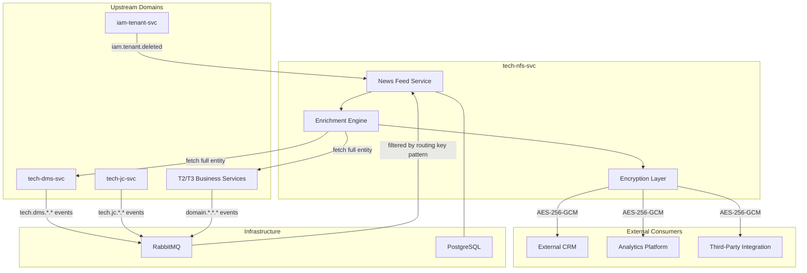
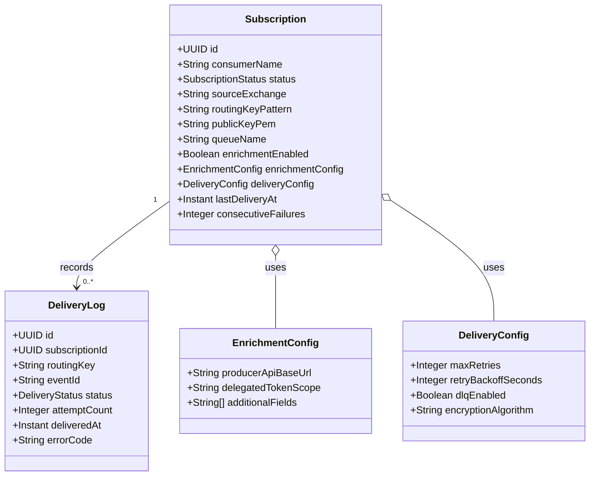
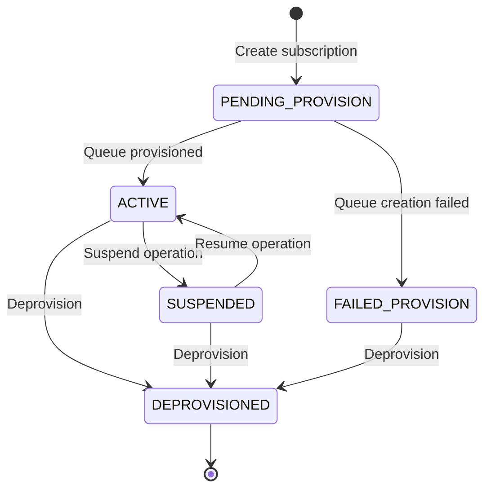
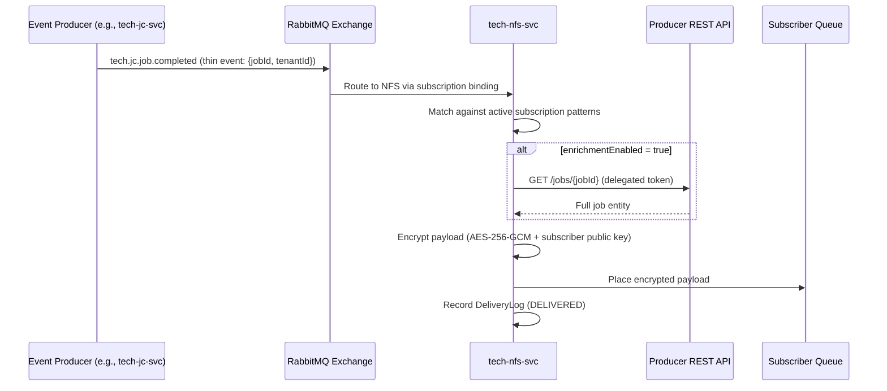
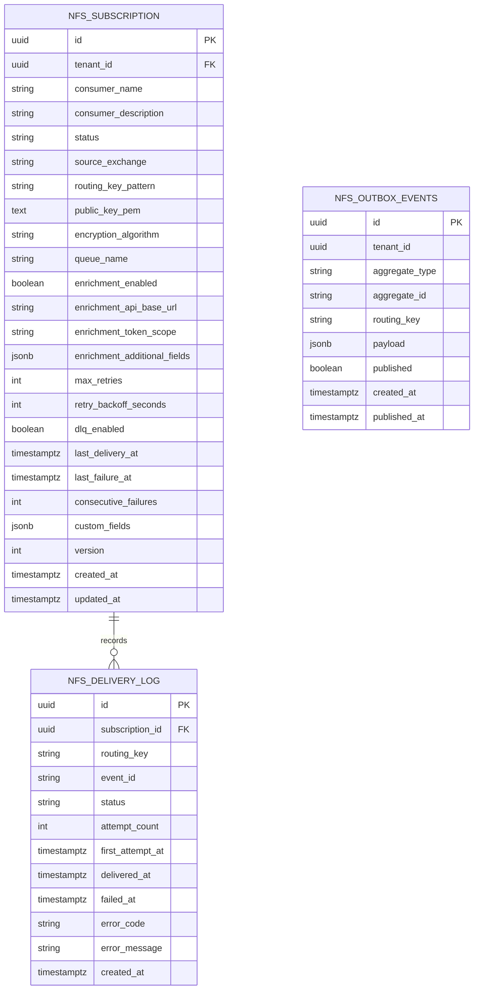

<!-- TEMPLATE COMPLIANCE: ~95%
Template: domain-service-spec.md v1.0.0
Present sections: §0–§15
Gaps: §5.3 process flow diagrams (stub only), §12.7 extension API endpoints (stub only)
-->

# tech.nfs — News Feed Service Domain Specification

> **Conceptual Stack Layer:** Domain / Service
> **Space:** Platform
> **Owner:** Platform Infrastructure Team
> **Schema alignment:** `service-layer.schema.json`
> **Companion files:** `contracts/http/tech/nfs/openapi.yaml`
> **Referenced by:** Platform-Feature Specs (F-TECH-004-xx), BFF Contract
> **Belongs to:** Tech Suite Spec (`spec/T1_Platform/tech/_tech_suite.md`)
>
> **Migration Note:** Derived from legacy prefix `t1`. API paths migrate from `/api/t1/nfs/v1`
> to `/api/tech/nfs/v1` per ADR-TECH-004. 6-month dual-prefix compatibility period.

> **Meta Information**
> - **Version:** 2026-04-03
> - **Template:** `domain-service-spec.md` v1.0.0
> - **Template Compliance:** ~95% — remaining gaps: §5.3 process flow diagrams (stub), §12.7 extension API endpoints (stub)
> - **Author(s):** OpenLeap Architecture Team
> - **Status:** DRAFT
> - **Suite:** `tech` (Technical Infrastructure)
> - **Domain:** `nfs` (News Feed / Event Distribution)
> - **Bounded Context Ref:** `bc:news-feed`
> - **Service ID:** `tech-nfs-svc`
> - **basePackage:** `io.openleap.tech.nfs`
> - **API Base Path:** `/api/tech/nfs/v1`
> - **Deprecated alias:** `/api/t1/nfs/v1` (ADR-TECH-004, 6-month transition)
> - **OpenLeap Starter Version:** `v3.0.0`
> - **Port:** `8097`
> - **Repository:** `https://github.com/openleap-io/io.openleap.tech.nfs`
> - **Tags:** `tech`, `nfs`, `platform`, `event`, `subscription`, `news-feed`
> - **Team:**
>   - Name: `team-tech`
>   - Email: `platform-infra@openleap.io`
>   - Slack: `#platform-infra`

> OPEN QUESTION: See Q-NFS-004 in §14.3 regarding the confirmed port assignment.

---

## Specification Guidelines Compliance

> ### Non-Negotiables
> - Never invent facts. If required info is missing, add an **OPEN QUESTION** entry.
> - Preserve intent and decisions. Only change meaning when explicitly requested.
> - Do not remove normative constraints unless they are explicitly replaced.
> - Keep the spec **self-contained**: no "see chat", no implicit context.
>
> ### Source of Truth Priority
> When sources conflict:
> 1. Spec (explicit) wins
> 2. Starter specs (implementation constraints) next
> 3. Guidelines (best practices) last
>
> Record conflicts in the **Decisions & Conflicts** section (see Section 14).
>
> ### Style Guide
> - Prefer short sentences and lists.
> - Use MUST/SHOULD/MAY for normative statements.
> - Keep terminology consistent (Aggregate, Domain Service, Application Service, Command, Event).
> - Avoid ambiguous words ("often", "maybe") unless explicitly noting uncertainty.
> - Keep examples minimal and clearly marked as examples.
> - Do not add implementation code unless the chapter explicitly requires it.

---

## 0. Document Purpose & Scope

### 0.1 Purpose

The News Feed Service (NFS) provides a secure, subscription-driven event distribution layer for the OpenLeap ERP platform. External consumers register subscriptions to receive internal domain events enriched with additional data and encrypted with the subscriber's public key. NFS decouples internal event production from external consumption, eliminating the need for every producer to manage individual subscriber connections, enrichment logic, or payload encryption.

### 0.2 Target Audience

- Platform Engineers maintaining the infrastructure-level event gateway
- Platform Infrastructure Team owning this service
- Domain Service Teams publishing events consumed by external parties
- Platform Administrators managing subscription lifecycle
- External Consumer Integration Teams setting up event delivery

### 0.3 Scope

**In Scope:**
- Subscription registration, management, and lifecycle (PENDING_PROVISION → ACTIVE → SUSPENDED → DEPROVISIONED)
- Per-subscription RabbitMQ queue provisioning
- Event enrichment: augmenting thin events with data fetched from the producer's API
- Payload encryption using the subscriber's public key (AES-256-GCM)
- Delivery log: tracking delivery attempts, status, and failures
- Dead Letter Queue (DLQ) management for failed deliveries
- GDPR tenant purge: delete all subscription data on `iam.tenant.deleted`
- Admin REST API for subscription management (F-TECH-004-01, F-TECH-004-02)

**Out of Scope:**
- Event production — NFS is a distribution service; it consumes events, not produces them
- Business-domain event schemas — owned by individual producer services
- Webhook delivery to HTTP endpoints — NFS uses RabbitMQ per-subscriber queues, not webhooks
- Internal event fanout to platform services — use RabbitMQ exchange bindings directly
- Notification delivery to end users (UI push) — separate concern

### 0.4 Related Documents

- `spec/T1_Platform/tech/_tech_suite.md` — Tech Suite Architecture Specification
- `spec/T1_Platform/iam/domain-specs/iam_tenant-spec.md` — Tenant Management (source of `iam.tenant.deleted`)
- `spec/T1_Platform/iam/domain-specs/iam_audit-spec.md` — Audit Service (potential consumer of subscription lifecycle events)
- `spec/T1_Platform/tech/domain-specs/tech_jc-spec.md` — Job Control Service (example event producer)
- `spec/T1_Platform/tech/domain-specs/tech_dms-spec.md` — Document Management Service (example event producer)
- `spec/T1_Platform/tech/features/leaves/F-TECH-004-01/feature-spec.md` — Browse Subscriptions
- `spec/T1_Platform/tech/features/leaves/F-TECH-004-02/feature-spec.md` — Manage Subscriptions
- `contracts/http/tech/nfs/openapi.yaml` — REST API contract

---

## 1. Business Context

### 1.1 Domain Purpose

The News Feed domain solves the **secure external event delivery problem** in a multi-tenant ERP. Every domain service in OpenLeap publishes thin internal events (per ADR-011) — these events carry only identifiers and change types, not full entity state. External consumers (third-party integrations, analytics platforms, CRM connectors) need enriched event data, delivered securely, without access to the internal RabbitMQ broker or database.

Without NFS, each producer would need to maintain its own subscriber list, implement enrichment logic, manage per-consumer encryption keys, handle retries and dead-letter handling, and expose authenticated enrichment endpoints per consumer. NFS centralizes this concern. Producers publish events once to their exchange; NFS handles all subscription routing, enrichment, encryption, and delivery reliability.

### 1.2 Business Value

- **Secure external delivery:** Payloads are encrypted with the subscriber's public key before delivery, ensuring only the intended consumer can read the content.
- **Enrichment without schema explosion:** Thin internal events remain lean; NFS enriches on behalf of subscribers using delegated tokens, so producers need not duplicate enrichment logic.
- **Centralized subscription management:** Platform administrators manage all external consumers in one place, with full visibility into delivery health.
- **Reliable delivery guarantees:** Built-in retry logic (configurable, default 3×), exponential backoff, and DLQ management minimize data loss on transient failures.
- **Tenant data isolation:** Subscriptions are tenant-scoped; no cross-tenant event delivery is possible.
- **SAP parity:** Replaces SAP Business Workflow notification dispatch and BAdI event exits as the platform's external event fan-out mechanism.

### 1.3 Key Stakeholders

| Role | Responsibility | Primary Use Cases |
|------|----------------|-------------------|
| Platform Infrastructure Team | Owns and operates NFS; manages subscription provisioning | All operational concerns |
| Platform Administrator | Registers and manages external subscriber configurations | UC-NFS-001 through UC-NFS-008 |
| External Consumer Integration Team | Consumes events from per-subscription RabbitMQ queues | Downstream — not directly using the API |
| Domain Service Team (producer) | Publishes events to exchange; consumed transparently by NFS | No direct NFS interaction required |
| Compliance / Audit | Reviews subscription configurations and delivery trails | UC-NFS-009 |

### 1.4 Strategic Positioning

The News Feed Service is a **T1 Platform Foundation** service (ADR-001, four-tier layering). It depends only on platform infrastructure (PostgreSQL, RabbitMQ) and the IAM suite for tenant context. Business domains (T2–T4) need not interact with NFS directly — they publish events to their exchange, and NFS handles the rest. NFS has no dependency on any T2–T4 business service.

NFS occupies the architectural niche of a **secure event gateway** — analogous to enterprise service bus connectors or event broker adapters, but purpose-built for the OpenLeap multi-tenant model with per-tenant isolation and field-level encryption.

### 1.5 Service Context

| Property | Value |
|----------|-------|
| **Suite** | `tech` |
| **Domain** | `nfs` |
| **Bounded Context** | `bc:news-feed` |
| **Service ID** | `tech-nfs-svc` |
| **Base Package** | `io.openleap.tech.nfs` |

**Responsibilities:**
- Accept and validate subscription registrations from platform administrators
- Provision dedicated RabbitMQ queues per subscription
- Consume internal domain events matching subscription routing key patterns
- Enrich event payloads by calling the producer's API with delegated tokens (when enabled)
- Encrypt enriched payload with the subscriber's public key (AES-256-GCM)
- Deliver encrypted events to the subscriber's dedicated queue
- Track delivery history per subscription (attempt count, status, timestamps)
- Manage DLQ for failed deliveries
- Enforce per-tenant data isolation (PostgreSQL RLS)
- Purge all subscription and delivery data on `iam.tenant.deleted`

**Authoritative Sources:**
| Source Type | Description | Access Pattern |
|-------------|-------------|----------------|
| REST API | Subscription CRUD, lifecycle operations, delivery history | Synchronous |
| Database | All Subscription and DeliveryLog records | Direct (owner) |
| Events | Consumes `iam.tenant.deleted`; forwards (not produces) other domain events | Asynchronous |



---

## 2. Service Identity

| Property | Value | Schema Field |
|----------|-------|-------------|
| **Service ID** | `tech-nfs-svc` | `metadata.id` |
| **Display Name** | `News Feed Service` | `metadata.name` |
| **Suite** | `tech` | `metadata.suite` |
| **Domain** | `nfs` | `metadata.domain` |
| **Bounded Context** | `bc:news-feed` | `metadata.bounded_context_ref` |
| **Version** | `1.0.0` | `metadata.version` |
| **Status** | DRAFT | `metadata.status` |
| **API Base Path** | `/api/tech/nfs/v1` | `metadata.api_base_path` |
| **Repository** | `https://github.com/openleap-io/io.openleap.tech.nfs` | `metadata.repository` |
| **Tags** | `tech`, `nfs`, `platform`, `event`, `subscription` | `metadata.tags` |

**Team:**
| Property | Value |
|----------|-------|
| **Name** | `team-tech` |
| **Email** | `platform-infra@openleap.io` |
| **Slack Channel** | `#platform-infra` |

---

## 3. Domain Model

### 3.1 Conceptual Overview

The News Feed domain has one primary aggregate: **Subscription**. A Subscription represents a registered external consumer's intent to receive events from one or more internal event sources. It carries all configuration needed to provision a dedicated RabbitMQ queue, optionally enrich event payloads with additional data, and encrypt the delivery using the subscriber's public key.

Each Subscription has a collection of **DeliveryLog** child entities that record individual event delivery attempts — their routing key, attempt count, final status (DELIVERED / FAILED / DLQ), and timestamps.

Two value objects capture enrichment configuration (**EnrichmentConfig**) and delivery reliability settings (**DeliveryConfig**).

### 3.2 Core Concepts



### 3.3 Aggregate Definitions

#### 3.3.1 Subscription

| Property | Value |
|----------|-------|
| **Aggregate ID** | `agg:subscription` |
| **Name** | `Subscription` |

**Business Purpose:**
Represents an external consumer's registration to receive enriched, encrypted domain events from a specified internal exchange. Each Subscription owns a dedicated RabbitMQ queue, a public key for payload encryption, and optional enrichment configuration that controls how thin events are augmented before delivery.

##### Aggregate Root

**Key Attributes:**
| Attribute | Type | Format | Description | Constraints | Required | Read-Only |
|-----------|------|--------|-------------|-------------|----------|-----------|
| id | string | uuid | Unique system identifier. Generated by `OlUuid.create()`. | Immutable | Yes | Yes |
| tenantId | string | uuid | Tenant ownership for RLS enforcement. | Immutable | Yes | Yes |
| consumerName | string | — | Unique human-readable name identifying the external consumer (e.g., `acme-crm-connector`). | Pattern: `^[a-z0-9-]+$`, max 128 chars; unique per tenant | Yes | No |
| consumerDescription | string | — | Free-text description of the consumer's purpose. | max 2000 chars | No | No |
| status | string | — | Current lifecycle state. | enum_ref: `SubscriptionStatus` | Yes | Yes |
| sourceExchange | string | — | RabbitMQ exchange name to subscribe to (e.g., `tech.jc.events`). | max 255 chars; must match known exchange pattern | Yes | No |
| routingKeyPattern | string | — | AMQP routing key pattern with wildcards (e.g., `tech.jc.job.*`). Use `#` for all events on an exchange. | max 512 chars | Yes | No |
| publicKeyPem | string | — | PEM-encoded RSA-4096 or EC-P384 public key used to encrypt AES session key before delivery. | Valid PEM format; min 2048-bit RSA | Yes | No |
| encryptionAlgorithm | string | — | Payload encryption algorithm. | enum_ref: `EncryptionAlgorithm`; default: `AES_256_GCM` | Yes | No |
| queueName | string | — | Auto-generated dedicated RabbitMQ queue name (e.g., `nfs.sub.{uuid}`). Set during provisioning. | System-assigned; immutable after provisioning | No | Yes |
| enrichmentEnabled | boolean | — | Whether to enrich thin events before delivery. | default: `false` | Yes | No |
| enrichmentApiBaseUrl | string | uri | Base URL of the producer's enrichment API. Required when `enrichmentEnabled=true`. | max 2048 chars | No | No |
| enrichmentDelegatedTokenScope | string | — | OAuth2 scope for the delegated token used to call the enrichment API. | max 512 chars | No | No |
| enrichmentAdditionalFields | array | — | List of additional field names to fetch from the enrichment API response. | max 50 items | No | No |
| maxRetries | integer | int32 | Maximum delivery retry attempts before moving to DLQ. | min: 0, max: 10; default: 3 | Yes | No |
| retryBackoffSeconds | integer | int32 | Exponential backoff base in seconds between retries. | min: 10, max: 3600; default: 60 | Yes | No |
| dlqEnabled | boolean | — | Whether failed deliveries are moved to a Dead Letter Queue. | default: `true` | Yes | No |
| lastDeliveryAt | string | date-time | Timestamp of the most recent successful delivery. | Null until first delivery | No | Yes |
| lastFailureAt | string | date-time | Timestamp of the most recent delivery failure. | Null until first failure | No | Yes |
| consecutiveFailures | integer | int32 | Count of consecutive delivery failures. Reset to 0 on successful delivery. | min: 0; default: 0 | Yes | Yes |
| version | integer | int32 | Optimistic locking version counter. | min: 0 | Yes | Yes |
| createdAt | string | date-time | Record creation timestamp. | — | Yes | Yes |
| updatedAt | string | date-time | Record last-modification timestamp. | — | Yes | Yes |
| customFields | object | — | Tenant-defined extension fields (JSONB). | max 50 keys | No | No |

**Lifecycle States:**

| Property | Value |
|----------|-------|
| **Initial State** | `PENDING_PROVISION` |
| **Terminal States** | `DEPROVISIONED` |



**State Descriptions:**
| State | Description | Business Meaning |
|-------|-------------|------------------|
| `PENDING_PROVISION` | Subscription record created; queue being provisioned | Transitional state; no events delivered yet |
| `ACTIVE` | Queue provisioned; events are actively being received and forwarded | Fully operational |
| `SUSPENDED` | Delivery paused; queue exists but events are not forwarded | Temporary halt; queue messages may accumulate |
| `FAILED_PROVISION` | Queue provisioning failed due to infrastructure error | Requires platform intervention; see Q-NFS-001 |
| `DEPROVISIONED` | Queue removed; subscription permanently closed | Terminal state; historical record retained |

**Allowed Transitions:**
| From State | To State | Trigger | Guard / Business Preconditions |
|------------|----------|---------|-------------------------------|
| — | `PENDING_PROVISION` | `POST /subscriptions` | consumerName unique per tenant; valid public key |
| `PENDING_PROVISION` | `ACTIVE` | Internal: queue provisioning succeeded | — |
| `PENDING_PROVISION` | `FAILED_PROVISION` | Internal: queue provisioning failed | — |
| `ACTIVE` | `SUSPENDED` | `POST /subscriptions/{id}:suspend` | Subscription must be ACTIVE |
| `SUSPENDED` | `ACTIVE` | `POST /subscriptions/{id}:resume` | Subscription must be SUSPENDED |
| `ACTIVE` or `SUSPENDED` or `FAILED_PROVISION` | `DEPROVISIONED` | `DELETE /subscriptions/{id}` | No guard; deprovisioning always allowed |

**Invariants:**
| Rule ID | Description |
|---------|-------------|
| BR-NFS-001 | Consumer name must be unique per tenant |
| BR-NFS-002 | A valid RSA-4096 or EC-P384 public key MUST be supplied at creation |
| BR-NFS-003 | Enrichment API base URL MUST be set when `enrichmentEnabled=true` |
| BR-NFS-004 | A DEPROVISIONED subscription cannot be reactivated |
| BR-NFS-005 | Routing key pattern must be a valid AMQP pattern (only `.`, `*`, `#` wildcards) |

**Domain Events Emitted:**

> **Design decision:** Per the Tech Suite Spec (§5.4), NFS does not publish domain events to the platform exchange. Subscription lifecycle changes (created, suspended, deprovisioned) are recorded in the audit trail via the outbox but are NOT published as platform events. See Q-NFS-003 for the open question on audit event publishing.

---

##### Child Entities

###### Entity: DeliveryLog

| Property | Value |
|----------|-------|
| **Entity ID** | `ent:delivery-log` |
| **Name** | `DeliveryLog` |
| **Relationship to Root** | one_to_many |

**Business Purpose:**
Records individual event delivery attempts for a Subscription. Each entry captures the original event's routing key and event ID, the delivery outcome (DELIVERED, FAILED, DLQ), the number of attempts made, and timestamps. Used for operational monitoring, SLA reporting, and failure investigation.

**Attributes:**
| Attribute | Type | Format | Description | Constraints | Required |
|-----------|------|--------|-------------|-------------|----------|
| id | string | uuid | Unique identifier. Generated by `OlUuid.create()`. | Immutable | Yes |
| subscriptionId | string | uuid | Parent subscription reference. | FK: Subscription.id | Yes |
| routingKey | string | — | AMQP routing key of the original event (e.g., `tech.jc.job.completed`). | max 512 chars | Yes |
| eventId | string | uuid | Original event envelope `eventId` from the producer. | — | Yes |
| status | string | — | Final delivery outcome. | enum_ref: `DeliveryStatus` | Yes |
| attemptCount | integer | int32 | Number of delivery attempts made. | min: 1 | Yes |
| firstAttemptAt | string | date-time | Timestamp of the first delivery attempt. | — | Yes |
| deliveredAt | string | date-time | Timestamp of successful delivery. Null if not yet delivered. | — | No |
| failedAt | string | date-time | Timestamp of final failure or DLQ move. Null if not failed. | — | No |
| errorCode | string | — | Machine-readable error code on failure (e.g., `ENCRYPTION_FAILED`, `QUEUE_UNAVAILABLE`). | max 64 chars | No |
| errorMessage | string | — | Human-readable error description. | max 2000 chars | No |
| createdAt | string | date-time | Record creation timestamp. | — | Yes |

**Collection Constraints:**
- Minimum items: 0 (no deliveries until first event matches)
- Maximum items: Unbounded (retention policy applies — see §8.3)

**Invariants:**
| Rule ID | Description |
|---------|-------------|
| BR-NFS-006 | A DeliveryLog entry MUST be created for every delivery attempt |
| BR-NFS-007 | `deliveredAt` MUST be set when status is `DELIVERED`; `failedAt` MUST be set when status is `DLQ` or `FAILED` |

---

##### Value Objects

###### Value Object: EnrichmentConfig

| Property | Value |
|----------|-------|
| **VO ID** | `vo:enrichment-config` |
| **Name** | `EnrichmentConfig` |

**Description:**
Encapsulates the configuration for augmenting thin events with additional data fetched from the producer's API. Used only when `enrichmentEnabled=true` on the Subscription. The enrichment call is made with a delegated OAuth2 token scoped to the specified scope, using the event's `entityIds` to resolve the full entity state.

**Attributes:**
| Attribute | Type | Format | Description | Constraints |
|-----------|------|--------|-------------|-------------|
| producerApiBaseUrl | string | uri | Base URL of the event producer's API (e.g., `https://jc-svc.internal/api/tech/jc/v1`). | max 2048 chars |
| delegatedTokenScope | string | — | OAuth2 scope string for the delegated token (e.g., `openleap.tech.jc.read`). | max 512 chars |
| additionalFields | array | — | Specific field names to extract from the producer API response. Empty array means full entity. | max 50 items |
| timeoutSeconds | integer | int32 | Maximum seconds to wait for the enrichment API response. | min: 1, max: 30; default: 10 |

**Validation Rules:**
- `producerApiBaseUrl` MUST be a valid HTTPS URL (HTTP not permitted in production)
- `delegatedTokenScope` MUST be non-empty when enrichment is enabled
- `additionalFields` values MUST be valid camelCase field names (pattern: `^[a-zA-Z][a-zA-Z0-9]*$`)

---

###### Value Object: DeliveryConfig

| Property | Value |
|----------|-------|
| **VO ID** | `vo:delivery-config` |
| **Name** | `DeliveryConfig` |

**Description:**
Encapsulates reliability and encryption settings for event delivery. Controls retry behaviour, DLQ enablement, and the encryption algorithm used for payload encryption.

**Attributes:**
| Attribute | Type | Format | Description | Constraints |
|-----------|------|--------|-------------|-------------|
| maxRetries | integer | int32 | Maximum retry attempts. | min: 0, max: 10; default: 3 |
| retryBackoffSeconds | integer | int32 | Exponential backoff base. | min: 10, max: 3600; default: 60 |
| dlqEnabled | boolean | — | Whether to move failed deliveries to DLQ. | default: `true` |
| encryptionAlgorithm | string | — | Algorithm for payload encryption. | enum_ref: `EncryptionAlgorithm` |

**Validation Rules:**
- `maxRetries` × `retryBackoffSeconds` MUST NOT exceed 24 hours total retry window
- `dlqEnabled=false` MUST be explicitly acknowledged (failure without DLQ means silent loss)

---

### 3.4 Enumerations

#### SubscriptionStatus

**Description:** Lifecycle state of a News Feed Subscription.

| Value | Description | Deprecated |
|-------|-------------|------------|
| `PENDING_PROVISION` | Subscription record created; dedicated queue is being provisioned in RabbitMQ | No |
| `ACTIVE` | Queue provisioned; events matching the routing key pattern are actively being delivered | No |
| `SUSPENDED` | Delivery paused by a platform administrator; queue exists and events accumulate | No |
| `FAILED_PROVISION` | Queue provisioning failed due to a RabbitMQ infrastructure error; requires manual intervention | No |
| `DEPROVISIONED` | Subscription permanently closed; queue has been removed; no further delivery possible | No |

#### DeliveryStatus

**Description:** Outcome of a single event delivery attempt lifecycle.

| Value | Description | Deprecated |
|-------|-------------|------------|
| `DELIVERED` | Event was successfully placed on the subscriber's dedicated queue | No |
| `RETRY` | Delivery failed; a retry is scheduled per the backoff policy | No |
| `DLQ` | All retry attempts exhausted; event moved to the Dead Letter Queue | No |
| `FAILED` | Delivery failed permanently with no DLQ configured (`dlqEnabled=false`) | No |
| `SKIPPED` | Subscription was SUSPENDED at delivery time; event not forwarded | No |

#### EncryptionAlgorithm

**Description:** Supported payload encryption algorithms.

| Value | Description | Deprecated |
|-------|-------------|------------|
| `AES_256_GCM` | AES-256-GCM symmetric encryption; session key wrapped with subscriber's RSA/EC public key | No |
| `NONE` | No encryption; for use only in development/test environments | No |

> **Note:** `NONE` MUST NOT be used in production tenants. See BR-NFS-008.

---

### 3.5 Shared Types

No shared types are exported by this service. `tenantId` (UUID) is consumed from the IAM suite as a shared kernel type.

---

## 4. Business Rules & Constraints

### 4.1 Business Rules Catalog

| ID | Rule Name | Description | Scope | Enforcement | Error Code |
|----|-----------|-------------|-------|-------------|------------|
| BR-NFS-001 | Unique Consumer Name | Consumer name must be unique within a tenant | Subscription | Create | `NFS_CONSUMER_NAME_DUPLICATE` |
| BR-NFS-002 | Valid Public Key | Public key must be a valid RSA-4096 or EC-P384 PEM | Subscription | Create, Key Rotation | `NFS_INVALID_PUBLIC_KEY` |
| BR-NFS-003 | Enrichment API Required | Enrichment API base URL required when enrichment enabled | Subscription | Create, Update | `NFS_ENRICHMENT_API_REQUIRED` |
| BR-NFS-004 | No Reactivation After Deprovision | A deprovisioned subscription cannot transition to any other state | Subscription | All lifecycle ops | `NFS_SUBSCRIPTION_DEPROVISIONED` |
| BR-NFS-005 | Valid Routing Key Pattern | Pattern must be a valid AMQP pattern | Subscription | Create, Update | `NFS_INVALID_ROUTING_KEY` |
| BR-NFS-006 | Delivery Log Required | Every delivery attempt must produce a DeliveryLog entry | DeliveryLog | Internal delivery process | `NFS_DELIVERY_LOG_MISSING` |
| BR-NFS-007 | Delivery Log Timestamps | Status-correlated timestamps must be set | DeliveryLog | Internal delivery process | `NFS_DELIVERY_LOG_INVALID` |
| BR-NFS-008 | No Production NONE Encryption | `NONE` encryption algorithm MUST NOT be used for production tenants | Subscription | Create, Update | `NFS_ENCRYPTION_REQUIRED` |
| BR-NFS-009 | Suspend Requires Active | Only ACTIVE subscriptions can be suspended | Subscription | Suspend operation | `NFS_SUBSCRIPTION_NOT_ACTIVE` |
| BR-NFS-010 | Resume Requires Suspended | Only SUSPENDED subscriptions can be resumed | Subscription | Resume operation | `NFS_SUBSCRIPTION_NOT_SUSPENDED` |

### 4.2 Detailed Rule Definitions

#### BR-NFS-001: Unique Consumer Name

**Business Context:**
Platform administrators need to uniquely identify external consumers by a stable, human-readable slug. Duplicate names would cause confusion in dashboards and delivery reports, and could lead to accidental queue misrouting.

**Rule Statement:**
Within a given tenant, no two active (non-DEPROVISIONED) subscriptions may share the same `consumerName`.

**Applies To:**
- Aggregate: Subscription
- Operations: Create

**Enforcement:**
Unique constraint on `(tenant_id, consumer_name)` in the database, excluding `DEPROVISIONED` records via partial index. Application-level check before insert to return a meaningful error.

**Validation Logic:**
Before inserting a new Subscription, query for an existing Subscription with the same `tenant_id` and `consumer_name` that is not `DEPROVISIONED`. If found, reject.

**Error Handling:**
- **Error Code:** `NFS_CONSUMER_NAME_DUPLICATE`
- **Error Message:** "A subscription with consumer name '{consumerName}' already exists for this tenant."
- **User action:** Choose a different consumer name or deprovision the existing subscription first.

**Examples:**
- **Valid:** First subscription with `consumerName: acme-crm`
- **Invalid:** Second subscription with `consumerName: acme-crm` while the first is ACTIVE

---

#### BR-NFS-002: Valid Public Key

**Business Context:**
Payload encryption depends entirely on a valid subscriber public key. An invalid or weak key would either cause runtime encryption failures or result in deliverable-but-unreadable payloads, both of which break the subscriber's integration.

**Rule Statement:**
The `publicKeyPem` must contain a valid RSA key of at least 2048 bits (recommended 4096) or an EC key using P-384 or P-521 curve. The key must be a public key, not a private key.

**Applies To:**
- Aggregate: Subscription
- Operations: Create, Key Rotation (POST /subscriptions/{id}:rotateKey)

**Enforcement:**
Application-layer PEM parsing and validation during request processing. Database stores the PEM string only after validation passes.

**Validation Logic:**
Parse the PEM block. Verify: (a) it is a PUBLIC KEY or RSA PUBLIC KEY, (b) RSA keys have key size ≥ 2048 bits, (c) EC keys use P-384 or P-521 named curve.

**Error Handling:**
- **Error Code:** `NFS_INVALID_PUBLIC_KEY`
- **Error Message:** "The provided public key is invalid or uses an unsupported algorithm. Supported: RSA-2048+, EC-P384, EC-P521."
- **User action:** Provide a valid PEM-encoded public key from a supported algorithm.

**Examples:**
- **Valid:** PEM block starting with `-----BEGIN PUBLIC KEY-----` wrapping an RSA-4096 key
- **Invalid:** A private key PEM, an RSA-1024 key, or a malformed PEM block

---

#### BR-NFS-003: Enrichment API Required

**Business Context:**
If enrichment is enabled, NFS must call an external API to augment the thin event. Without a configured API URL, the enrichment step fails at runtime for every event, causing all deliveries to be retried and eventually DLQ'd.

**Rule Statement:**
When `enrichmentEnabled=true`, `enrichmentApiBaseUrl` MUST be a valid HTTPS URL and `enrichmentDelegatedTokenScope` MUST be non-empty.

**Applies To:**
- Aggregate: Subscription
- Operations: Create, Update

**Enforcement:**
Application-layer cross-field validation during request processing.

**Validation Logic:**
If `enrichmentEnabled=true`: verify `enrichmentApiBaseUrl` is non-null, is a valid HTTPS URL, and `enrichmentDelegatedTokenScope` is non-null and non-empty.

**Error Handling:**
- **Error Code:** `NFS_ENRICHMENT_API_REQUIRED`
- **Error Message:** "Enrichment is enabled but no API base URL or token scope is configured."
- **User action:** Provide `enrichmentApiBaseUrl` and `enrichmentDelegatedTokenScope`, or set `enrichmentEnabled=false`.

---

#### BR-NFS-004: No Reactivation After Deprovision

**Business Context:**
Deprovisioning removes the RabbitMQ queue. Attempting to deliver events to a non-existent queue would cause infrastructure errors. Deprovisioning is an intentional, terminal action.

**Rule Statement:**
A Subscription in `DEPROVISIONED` state cannot transition to any other state. Any lifecycle operation on a DEPROVISIONED subscription MUST be rejected.

**Applies To:**
- Aggregate: Subscription
- Operations: Suspend, Resume, Key Rotation, Update

**Enforcement:**
Application-layer state guard before any mutation command.

**Error Handling:**
- **Error Code:** `NFS_SUBSCRIPTION_DEPROVISIONED`
- **Error Message:** "Subscription '{id}' is deprovisioned and cannot be modified."
- **User action:** Create a new subscription if re-connection is needed.

---

#### BR-NFS-005: Valid Routing Key Pattern

**Business Context:**
An invalid routing key pattern would either match no events (silent delivery failure) or cause RabbitMQ binding errors during provisioning.

**Rule Statement:**
`routingKeyPattern` must be a valid AMQP 0-9-1 topic routing key pattern. It may contain word characters (`[a-zA-Z0-9_]`), dots (`.`), single-word wildcards (`*`), and multi-word wildcards (`#`). `#` MUST appear only as the last segment.

**Applies To:**
- Aggregate: Subscription
- Operations: Create, Update

**Enforcement:**
Regex validation: `^[a-zA-Z0-9_*]+(\\.[a-zA-Z0-9_*]+)*(\\.[#])?$|^#$`

**Error Handling:**
- **Error Code:** `NFS_INVALID_ROUTING_KEY`
- **Error Message:** "Routing key pattern '{pattern}' is not a valid AMQP topic pattern."
- **User action:** Use only alphanumeric segments separated by dots; `*` matches one segment, `#` matches zero or more trailing segments.

**Examples:**
- **Valid:** `tech.jc.job.*`, `tech.dms.document.#`, `#`
- **Invalid:** `tech..job.*`, `tech.jc.*.job.#`, `tech.jc.job.##`

---

#### BR-NFS-008: No Production NONE Encryption

**Business Context:**
Unencrypted event payloads in production could expose sensitive business data to unauthorized parties with queue access. Encryption is a non-negotiable security requirement for production tenants.

**Rule Statement:**
The `encryptionAlgorithm` MUST NOT be set to `NONE` for production tenants. Only development and test tenant classes may use `NONE`.

**Applies To:**
- Aggregate: Subscription
- Operations: Create, Update

**Enforcement:**
Application-layer check: if tenant class is `PRODUCTION`, reject `encryptionAlgorithm=NONE`.

> OPEN QUESTION: See Q-NFS-006 in §14.3 — tenant class classification mechanism.

**Error Handling:**
- **Error Code:** `NFS_ENCRYPTION_REQUIRED`
- **Error Message:** "Encryption algorithm NONE is not permitted for production tenants."
- **User action:** Use `AES_256_GCM` and provide a valid public key.

---

### 4.3 Data Validation Rules

**Field-Level Validations:**

| Field | Validation Rule | Error Message |
|-------|----------------|---------------|
| consumerName | Required; Pattern: `^[a-z0-9-]+$`; max 128 chars | "Consumer name is required and must be lowercase alphanumeric with hyphens, max 128 chars." |
| sourceExchange | Required; max 255 chars; non-empty | "Source exchange is required." |
| routingKeyPattern | Required; valid AMQP pattern; max 512 chars | "Routing key pattern is required and must be a valid AMQP topic pattern." |
| publicKeyPem | Required; valid PEM; RSA ≥ 2048 or EC P-384/P-521 | "A valid public key in PEM format is required." |
| encryptionAlgorithm | Required; must be in `EncryptionAlgorithm` enum | "Unsupported encryption algorithm." |
| maxRetries | Must be between 0 and 10 | "maxRetries must be between 0 and 10." |
| retryBackoffSeconds | Must be between 10 and 3600 | "retryBackoffSeconds must be between 10 and 3600." |
| enrichmentApiBaseUrl | Must be a valid HTTPS URL when set | "Enrichment API base URL must be a valid HTTPS URL." |

**Cross-Field Validations:**
- When `enrichmentEnabled=true`, both `enrichmentApiBaseUrl` and `enrichmentDelegatedTokenScope` MUST be present (BR-NFS-003)
- `maxRetries × retryBackoffSeconds` MUST be ≤ 86400 seconds (24 hours)
- `encryptionAlgorithm=NONE` requires `publicKeyPem` to be absent or null

### 4.4 Reference Data Dependencies

| Catalog | Source Service | Fields Referencing | Validation |
|---------|----------------|-------------------|------------|
| Tenant class | `iam-tenant-svc` | `tenantId` (for production check in BR-NFS-008) | On create/update |
| Exchange catalog | Platform config | `sourceExchange` | On create (OPEN QUESTION: See Q-NFS-007) |

---

## 5. Use Cases

### 5.1 Business Logic Placement

| Logic Type | Placement | Examples |
|------------|-----------|----------|
| Aggregate invariants | Domain Object (Subscription) | Unique consumer name, valid public key, routing key pattern |
| State machine transitions | Domain Object (Subscription) | PENDING_PROVISION → ACTIVE, ACTIVE → SUSPENDED |
| Cross-aggregate delivery logic | Domain Service (EventDeliveryService) | Enrichment, encryption, queue dispatch |
| Orchestration & transactions | Application Service (SubscriptionAppService) | Create subscription + provision queue + persist outbox |

### 5.2 Use Cases

| ID | Name | Type | Actor | Trigger | Description |
|----|------|------|-------|---------|-------------|
| UC-NFS-001 | Create Subscription | WRITE | Platform Administrator | REST POST | Register a new external consumer subscription |
| UC-NFS-002 | List Subscriptions | READ | Platform Administrator | REST GET | Browse all subscriptions for the current tenant |
| UC-NFS-003 | Get Subscription Detail | READ | Platform Administrator | REST GET | Retrieve a single subscription's full configuration and status |
| UC-NFS-004 | Update Subscription | WRITE | Platform Administrator | REST PUT | Update subscription configuration (enrichment, delivery settings) |
| UC-NFS-005 | Suspend Subscription | WRITE | Platform Administrator | REST POST (action) | Pause event delivery for an active subscription |
| UC-NFS-006 | Resume Subscription | WRITE | Platform Administrator | REST POST (action) | Re-enable event delivery for a suspended subscription |
| UC-NFS-007 | Deprovision Subscription | WRITE | Platform Administrator | REST DELETE | Permanently close a subscription and remove its queue |
| UC-NFS-008 | Rotate Public Key | WRITE | Platform Administrator | REST POST (action) | Replace the subscriber's public key without disrupting delivery |
| UC-NFS-009 | List Delivery History | READ | Platform Administrator | REST GET | Browse delivery log entries for a subscription |

---

#### UC-NFS-001: Create Subscription

**Actor:** Platform Administrator

**Preconditions:**
- Administrator is authenticated with `ROLE_PLATFORM_ADMIN`
- `consumerName` is unique within the tenant
- `publicKeyPem` is a valid RSA/EC public key

**Main Flow:**
1. Administrator submits POST `/subscriptions` with consumer configuration
2. System validates all fields (BR-NFS-001 through BR-NFS-005, BR-NFS-008)
3. System creates Subscription record in `PENDING_PROVISION` state
4. System triggers asynchronous RabbitMQ queue provisioning
5. On successful provisioning: Subscription transitions to `ACTIVE`; `queueName` is set
6. System returns 201 Created with the subscription resource

**Postconditions:**
- Subscription is persisted in `PENDING_PROVISION` (transitioning to `ACTIVE`)
- Dedicated RabbitMQ queue `nfs.sub.{id}` is provisioned and bound to the source exchange

**Business Rules Applied:**
- BR-NFS-001: Unique consumer name
- BR-NFS-002: Valid public key
- BR-NFS-003: Enrichment API required if enabled
- BR-NFS-005: Valid routing key pattern
- BR-NFS-008: No NONE encryption in production

**Alternative Flows:**
- **Alt-1:** If `enrichmentEnabled=true` and enrichment API URL is missing, return 422 with `NFS_ENRICHMENT_API_REQUIRED`

**Exception Flows:**
- **Exc-1:** If RabbitMQ provisioning fails, status transitions to `FAILED_PROVISION`; administrator must retry or contact platform team

---

#### UC-NFS-005: Suspend Subscription

**Actor:** Platform Administrator

**Preconditions:**
- Subscription exists and is in `ACTIVE` state
- Administrator is authenticated with `ROLE_PLATFORM_ADMIN`

**Main Flow:**
1. Administrator submits POST `/subscriptions/{id}:suspend`
2. System validates subscription is in `ACTIVE` state (BR-NFS-009)
3. System transitions Subscription to `SUSPENDED`
4. RabbitMQ binding is deactivated; events matching the pattern are no longer forwarded

**Postconditions:**
- Subscription is in `SUSPENDED` state
- No further events are delivered until resumed
- Queue persists; any accumulated messages remain

**Business Rules Applied:**
- BR-NFS-009: Suspend requires ACTIVE state
- BR-NFS-004: DEPROVISIONED subscription guard

**Exception Flows:**
- **Exc-1:** If subscription is DEPROVISIONED, return 409 with `NFS_SUBSCRIPTION_DEPROVISIONED`

---

#### UC-NFS-008: Rotate Public Key

**Actor:** Platform Administrator

**Preconditions:**
- Subscription exists and is not `DEPROVISIONED`
- New public key is valid (BR-NFS-002)

**Main Flow:**
1. Administrator submits POST `/subscriptions/{id}:rotateKey` with `newPublicKeyPem`
2. System validates the new key is valid PEM (BR-NFS-002)
3. System updates `publicKeyPem` on the Subscription
4. All subsequent deliveries use the new key
5. In-flight deliveries encrypted with the old key are not affected

**Postconditions:**
- Subscription's `publicKeyPem` is updated
- All new event deliveries use the new encryption key

**Business Rules Applied:**
- BR-NFS-002: Valid public key
- BR-NFS-004: DEPROVISIONED guard

> OPEN QUESTION: See Q-NFS-008 in §14.3 — dual-key transition window during rotation.

---

### 5.3 Process Flow Diagrams

> **STUB:** Full sequence diagrams to be added in a subsequent spec revision. Key flows to document:
> - Subscription creation and queue provisioning (happy path + failure path)
> - Event delivery pipeline (receive → enrich → encrypt → deliver)
> - Key rotation with in-flight event handling

### 5.4 Cross-Domain Workflows

#### Workflow: GDPR Tenant Purge

**Pattern:** Choreography (ADR-029)

**Participating Services:**
| Service | Role |
|---------|------|
| `iam-tenant-svc` | Publisher of `iam.tenant.deleted` |
| `tech-nfs-svc` | Consumer — purges all subscriptions and delivery logs for the deleted tenant |

**Trigger:** `iam.tenant.deleted` event received on queue `tech.nfs.in.iam.tenant.events`

**Workflow Steps:**
1. `iam-tenant-svc` publishes `iam.tenant.deleted` with `{ tenantId, requestedBy }`
2. NFS receives event; validates `tenantId`
3. NFS soft-deletes all Subscription records for the tenant
4. NFS removes all dedicated RabbitMQ queues for the tenant's subscriptions
5. NFS deletes all DeliveryLog records for the tenant
6. NFS acknowledges the message

**Failure Path:** If queue removal fails, NFS logs a dead-letter event and platform team is notified. Subscription records are soft-deleted regardless to prevent further use.

**Business Implications:**
- All external event delivery for the tenant ceases immediately
- Subscribers lose access to their dedicated queues
- Delivery history is purged in compliance with GDPR right to erasure

---

## 6. REST API

### 6.1 API Overview

| Aspect | Value |
|--------|-------|
| **Base Path** | `/api/tech/nfs/v1` |
| **Auth** | Bearer JWT (IAM-issued) |
| **Content-Type** | `application/json` |
| **Versioning** | URI path versioning (`/v1`) |
| **Pagination** | Cursor-based; `?page=0&size=25` |
| **Error Format** | RFC 7807 Problem Details |
| **Idempotency** | Write endpoints accept `Idempotency-Key` header |

### 6.2 Resource Operations

#### 6.2.1 Subscriptions — List

```http
GET /api/tech/nfs/v1/subscriptions?page=0&size=25&status=ACTIVE
Authorization: Bearer {token}
```

**Query Parameters:**
| Parameter | Type | Required | Description |
|-----------|------|----------|-------------|
| page | integer | No | Page number (0-based); default 0 |
| size | integer | No | Page size; default 25; max 100 |
| status | string | No | Filter by SubscriptionStatus |
| consumerName | string | No | Filter by consumer name (prefix match) |

**Success Response:** `200 OK`
```json
{
  "content": [
    {
      "id": "f47ac10b-58cc-4372-a567-0e02b2c3d479",
      "consumerName": "acme-crm-connector",
      "status": "ACTIVE",
      "sourceExchange": "tech.jc.events",
      "routingKeyPattern": "tech.jc.job.*",
      "enrichmentEnabled": false,
      "queueName": "nfs.sub.f47ac10b-58cc-4372-a567-0e02b2c3d479",
      "lastDeliveryAt": "2026-04-03T10:15:00Z",
      "consecutiveFailures": 0,
      "version": 2,
      "createdAt": "2026-01-15T08:00:00Z",
      "updatedAt": "2026-04-01T12:00:00Z",
      "_links": { "self": { "href": "/api/tech/nfs/v1/subscriptions/f47ac10b-58cc-4372-a567-0e02b2c3d479" } }
    }
  ],
  "page": { "number": 0, "size": 25, "totalElements": 12, "totalPages": 1 }
}
```

**Error Responses:**
- `401 Unauthorized` — Missing or invalid JWT
- `403 Forbidden` — Insufficient role

---

#### 6.2.2 Subscriptions — Create

```http
POST /api/tech/nfs/v1/subscriptions
Authorization: Bearer {token}
Content-Type: application/json
Idempotency-Key: {client-generated-uuid}
```

**Request Body:**
```json
{
  "consumerName": "acme-crm-connector",
  "consumerDescription": "CRM integration receiving job completion events",
  "sourceExchange": "tech.jc.events",
  "routingKeyPattern": "tech.jc.job.*",
  "publicKeyPem": "-----BEGIN PUBLIC KEY-----\nMIIBIjANBgkq...\n-----END PUBLIC KEY-----",
  "encryptionAlgorithm": "AES_256_GCM",
  "enrichmentEnabled": true,
  "enrichmentApiBaseUrl": "https://jc-svc.internal/api/tech/jc/v1",
  "enrichmentDelegatedTokenScope": "openleap.tech.jc.read",
  "enrichmentAdditionalFields": ["status", "feedback", "fieldValues"],
  "maxRetries": 3,
  "retryBackoffSeconds": 60,
  "dlqEnabled": true
}
```

**Success Response:** `201 Created`
```json
{
  "id": "f47ac10b-58cc-4372-a567-0e02b2c3d479",
  "consumerName": "acme-crm-connector",
  "status": "PENDING_PROVISION",
  "sourceExchange": "tech.jc.events",
  "routingKeyPattern": "tech.jc.job.*",
  "publicKeyPem": "-----BEGIN PUBLIC KEY-----\nMIIBIjANBgkq...\n-----END PUBLIC KEY-----",
  "encryptionAlgorithm": "AES_256_GCM",
  "enrichmentEnabled": true,
  "queueName": null,
  "maxRetries": 3,
  "retryBackoffSeconds": 60,
  "dlqEnabled": true,
  "consecutiveFailures": 0,
  "version": 1,
  "createdAt": "2026-04-03T10:00:00Z",
  "updatedAt": "2026-04-03T10:00:00Z",
  "_links": {
    "self": { "href": "/api/tech/nfs/v1/subscriptions/f47ac10b-58cc-4372-a567-0e02b2c3d479" }
  }
}
```

**Response Headers:**
- `Location: /api/tech/nfs/v1/subscriptions/f47ac10b-58cc-4372-a567-0e02b2c3d479`
- `ETag: "1"`

**Business Rules Checked:**
- BR-NFS-001: Unique consumer name
- BR-NFS-002: Valid public key
- BR-NFS-003: Enrichment API required
- BR-NFS-005: Valid routing key pattern
- BR-NFS-008: No NONE encryption in production

**Error Responses:**
- `400 Bad Request` — Malformed JSON or missing required fields
- `401 Unauthorized` — Invalid JWT
- `403 Forbidden` — Insufficient role
- `409 Conflict` — Consumer name already exists for this tenant
- `422 Unprocessable Entity` — Business rule violation (invalid key, bad routing pattern, enrichment config incomplete)

---

#### 6.2.3 Subscriptions — Get

```http
GET /api/tech/nfs/v1/subscriptions/{id}
Authorization: Bearer {token}
```

**Success Response:** `200 OK`
```json
{
  "id": "f47ac10b-58cc-4372-a567-0e02b2c3d479",
  "consumerName": "acme-crm-connector",
  "consumerDescription": "CRM integration receiving job completion events",
  "status": "ACTIVE",
  "sourceExchange": "tech.jc.events",
  "routingKeyPattern": "tech.jc.job.*",
  "publicKeyPem": "-----BEGIN PUBLIC KEY-----\nMIIBIjANBgkq...\n-----END PUBLIC KEY-----",
  "encryptionAlgorithm": "AES_256_GCM",
  "enrichmentEnabled": true,
  "enrichmentApiBaseUrl": "https://jc-svc.internal/api/tech/jc/v1",
  "enrichmentDelegatedTokenScope": "openleap.tech.jc.read",
  "enrichmentAdditionalFields": ["status", "feedback", "fieldValues"],
  "queueName": "nfs.sub.f47ac10b-58cc-4372-a567-0e02b2c3d479",
  "maxRetries": 3,
  "retryBackoffSeconds": 60,
  "dlqEnabled": true,
  "lastDeliveryAt": "2026-04-03T10:15:00Z",
  "lastFailureAt": null,
  "consecutiveFailures": 0,
  "customFields": {},
  "version": 2,
  "createdAt": "2026-01-15T08:00:00Z",
  "updatedAt": "2026-04-01T12:00:00Z",
  "_links": {
    "self": { "href": "/api/tech/nfs/v1/subscriptions/f47ac10b-58cc-4372-a567-0e02b2c3d479" },
    "deliveries": { "href": "/api/tech/nfs/v1/subscriptions/f47ac10b-58cc-4372-a567-0e02b2c3d479/deliveries" }
  }
}
```

**Response Headers:**
- `ETag: "2"`

**Error Responses:**
- `404 Not Found` — Subscription does not exist or belongs to different tenant

---

#### 6.2.4 Subscriptions — Update

```http
PUT /api/tech/nfs/v1/subscriptions/{id}
Authorization: Bearer {token}
Content-Type: application/json
If-Match: "2"
```

**Request Body:** Same structure as Create; all mutable fields may be updated.

> `publicKeyPem` updates via PUT are allowed but the preferred mechanism is `POST .../subscriptions/{id}:rotateKey` (UC-NFS-008).

**Success Response:** `200 OK` — updated subscription resource

**Response Headers:**
- `ETag: "{new-version}"`

**Error Responses:**
- `404 Not Found`
- `409 Conflict` — Consumer name collision
- `412 Precondition Failed` — ETag mismatch (optimistic lock)
- `422 Unprocessable Entity` — Business rule violation

---

#### 6.2.5 Subscriptions — Deprovision

```http
DELETE /api/tech/nfs/v1/subscriptions/{id}
Authorization: Bearer {token}
```

**Success Response:** `204 No Content`

> Deprovisioning is asynchronous: the subscription transitions to `DEPROVISIONED` immediately in the database, but queue removal from RabbitMQ happens in the background.

**Error Responses:**
- `404 Not Found`

---

#### 6.2.6 Delivery History — List

```http
GET /api/tech/nfs/v1/subscriptions/{id}/deliveries?page=0&size=25&status=DLQ
Authorization: Bearer {token}
```

**Query Parameters:**
| Parameter | Type | Required | Description |
|-----------|------|----------|-------------|
| page | integer | No | Page number (0-based); default 0 |
| size | integer | No | Page size; default 25; max 100 |
| status | string | No | Filter by DeliveryStatus |
| from | string | date-time | No | Filter by deliveredAt / failedAt from timestamp |
| to | string | date-time | No | Filter by deliveredAt / failedAt to timestamp |

**Success Response:** `200 OK`
```json
{
  "content": [
    {
      "id": "a1b2c3d4-0000-0000-0000-000000000001",
      "subscriptionId": "f47ac10b-58cc-4372-a567-0e02b2c3d479",
      "routingKey": "tech.jc.job.completed",
      "eventId": "evt-8a9b-cc1d-2e3f",
      "status": "DELIVERED",
      "attemptCount": 1,
      "firstAttemptAt": "2026-04-03T10:15:00Z",
      "deliveredAt": "2026-04-03T10:15:01Z",
      "failedAt": null,
      "errorCode": null,
      "errorMessage": null
    }
  ],
  "page": { "number": 0, "size": 25, "totalElements": 847, "totalPages": 34 }
}
```

---

### 6.3 Business Operations

#### 6.3.1 Suspend Subscription

```http
POST /api/tech/nfs/v1/subscriptions/{id}:suspend
Authorization: Bearer {token}
Content-Type: application/json
```

**Request Body:** Empty or `{}`

**Success Response:** `200 OK` — updated subscription resource (status: `SUSPENDED`)

**Business Rules Checked:**
- BR-NFS-009: Must be ACTIVE
- BR-NFS-004: Must not be DEPROVISIONED

**Error Responses:**
- `404 Not Found`
- `409 Conflict` — Subscription not in ACTIVE state (`NFS_SUBSCRIPTION_NOT_ACTIVE`)

---

#### 6.3.2 Resume Subscription

```http
POST /api/tech/nfs/v1/subscriptions/{id}:resume
Authorization: Bearer {token}
Content-Type: application/json
```

**Success Response:** `200 OK` — updated subscription resource (status: `ACTIVE`)

**Business Rules Checked:**
- BR-NFS-010: Must be SUSPENDED
- BR-NFS-004: Must not be DEPROVISIONED

**Error Responses:**
- `404 Not Found`
- `409 Conflict` — Subscription not in SUSPENDED state (`NFS_SUBSCRIPTION_NOT_SUSPENDED`)

---

#### 6.3.3 Rotate Public Key

```http
POST /api/tech/nfs/v1/subscriptions/{id}:rotateKey
Authorization: Bearer {token}
Content-Type: application/json
```

**Request Body:**
```json
{
  "newPublicKeyPem": "-----BEGIN PUBLIC KEY-----\nMIIBIjANBgkq...\n-----END PUBLIC KEY-----"
}
```

**Success Response:** `200 OK` — updated subscription resource

**Business Rules Checked:**
- BR-NFS-002: Valid public key
- BR-NFS-004: Must not be DEPROVISIONED

**Error Responses:**
- `404 Not Found`
- `409 Conflict` — Subscription is DEPROVISIONED
- `422 Unprocessable Entity` — Invalid public key (`NFS_INVALID_PUBLIC_KEY`)

---

### 6.4 OpenAPI Specification

| Field | Value |
|-------|-------|
| **Specification File** | `spec/T1_Platform/tech/contracts/http/tech/nfs/openapi.yaml` |
| **Standard** | OpenAPI 3.1 |
| **Docs URL** | `/api/tech/nfs/v1/swagger-ui` (development only) |

---

## 7. Events & Integrations

### 7.1 Architecture Pattern

| Field | Value |
|-------|-------|
| **Primary Pattern** | Event-Driven Architecture (EDA) — Choreography |
| **Message Broker** | RabbitMQ |
| **Exchange Type** | Topic exchanges (consumed); Per-subscriber queues (delivered) |
| **Suite Integration Pattern** | As defined in Tech Suite Spec §4.1: EDA + Synchronous REST |

**NFS-specific architecture note:**
NFS is a **distribution service**, not a standard CQRS producer. Its event architecture differs from other services:
- NFS **consumes** events from other services' exchanges and forwards them to per-subscriber queues
- NFS does **not** publish domain events to a platform exchange (Tech Suite Spec §5.4)
- The "published events" in §7.2 refers to events forwarded to external subscribers, not platform events

### 7.2 Published Events (Platform Exchange)

**None.** Per the Tech Suite Architecture Decision (§5.4 of `_tech_suite.md`), NFS does not publish domain events to the platform exchange. NFS is a distribution service; its output is encrypted event delivery to per-subscriber RabbitMQ queues, not platform event fan-out.

> OPEN QUESTION: See Q-NFS-003 in §14.3 — whether subscription lifecycle events should be published for audit consumers.

### 7.3 Consumed Events

#### Consumed Event: `iam.tenant.deleted`

**Exchange:** `iam.tenant.events`
**Routing Key:** `iam.tenant.deleted`
**Queue:** `tech.nfs.in.iam.tenant.events`
**Handler Class:** `TenantPurgeEventHandler`

**Business Logic:**
On receiving `iam.tenant.deleted`, NFS:
1. Soft-deletes all Subscription records for the tenant
2. Schedules asynchronous removal of all dedicated RabbitMQ queues for the tenant
3. Deletes all DeliveryLog records for the tenant

**Queue Configuration:**
- Queue: `tech.nfs.in.iam.tenant.events`
- Exchange binding: `iam.tenant.events` → routing key `iam.tenant.deleted`
- Dead Letter Exchange: `tech.nfs.dlx`
- Durable: yes

**Failure Handling:**
- Retry 3× with exponential backoff (ADR-014)
- After 3 failures: move to DLQ `tech.nfs.dlx.iam.tenant.events`
- Alert: PagerDuty notification for DLQ message

#### Consumed Events: All Subscribed Exchange Events

**Exchange:** Any exchange registered in active Subscription.sourceExchange values
**Routing Key:** Determined per Subscription.routingKeyPattern
**Queue:** `nfs.sub.{subscriptionId}` (per-subscription)

**Business Logic:**
For each event matching a Subscription's routing key pattern:
1. If `enrichmentEnabled=true`: call producer API with delegated token to fetch enriched entity
2. Construct enriched payload
3. Encrypt payload with subscriber's `publicKeyPem` using AES-256-GCM
4. Place encrypted payload on the subscriber's dedicated queue
5. Record DeliveryLog entry

**Failure Handling:**
- Retry up to `maxRetries` times with `retryBackoffSeconds` exponential backoff (ADR-014)
- After exhausting retries: move to DLQ if `dlqEnabled=true`; record DeliveryLog with `status=DLQ` or `FAILED`

### 7.4 Event Flow Diagrams



### 7.5 Integration Points Summary

**Upstream Dependencies:**

| Service | Purpose | Integration Type | Criticality | Fallback |
|---------|---------|-----------------|-------------|---------|
| `iam-tenant-svc` | JWT validation; tenant deletion event | REST (JWT validation) + Event | Critical | Service unavailable → 401 |
| All event producers | Source of events delivered to subscribers | RabbitMQ exchange bindings | High | Events not matched → not delivered |
| Producer REST APIs | Enrichment calls for augmenting thin events | REST (delegated token) | Medium | Enrichment failure → retry or deliver un-enriched (Q-NFS-002) |

**Downstream Consumers:**

| Consumer | Purpose | Integration Type | Criticality |
|---------|---------|-----------------|-------------|
| External subscribers | Receive enriched, encrypted events | Per-subscriber RabbitMQ queue | High |

---

## 8. Data Model

### 8.1 Storage Technology

| Component | Technology | Rationale |
|-----------|-----------|-----------|
| Primary store | PostgreSQL (ADR-016) | Relational model for subscriptions and delivery logs; RLS for tenant isolation |
| Message broker | RabbitMQ | Per-subscriber queues; topic exchange bindings |
| UUID generation | `OlUuid.create()` (ADR-021) | Platform-standard UUID generation |

**Multi-tenancy:** Shared schema with Row-Level Security via `tenant_id` (ADR-020).

### 8.2 Conceptual Data Model



### 8.3 Table Definitions

#### Table: nfs_subscription

**Business Description:** Stores all registered subscription configurations. One row per external consumer registration. Tenant-isolated via RLS on `tenant_id`.

**Columns:**
| Column | Type | Nullable | PK | FK | Description |
|--------|------|----------|----|----|-------------|
| id | UUID | No | Yes | — | Surrogate primary key. Generated by `OlUuid.create()`. |
| tenant_id | UUID | No | No | iam_tenant(id) | Tenant owner. Enforces RLS. |
| consumer_name | VARCHAR(128) | No | No | — | Unique human-readable consumer identifier within tenant. |
| consumer_description | VARCHAR(2000) | Yes | No | — | Optional description of the consumer. |
| status | VARCHAR(32) | No | No | — | SubscriptionStatus enum value. |
| source_exchange | VARCHAR(255) | No | No | — | RabbitMQ exchange to subscribe to. |
| routing_key_pattern | VARCHAR(512) | No | No | — | AMQP routing key pattern. |
| public_key_pem | TEXT | No | No | — | PEM-encoded subscriber public key. |
| encryption_algorithm | VARCHAR(32) | No | No | — | EncryptionAlgorithm enum value. Default: AES_256_GCM. |
| queue_name | VARCHAR(255) | Yes | No | — | Auto-assigned RabbitMQ queue name. Set after provisioning. |
| enrichment_enabled | BOOLEAN | No | No | — | Whether enrichment is active. Default: false. |
| enrichment_api_base_url | VARCHAR(2048) | Yes | No | — | Producer enrichment API base URL. |
| enrichment_token_scope | VARCHAR(512) | Yes | No | — | OAuth2 scope for delegated enrichment token. |
| enrichment_additional_fields | JSONB | Yes | No | — | Array of field names to fetch. |
| max_retries | INTEGER | No | No | — | Maximum retry attempts. Default: 3. |
| retry_backoff_seconds | INTEGER | No | No | — | Retry backoff base in seconds. Default: 60. |
| dlq_enabled | BOOLEAN | No | No | — | Whether DLQ is configured. Default: true. |
| last_delivery_at | TIMESTAMPTZ | Yes | No | — | Timestamp of last successful delivery. |
| last_failure_at | TIMESTAMPTZ | Yes | No | — | Timestamp of last delivery failure. |
| consecutive_failures | INTEGER | No | No | — | Count of consecutive failures. Default: 0. |
| custom_fields | JSONB | No | No | — | Tenant-defined extension fields. Default: `{}`. |
| version | INTEGER | No | No | — | Optimistic locking counter. |
| created_at | TIMESTAMPTZ | No | No | — | Record creation timestamp. |
| updated_at | TIMESTAMPTZ | No | No | — | Record last modification timestamp. |

**Indexes:**
| Index Name | Columns | Unique |
|------------|---------|--------|
| `nfs_subscription_pk` | `id` | Yes |
| `nfs_subscription_tenant_consumer_uk` | `(tenant_id, consumer_name)` WHERE `status <> 'DEPROVISIONED'` | Yes (partial) |
| `nfs_subscription_tenant_status_idx` | `(tenant_id, status)` | No |
| `nfs_subscription_custom_fields_gin` | `custom_fields` (GIN) | No |

**Relationships:**
- To `nfs_delivery_log`: one-to-many via `subscription_id`

**Data Retention:**
- Soft-delete: status transitions to `DEPROVISIONED`; record retained for audit purposes
- Hard-delete: on `iam.tenant.deleted` event (GDPR purge)
- Retention period: tenant data purged per GDPR right to erasure; non-personal metadata retained 7 years per GoBD

---

#### Table: nfs_delivery_log

**Business Description:** Immutable delivery attempt records. One row per delivery attempt (or final outcome). Used for operational dashboards, failure analysis, and SLA reporting.

**Columns:**
| Column | Type | Nullable | PK | FK | Description |
|--------|------|----------|----|----|-------------|
| id | UUID | No | Yes | — | Surrogate primary key. Generated by `OlUuid.create()`. |
| subscription_id | UUID | No | No | nfs_subscription(id) | Parent subscription. |
| routing_key | VARCHAR(512) | No | No | — | AMQP routing key of the original event. |
| event_id | VARCHAR(255) | No | No | — | Original event envelope `eventId`. |
| status | VARCHAR(32) | No | No | — | DeliveryStatus enum value. |
| attempt_count | INTEGER | No | No | — | Number of delivery attempts made. |
| first_attempt_at | TIMESTAMPTZ | No | No | — | Timestamp of first delivery attempt. |
| delivered_at | TIMESTAMPTZ | Yes | No | — | Timestamp of successful delivery. |
| failed_at | TIMESTAMPTZ | Yes | No | — | Timestamp of final failure or DLQ move. |
| error_code | VARCHAR(64) | Yes | No | — | Machine-readable error code. |
| error_message | VARCHAR(2000) | Yes | No | — | Human-readable error description. |
| created_at | TIMESTAMPTZ | No | No | — | Record creation timestamp. |

**Indexes:**
| Index Name | Columns | Unique |
|------------|---------|--------|
| `nfs_delivery_log_pk` | `id` | Yes |
| `nfs_delivery_log_subscription_idx` | `(subscription_id, first_attempt_at DESC)` | No |
| `nfs_delivery_log_status_idx` | `(subscription_id, status)` | No |

**Relationships:**
- To `nfs_subscription`: many-to-one via `subscription_id`

**Data Retention:**
- Retained 90 days per delivery date; soft-expired (status archived) after 90 days, hard-deleted after 1 year
- On `iam.tenant.deleted`: all records for the tenant deleted immediately

---

#### Table: nfs_outbox_events

**Business Description:** Transactional outbox (ADR-013) for any platform events NFS emits (reserved for subscription lifecycle audit events if Q-NFS-003 is resolved affirmatively). Ensures at-least-once delivery (ADR-014).

**Columns:**
| Column | Type | Nullable | PK | FK | Description |
|--------|------|----------|----|----|-------------|
| id | UUID | No | Yes | — | Surrogate primary key. |
| tenant_id | UUID | No | No | — | Tenant for which the event was generated. |
| aggregate_type | VARCHAR(255) | No | No | — | e.g., `tech.nfs.subscription` |
| aggregate_id | UUID | No | No | — | Subscription ID. |
| routing_key | VARCHAR(512) | No | No | — | Target routing key. |
| payload | JSONB | No | No | — | Thin event payload. |
| published | BOOLEAN | No | No | — | Whether the relay has forwarded this event. Default: false. |
| created_at | TIMESTAMPTZ | No | No | — | Record creation timestamp. |
| published_at | TIMESTAMPTZ | Yes | No | — | Timestamp when relay forwarded the event. |

**Indexes:**
| Index Name | Columns | Unique |
|------------|---------|--------|
| `nfs_outbox_events_pk` | `id` | Yes |
| `nfs_outbox_unpublished_idx` | `(published, created_at)` WHERE `published = false` | No |

**Data Retention:**
- Published records purged after 7 days
- Unpublished records retained indefinitely (alerts on backlog)

### 8.4 Reference Data Dependencies

| Catalog | Source Service | Fields Referencing | Validation Timing |
|---------|----------------|-------------------|-------------------|
| Tenant registry | `iam-tenant-svc` | `tenant_id` | At request time (JWT claim) |
| Exchange catalog | Platform RabbitMQ config | `source_exchange` | At subscription creation (OPEN QUESTION: see Q-NFS-007) |

---

## 9. Security

### 9.1 Data Classification

**Overall Classification:** Confidential

| Data Element | Classification | Rationale | Protection Measures |
|--------------|----------------|-----------|---------------------|
| `public_key_pem` | Confidential | Subscriber's encryption key; exposure could enable MITM | TLS in transit; encrypted at rest (SSE-KMS) |
| `enrichment_api_base_url` | Confidential | Internal API endpoint of producer service | Not logged; access-controlled by RBAC |
| `enrichment_token_scope` | Confidential | OAuth2 scope; reveals authorization model | Not logged; stored encrypted at rest |
| Encrypted event payloads | Confidential | Business event data, potentially containing PII | AES-256-GCM encryption; keys per subscriber |
| `consumer_name`, `consumer_description` | Internal | Identifies external integration partners | RBAC access control |
| DeliveryLog entries | Internal | Operational metadata; may reference entity IDs | RBAC access control; tenant RLS |

### 9.2 Access Control

**Roles & Permissions:**
| Permission | `ROLE_PLATFORM_ADMIN` | `ROLE_TENANT_ADMIN` | `ROLE_AUTHENTICATED` |
|------------|----------------------|--------------------|--------------------|
| List subscriptions | ✓ | ✓ | — |
| Get subscription detail | ✓ | ✓ | — |
| Create subscription | ✓ | — | — |
| Update subscription | ✓ | — | — |
| Suspend subscription | ✓ | — | — |
| Resume subscription | ✓ | — | — |
| Deprovision subscription | ✓ | — | — |
| Rotate public key | ✓ | — | — |
| List delivery history | ✓ | ✓ | — |

**Data Isolation:**
- All database queries MUST filter by `tenant_id` using PostgreSQL Row-Level Security (RLS)
- JWT `tenantId` claim is propagated to all service calls and event envelope
- No cross-tenant subscription or delivery data access is possible

**Public Key Exposure:**
- `publicKeyPem` is returned in GET responses (it is a public key — not secret by definition)
- `enrichment_token_scope` and `enrichmentApiBaseUrl` MUST NOT be included in list responses (only in detail responses for `ROLE_PLATFORM_ADMIN`)

### 9.3 Compliance Requirements

| Regulation | Requirement | Implementation |
|-----------|-------------|----------------|
| GDPR (EU) | Data subject right to erasure | All subscription and delivery data purged on `iam.tenant.deleted` |
| GDPR (EU) | Data minimization | DeliveryLog entries retain only metadata (routing key, event ID, status); no event content |
| GoBD (DE) | Audit trail retention | Subscription audit records retained 7 years after deprovisioning |
| ISO 27001 | Cryptographic controls | AES-256-GCM payload encryption; RSA-4096 / EC-P384 key wrapping; TLS 1.3 in transit |
| ISO 27001 | Access control | RBAC enforced on all endpoints; no anonymous access |

**Compliance Controls:**
- **Data Retention:** DeliveryLog entries expire after 1 year; audit trail (subscription lifecycle) retained 7 years
- **Right to Erasure:** `iam.tenant.deleted` triggers full purge of all data; queue deprovisioning completes within 24h
- **Audit Trail:** All subscription lifecycle transitions recorded with actor and timestamp

---

## 10. Quality Attributes

### 10.1 Performance

**Response Time Targets:**
| Operation | Target P95 | Target P99 |
|-----------|-----------|-----------|
| GET /subscriptions | < 200ms | < 500ms |
| POST /subscriptions | < 500ms | < 1000ms |
| GET /deliveries | < 300ms | < 800ms |
| Event enrichment + delivery (async) | < 5s per event | < 30s per event |

**Throughput:**
| Metric | Target |
|--------|--------|
| Peak read requests | 50 req/sec |
| Peak write requests | 10 req/sec |
| Event processing throughput | 500 events/sec (aggregate across all subscriptions) |

**Concurrency:**
| Metric | Target |
|--------|--------|
| Simultaneous admin users | 50 |
| Concurrent event delivery workers | 10 worker threads (configurable) |

### 10.2 Availability & Reliability

**Targets:**
| Metric | Target |
|--------|--------|
| Availability (SLA) | 99.5% (43.8h downtime/year) |
| RTO | 15 minutes |
| RPO | 5 minutes (outbox-based; no event loss after commit) |

**Failure Scenarios:**
| Failure | Impact | Mitigation |
|---------|--------|------------|
| PostgreSQL database failure | Full service unavailable; deliveries paused | Failover to replica; outbox ensures no event loss |
| RabbitMQ broker outage | Event delivery paused; queue messages accumulate | Persistent queues survive broker restart; outbox retains events |
| Enrichment API unavailable | Enrichment fails for affected subscriptions | Configurable enrichment timeout (10s); retry with backoff; option to deliver un-enriched (Q-NFS-002) |
| Subscriber queue full | DLQ overflow | Alert on queue depth; admin review |

### 10.3 Scalability

**Horizontal Scaling:**
- NFS application instances MUST be stateless; scale horizontally behind load balancer
- RabbitMQ consumers must use consumer group coordination to avoid duplicate delivery
- Database read replicas for delivery history queries (high read volume expected)

**Capacity Planning:**
| Metric | Estimate |
|--------|----------|
| Subscriptions per tenant | Typically 1–20; max 100 |
| Events delivered per day (per subscription) | 1,000–100,000 |
| DeliveryLog rows per day (platform-wide) | ~1M at 100 subscriptions × 10,000 events |
| Storage growth (DeliveryLog, 1 year retention) | ~500MB per 1M rows |

### 10.4 Maintainability

**API Versioning:**
- URI versioning: `/api/tech/nfs/v1`; breaking changes require `/v2`
- Non-breaking additions (new optional fields, new enum values) do not require version bump

**Backward Compatibility:**
- All new optional fields default to `null` or existing behaviour
- Enum values MUST NOT be removed without deprecation period of ≥ 6 months

**Monitoring:**
- Health check: `GET /api/tech/nfs/v1/actuator/health`
- Metrics: Prometheus endpoint at `/actuator/prometheus`
- Key metrics: `nfs_delivery_success_total`, `nfs_delivery_failure_total`, `nfs_dlq_depth`, `nfs_enrichment_latency_seconds`

**Alerting Thresholds:**
| Alert | Condition | Severity |
|-------|-----------|---------|
| High DLQ depth | Any subscription DLQ depth > 100 | P2 |
| Delivery failure rate | > 5% in 5 minutes | P2 |
| Enrichment API timeout rate | > 10% in 5 minutes | P3 |
| Consecutive failures spike | Any subscription consecutive_failures > maxRetries | P3 |

---

## 11. Feature Dependencies

### 11.1 Purpose

This section maps platform features (from the Tech Suite Feature Catalog) to the service endpoints they depend on. It allows BFF developers to understand which API operations underpin each feature and enables impact analysis when endpoints change.

### 11.2 Feature Dependency Register

| Feature ID | Feature Name | Status | Depends On Service | Endpoints Used |
|-----------|-------------|--------|-------------------|----------------|
| `F-TECH-004` | News Feed Administration | draft | `tech-nfs-svc` | All NFS endpoints |
| `F-TECH-004-01` | Browse Subscriptions | draft | `tech-nfs-svc` | `GET /subscriptions`, `GET /subscriptions/{id}`, `GET /subscriptions/{id}/deliveries` |
| `F-TECH-004-02` | Manage Subscriptions | draft | `tech-nfs-svc` | `POST /subscriptions`, `PUT /subscriptions/{id}`, `DELETE /subscriptions/{id}`, `POST /subscriptions/{id}:suspend`, `POST /subscriptions/{id}:resume`, `POST /subscriptions/{id}:rotateKey` |

### 11.3 Endpoints per Feature

| Endpoint | HTTP Method | Feature | isMutation |
|----------|------------|---------|-----------|
| `/subscriptions` | GET | F-TECH-004-01 | No |
| `/subscriptions/{id}` | GET | F-TECH-004-01 | No |
| `/subscriptions/{id}/deliveries` | GET | F-TECH-004-01 | No |
| `/subscriptions` | POST | F-TECH-004-02 | Yes |
| `/subscriptions/{id}` | PUT | F-TECH-004-02 | Yes |
| `/subscriptions/{id}` | DELETE | F-TECH-004-02 | Yes |
| `/subscriptions/{id}:suspend` | POST | F-TECH-004-02 | Yes |
| `/subscriptions/{id}:resume` | POST | F-TECH-004-02 | Yes |
| `/subscriptions/{id}:rotateKey` | POST | F-TECH-004-02 | Yes |

### 11.4 BFF Aggregation Hints

| Feature | Aggregation Notes |
|---------|------------------|
| F-TECH-004-01 | Single service call (`GET /subscriptions`). No aggregation required. BFF MUST filter `enrichmentApiBaseUrl` and `enrichmentTokenScope` for `ROLE_TENANT_ADMIN`. |
| F-TECH-004-02 | Write operations map 1:1 to NFS endpoints. BFF validates Zod schema before forwarding. BFF gates write operations to `ROLE_PLATFORM_ADMIN`. |

### 11.5 Impact Assessment

**If `/subscriptions` changes:**
- Both F-TECH-004-01 and F-TECH-004-02 are impacted
- BFF contract must be updated
- AUI screen contracts for F-TECH-004-01 and F-TECH-004-02 may require updates

**If delivery history endpoint changes:**
- Only F-TECH-004-01 (Browse Subscriptions) is affected

---

## 12. Extension Points

### 12.1 Purpose

NFS is designed following the Open-Closed Principle: it is open for extension but closed for modification. Product deployments may add custom fields to subscriptions, define custom validation rules for subscriber eligibility, hook into subscription lifecycle transitions, and add custom actions to the subscription admin UI — all without modifying the platform service code.

### 12.2 Custom Fields (extension-field)

#### Custom Fields: Subscription

**Extensible:** Yes

**Rationale:** Platform administrators managing subscriptions may need to attach deployment-specific metadata — such as contract reference numbers, cost center codes, SLA tier designations, or internal integration identifiers — that the platform does not model but that products need for reporting and governance.

**Storage:** `custom_fields JSONB` column on `nfs_subscription`

**API Contract:**
- Custom fields included in subscription REST responses under `customFields: { ... }`
- Custom fields accepted in create/update request bodies under `customFields: { ... }`
- Unknown custom field keys are accepted; defined fields are validated per their definition
- Validation failures return HTTP 422

**Field-Level Security:** Custom field definitions carry `readPermission` and `writePermission`. The BFF MUST filter custom fields based on the user's permissions before including them in responses.

**Event Propagation:** Custom field values are NOT propagated in delivery envelopes (custom fields are admin metadata, not subscriber data).

**Extension Candidates:**
- `contractRef` — Internal contract or SLA reference number for the subscriber agreement
- `costCenter` — Cost center code for billing attribution
- `slaTier` — Subscriber SLA tier (STANDARD, PREMIUM, ENTERPRISE)
- `integrationOwner` — Team or person responsible for this integration
- `externalSystemId` — ID of this subscription in an external CMDB or integration registry

---

### 12.3 Extension Events

| Extension Event Hook | Aggregate | Lifecycle Point | Semantics |
|---------------------|-----------|----------------|-----------|
| `ext.nfs.pre-subscription-create` | Subscription | Before create commit | Allows product to enrich or validate subscription before persistence |
| `ext.nfs.post-subscription-create` | Subscription | After create commit | Allows product to trigger downstream provisioning or notifications |
| `ext.nfs.post-subscription-suspend` | Subscription | After suspend | Allows product to notify dependent systems |
| `ext.nfs.post-subscription-deprovision` | Subscription | After deprovision | Allows product to clean up related product-level resources |

All extension events follow fire-and-forget semantics. NFS does not wait for extension event processing to complete before continuing.

### 12.4 Extension Rules

| Rule Slot ID | Aggregate | Lifecycle Point | Default Behavior | Product Override |
|-------------|-----------|----------------|-----------------|-----------------|
| `EXT-RULE-NFS-001` | Subscription | Create — subscriber eligibility | Allow any valid configuration | Products may add custom eligibility checks (e.g., "subscriber must have signed DPA") |
| `EXT-RULE-NFS-002` | Subscription | Create/Update — source exchange allowlist | Allow any exchange | Products may restrict which exchanges a subscriber may register on |
| `EXT-RULE-NFS-003` | Subscription | Key rotation | Allow rotation at any time | Products may enforce a minimum key rotation interval |

### 12.5 Extension Actions

| Action Slot | Aggregate | Default Label | Purpose |
|-------------|-----------|--------------|---------|
| `ext.nfs.test-delivery` | Subscription | "Send Test Event" | Send a synthetic test event to verify end-to-end delivery without waiting for a real event |
| `ext.nfs.export-delivery-log` | Subscription | "Export Delivery Log" | Export full delivery history to CSV or XLSX for external reporting |
| `ext.nfs.view-dlq` | Subscription | "View Dead Letter Queue" | Surface DLQ messages in the admin UI for manual review or requeue |

These surface as extension zones in the AUI screen contract for F-TECH-004-01 (`ext.customActions`).

### 12.6 Aggregate Hooks

#### Pre-Create Hook: Subscription

| Property | Value |
|----------|-------|
| **Hook ID** | `hook.nfs.subscription.pre-create` |
| **Lifecycle Point** | Before Subscription is persisted |
| **Input** | `CreateSubscriptionCommand` (full request payload) |
| **Output** | Modified command or validation error |
| **Timeout** | 5 seconds |
| **Failure Mode** | Fail-fast: if hook throws, subscription creation is aborted and 422 returned |

#### Post-Create Hook: Subscription

| Property | Value |
|----------|-------|
| **Hook ID** | `hook.nfs.subscription.post-create` |
| **Lifecycle Point** | After Subscription is persisted (same transaction) |
| **Input** | Created `Subscription` aggregate |
| **Output** | Void (enrichment only; cannot abort) |
| **Timeout** | 5 seconds |
| **Failure Mode** | Fire-and-forget: hook failure is logged but does not roll back creation |

#### Pre-Deliver Hook: Event Payload

| Property | Value |
|----------|-------|
| **Hook ID** | `hook.nfs.delivery.pre-deliver` |
| **Lifecycle Point** | After enrichment, before encryption and dispatch |
| **Input** | Enriched event payload (JSON), Subscription context |
| **Output** | Modified payload or delivery-skip signal |
| **Timeout** | 3 seconds |
| **Failure Mode** | Fail-safe: hook failure falls back to original payload; hook error is logged |

### 12.7 Extension API Endpoints

> **STUB:** Extension management endpoints (register handler, extension config CRUD) to be defined in a subsequent revision once the `core-extension` module API is finalized. See Q-NFS-009.

### 12.8 Extension Points Summary & Guidelines

**Quick Reference Matrix:**

| Extension Type | Slot ID | Aggregate | Available |
|---------------|---------|-----------|-----------|
| extension-field | `customFields` | Subscription | Yes |
| extension-event | `ext.nfs.pre-subscription-create` | Subscription | Yes |
| extension-event | `ext.nfs.post-subscription-create` | Subscription | Yes |
| extension-event | `ext.nfs.post-subscription-suspend` | Subscription | Yes |
| extension-event | `ext.nfs.post-subscription-deprovision` | Subscription | Yes |
| extension-rule | `EXT-RULE-NFS-001` | Subscription | Yes |
| extension-rule | `EXT-RULE-NFS-002` | Subscription | Yes |
| extension-rule | `EXT-RULE-NFS-003` | Subscription | Yes |
| extension-action | `ext.nfs.test-delivery` | Subscription | Yes |
| extension-action | `ext.nfs.export-delivery-log` | Subscription | Yes |
| extension-action | `ext.nfs.view-dlq` | Subscription | Yes |
| aggregate-hook | `hook.nfs.subscription.pre-create` | Subscription | Yes |
| aggregate-hook | `hook.nfs.subscription.post-create` | Subscription | Yes |
| aggregate-hook | `hook.nfs.delivery.pre-deliver` | Delivery process | Yes |

**Guidelines:**
1. Custom fields MUST NOT store business-critical data; they are metadata only
2. Extension rules MUST NOT modify the core delivery mechanism; they may only add checks or restrictions
3. Extension actions MUST be clearly labelled as product-specific in the UI (e.g., with a plugin icon)
4. Aggregate hooks MUST be idempotent — the same input must always produce the same output
5. Pre-deliver hooks that modify payload MUST preserve the original event envelope structure; only `payload.enrichedData` may be modified
6. Extensions MUST respect tenant isolation — no cross-tenant data access in hook implementations

---

## 13. Migration & Evolution

### 13.1 Data Migration

NFS is a new platform service with no direct predecessor in SAP. The closest SAP analog for external event distribution is SAP Business Workflow (transaction `SWDD`) combined with BAdI-based exits and IDocs for external system notification.

**Legacy Migration Framework:**

| Source | Target | Mapping | Data Quality Concerns |
|--------|--------|---------|----------------------|
| SAP Workflow recipients (WS-* objects) | NFS Subscription.consumerName | Manual mapping per integration | Recipient configuration may be implicit; requires discovery |
| SAP ALE partner profiles (transaction `WE20`) | NFS sourceExchange + routingKeyPattern | Manual mapping to event domain | ALE message types → event routing keys; no 1:1 mapping |
| SAP RFC destination endpoints | NFS enrichmentApiBaseUrl | Manual; RFC → REST URL translation | RFC destinations may use synchronous calls; NFS uses async delivery |
| Existing webhook integrations | NFS Subscription (with queue adapter) | Migration script to register subscriptions | Verify public key infrastructure is in place |

**Migration Sequence:**
1. Inventory all existing external event integrations (SAP ALE, RFC callbacks, webhook endpoints)
2. For each integration: create a corresponding NFS Subscription with appropriate routing key pattern
3. Verify delivery end-to-end in a test tenant before deactivating legacy integration
4. Maintain dual delivery during transition period (configurable)
5. Decommission legacy integrations after validation

### 13.2 Deprecation & Sunset

**Deprecated Features:**

| Feature | Deprecated Since | Sunset Date | Replacement |
|---------|-----------------|-------------|-------------|
| API path `/api/t1/nfs/v1` | ADR-TECH-004 (2026-Q1) | 2026-Q3 | `/api/tech/nfs/v1` |
| `NONE` encryption in production | v1.0.0 | Never removed (blocked at runtime for production tenants) | `AES_256_GCM` |

**Communication Plan:**
- Deprecation notices sent via API response headers: `Deprecation: true`, `Sunset: {date}`
- Changelog entries published for all deprecations
- Platform administrators notified via `#platform-infra` Slack channel

---

## 14. Governance

### 14.1 Consistency Checks

| Check | Status | Notes |
|-------|--------|-------|
| Every REST WRITE endpoint maps to exactly one WRITE use case | Pass | POST→UC-NFS-001, PUT→UC-NFS-004, DELETE→UC-NFS-007, :suspend→UC-NFS-005, :resume→UC-NFS-006, :rotateKey→UC-NFS-008 |
| Every WRITE use case maps to exactly one domain operation | Pass | Each use case has a corresponding Command handler (ADR-006, ADR-007) |
| Events listed in use cases appear in §7 with schema refs | Pass | Only GDPR purge uses consumed events; §7.3 documents both consumed events |
| Persistence and multitenancy assumptions consistent | Pass | All tables include `tenant_id`; RLS applied; `OlUuid.create()` used throughout |
| No chapter contradicts another | Pass | No contradictions found; NFS design decisions documented in §14.2 |
| Feature dependencies (§11) align with feature spec SS5 refs | Pass | F-TECH-004-01 and F-TECH-004-02 endpoints match §5.1 of their feature specs |
| Extension points (§12) do not duplicate integration events (§7) | Pass | Extension events in §12.3 are product-level hooks; §7.2 intentionally empty (NFS publishes no platform events) |

### 14.2 Decisions & Conflicts

**Source Priority:** Spec (explicit) > Starter specs > Guidelines (best practices)

**D-NFS-001: NFS Publishes No Platform Domain Events**
- **Decision:** NFS does not publish domain events to the platform exchange (`tech.nfs.events`)
- **Rationale:** Tech Suite Spec §5.4 explicitly excludes NFS from the event catalog. NFS output is encrypted delivery to per-subscriber queues, not event fan-out to platform consumers.
- **Impact:** §7.2 Published Events is intentionally empty. Audit trail for subscription lifecycle is tracked via outbox table (reserved for future use per Q-NFS-003).

**D-NFS-002: Subscription as Single Aggregate**
- **Decision:** Subscription is the single aggregate. DeliveryLog is a child entity managed through the Subscription root.
- **Rationale:** Delivery logs are always accessed in the context of a specific subscription. No cross-subscription delivery log queries are expected. This avoids leaking delivery log access outside tenant context.

**D-NFS-003: Async Queue Provisioning**
- **Decision:** RabbitMQ queue provisioning is asynchronous. `PENDING_PROVISION` is a transient state that resolves within seconds.
- **Rationale:** Queue provisioning via RabbitMQ Management API is fast but involves network I/O. Blocking the REST response on queue provisioning would increase P99 latency for create operations.

**D-NFS-004: No Webhook Delivery**
- **Decision:** NFS delivers to per-subscriber RabbitMQ queues, not to HTTP webhook endpoints.
- **Rationale:** Webhook delivery requires managing TLS certificates, subscriber availability, retry logic on subscriber HTTP failures, and potentially long-polling connections. RabbitMQ queue delivery decouples NFS from subscriber availability; the subscriber consumes at their own pace.

### 14.3 Open Questions

**Q-NFS-001: Queue Provisioning Failure Handling**
- **Question:** What is the recovery mechanism when RabbitMQ queue provisioning fails and a Subscription enters `FAILED_PROVISION`? Is there an automatic retry? Does the platform alert the admin? Is there a self-service "retry provisioning" API endpoint?
- **Why it matters:** Without a defined recovery path, subscriptions stuck in `FAILED_PROVISION` require manual intervention with no SLA.
- **Suggested options:** (A) Automatic retry with exponential backoff up to 5 attempts; (B) Manual retry via `POST /subscriptions/{id}:reprovision`; (C) Both.
- **Owner:** TBD

**Q-NFS-002: Enrichment API Failure Behavior**
- **Question:** If the enrichment API call fails (timeout, 5xx), should NFS (A) retry enrichment and delay delivery, (B) deliver the un-enriched thin event, or (C) fail the delivery and retry the entire pipeline? What is the subscriber's expectation?
- **Why it matters:** This determines whether enrichment failures cascade to delivery failures (option C) or result in partial data delivery (option B).
- **Suggested options:** (A) Retry enrichment 3× then fail; (B) Deliver un-enriched on enrichment failure; (C) Let subscription config choose behaviour.
- **Owner:** TBD

**Q-NFS-003: Subscription Lifecycle Audit Events**
- **Question:** Should NFS publish subscription lifecycle events (subscription.created, subscription.suspended, subscription.deprovisioned) to a platform exchange for audit consumers? The suite spec says NFS publishes no events, but audit trail needs persist lifecycle changes.
- **Why it matters:** Without published events, audit trail is only available via the outbox table and the database — not through the standard event consumer pattern used by `iam-audit-svc`.
- **Suggested options:** (A) No platform events; rely on outbox + database for audit; (B) Publish minimal lifecycle events to `tech.nfs.events`; update suite spec.
- **Owner:** Architecture Team

**Q-NFS-004: Port Assignment**
- **Question:** What is the confirmed port assignment for `tech-nfs-svc`? Port `8097` has been used in this spec based on the port sequence of existing tech services.
- **Why it matters:** Port conflicts with other services would block local development.
- **Suggested options:** Confirm `8097` or assign from platform port registry.
- **Owner:** Platform Infrastructure Team

**Q-NFS-005: Repository URI**
- **Question:** Has the repository `https://github.com/openleap-io/io.openleap.tech.nfs` been created?
- **Why it matters:** Feature specs and CI/CD pipelines reference this URI.
- **Owner:** Platform Infrastructure Team

**Q-NFS-006: Tenant Class Classification**
- **Question:** How does NFS determine whether a tenant is a "production" tenant for enforcement of BR-NFS-008 (no NONE encryption)? Via a tenant attribute from IAM, via a config flag, or via environment variable?
- **Why it matters:** Without a classification mechanism, BR-NFS-008 cannot be reliably enforced.
- **Suggested options:** (A) Tenant attribute `tenantClass: PRODUCTION|TEST|DEV` from `iam-tenant-svc`; (B) Config flag per deployment environment.
- **Owner:** IAM + NFS teams

**Q-NFS-007: Source Exchange Validation**
- **Question:** Should NFS validate that `sourceExchange` references an existing, known RabbitMQ exchange at subscription creation time? If so, where is the authoritative exchange catalog maintained?
- **Why it matters:** Silently accepting an unknown exchange would result in a Subscription that never receives events (no delivery, no errors).
- **Suggested options:** (A) Validate against RabbitMQ Management API at creation time; (B) Maintain exchange allowlist in NFS config; (C) Accept any exchange; platform team ensures correctness.
- **Owner:** TBD

**Q-NFS-008: Key Rotation Dual-Key Window**
- **Question:** When a public key is rotated via `POST /subscriptions/{id}:rotateKey`, there may be in-flight events encrypted with the old key that have not yet been consumed by the subscriber. Should NFS maintain a transition window where both old and new keys are valid, or is this the subscriber's responsibility to handle?
- **Why it matters:** Subscribers that do not consume their queue in real-time could receive a mix of old-key and new-key messages after a rotation.
- **Suggested options:** (A) NFS maintains a 24h dual-key window; (B) Subscriber responsibility; NFS switches immediately; (C) Document transition as a subscriber operational concern.
- **Owner:** TBD

**Q-NFS-009: Extension API Endpoints**
- **Question:** What are the specific REST endpoints for managing extension rules, hooks, and custom field definitions for NFS subscriptions? These depend on the `core-extension` module API being finalized.
- **Why it matters:** §12.7 is currently a stub; product developers cannot implement extensions without this.
- **Owner:** Platform Architecture Team (core-extension module)

### 14.4 ADRs

No NFS-specific ADRs have been formally adopted at this time. Key decisions are documented as D-NFS-001 through D-NFS-004 in §14.2 pending formal ADR creation.

| ADR ID | Status | Title |
|--------|--------|-------|
| ADR-NFS-001 | Proposed | NFS Event Distribution Model (no platform events; per-subscriber queues) |

### 14.5 Suite-Level ADR References

| ADR | Applies To |
|-----|------------|
| ADR-TECH-004 | Suite prefix migration `t1` → `tech`; API path deprecation |
| ADR-TECH-001 | T1 administrative features pattern (applies to F-TECH-004) |
| ADR-001 (dev.guidelines) | Four-tier layering: NFS is T1; no T2/T3 direct dependencies |
| ADR-002 (dev.guidelines) | CQRS: use cases typed as WRITE or READ |
| ADR-003 (dev.guidelines) | Event-driven architecture |
| ADR-011 (dev.guidelines) | Thin events: NFS consumes thin events and enriches them |
| ADR-013 (dev.guidelines) | Outbox publishing: nfs_outbox_events table |
| ADR-014 (dev.guidelines) | At-least-once delivery: retry + DLQ on delivery failures |
| ADR-016 (dev.guidelines) | PostgreSQL storage |
| ADR-020 (dev.guidelines) | Dual-key pattern: UUID PK + business key UK |
| ADR-021 (dev.guidelines) | `OlUuid.create()` for UUID generation |
| ADR-067 (dev.guidelines) | Extensibility: `custom_fields JSONB` on Subscription |

---

## 15. Appendix

### 15.1 Glossary

| Term | Definition |
|------|------------|
| Subscription | A registration by an external consumer to receive enriched, encrypted events from a specific internal producer. Each subscription gets a dedicated RabbitMQ queue. See tech suite glossary: `tech:glossary:subscription`. |
| Enrichment | The process of augmenting a thin domain event with additional data fetched from the producer's API using a delegated token, before delivering to the subscriber. See tech suite glossary: `tech:glossary:enrichment`. |
| DeliveryLog | An immutable record of a single event delivery attempt for a subscription, including outcome, retry count, and error details. |
| Thin Event | An event that carries only entity identifiers and change type — no full entity state. Per ADR-011. |
| Dedicated Queue | A per-subscription RabbitMQ queue, named `nfs.sub.{subscriptionId}`, provisioned exclusively for one external consumer. |
| DLQ | Dead Letter Queue. A RabbitMQ queue that receives events after all retry attempts are exhausted. |
| AES-256-GCM | Advanced Encryption Standard with 256-bit key and Galois/Counter Mode. Used for payload encryption in NFS. |
| Delegated Token | An OAuth2 access token obtained by NFS on behalf of a subscriber to call the producer's enrichment API. Scoped minimally to the required read operations. |
| PENDING_PROVISION | A transient subscription state indicating that the RabbitMQ queue is being provisioned. Normal resolution time: < 5 seconds. |
| Routing Key Pattern | An AMQP 0-9-1 topic routing key with optional wildcard segments (`*` for one word, `#` for zero or more words). Used to filter which events a subscription receives. |

### 15.2 References

| Reference | Path / URL |
|-----------|-----------|
| Tech Suite Specification | `spec/T1_Platform/tech/_tech_suite.md` |
| Domain Service Spec Template | `concepts/templates/platform/domain/domain-service-spec.md` (TPL-SVC v1.0.0) |
| Template Registry | `concepts/templates/template-registry.json` |
| Browse Subscriptions Feature | `spec/T1_Platform/tech/features/leaves/F-TECH-004-01/feature-spec.md` |
| Manage Subscriptions Feature | `spec/T1_Platform/tech/features/leaves/F-TECH-004-02/feature-spec.md` |
| NFS OpenAPI Contract | `spec/T1_Platform/tech/contracts/http/tech/nfs/openapi.yaml` |
| ADR-011 (thin events) | `io.openleap.dev.guidelines` |
| ADR-013 (outbox) | `io.openleap.dev.guidelines` |
| ADR-067 (extensibility) | `io.openleap.dev.guidelines` |
| AMQP 0-9-1 Specification | https://www.amqp.org/specification/0-9-1/amqp-org-download |

### 15.3 Status Output Requirements

Per template §15.3, the following output files MUST be maintained:

| File | Purpose |
|------|---------|
| `status/spec-changelog.md` | Non-trivial change history |
| `status/spec-open-questions.md` | All Q-NFS-xxx items with tracking status |

### 15.4 Change Log

| Date | Version | Author | Changes |
|------|---------|--------|---------|
| 2026-04-03 | 1.0.0 | OpenLeap Architecture Team | Full upgrade to TPL-SVC v1.0.0 compliance. Written from scratch (migration stub only existed previously). All 16 sections (§0–§15) authored. 9 open questions raised (Q-NFS-001 through Q-NFS-009). |

---

**END OF SPECIFICATION**
