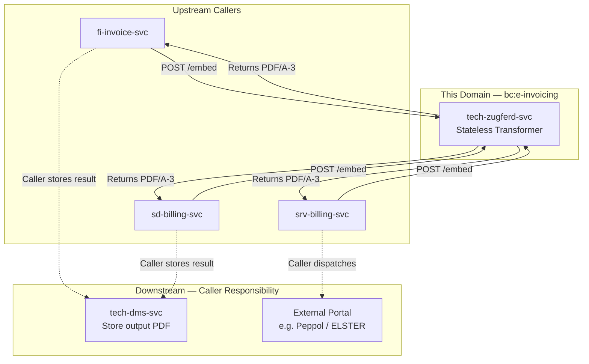
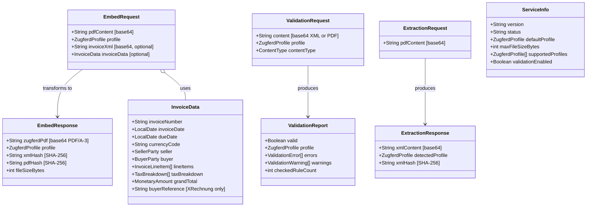
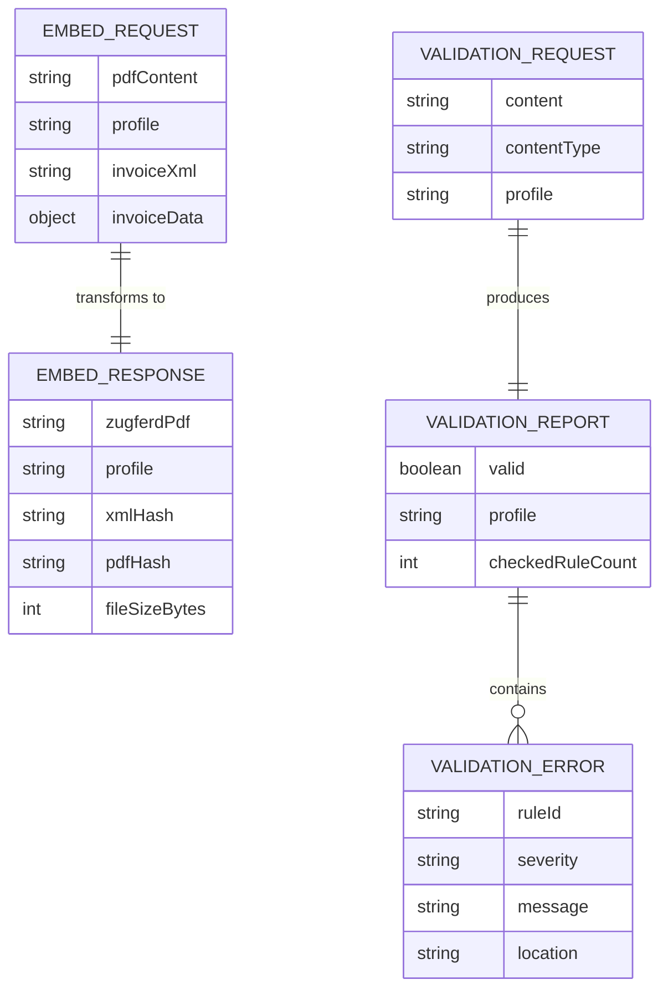

<!-- TEMPLATE COMPLIANCE: ~95%
Template: domain-service-spec.md v1.0.0
Present sections: §0–§15
Gaps: §5.3 process flow diagrams (stub), §12.7 extension API endpoints (stub)
-->

# tech.zugferd — ZUGFeRD / E-Invoicing Service Domain Specification

> **Conceptual Stack Layer:** Domain / Service
> **Space:** Platform
> **Owner:** Platform Infrastructure Team
> **Schema alignment:** `service-layer.schema.json`
> **Companion files:** `contracts/http/tech/zugferd/openapi.yaml`
> **Referenced by:** Platform-Feature Specs (F-TECH-005-xx), BFF Contract
> **Belongs to:** Tech Suite Spec (`spec/T1_Platform/tech/_tech_suite.md`)

> **Meta Information**
> - **Version:** 2026-04-03
> - **Template:** `domain-service-spec.md` v1.0.0
> - **Template Compliance:** ~95% — remaining gaps: §5.3 process flow diagrams (stub), §12.7 extension API endpoints (stub)
> - **Author(s):** OpenLeap Architecture Team
> - **Status:** DRAFT
> - **Suite:** `tech` (Technical Infrastructure)
> - **Domain:** `zugferd` (ZUGFeRD / E-Invoicing)
> - **Bounded Context Ref:** `bc:e-invoicing`
> - **Service ID:** `tech-zugferd-svc`
> - **basePackage:** `io.openleap.tech.zugferd`
> - **API Base Path:** `/api/tech/zugferd/v1`
> - **Deprecated alias:** `/api/t1/zugferd/v1` (ADR-TECH-004, 6-month transition)
> - **OpenLeap Starter Version:** `v3.0.0`
> - **Port:** `8098` (see Q-ZF-001)
> - **Repository:** `https://github.com/openleap-io/io.openleap.tech.zugferd`
> - **Tags:** `tech`, `zugferd`, `platform`, `e-invoicing`, `xrechnung`, `en16931`, `pdf`
> - **Team:**
>   - Name: `team-tech`
>   - Email: `platform-infra@openleap.io`
>   - Slack: `#platform-infra`

---

## Specification Guidelines Compliance

> ### Non-Negotiables
> - Never invent facts. If required info is missing, add an **OPEN QUESTION** entry.
> - Preserve intent and decisions. Only change meaning when explicitly requested.
> - Do not remove normative constraints unless they are explicitly replaced.
> - Keep the spec **self-contained**: no "see chat", no implicit context.
>
> ### Source of Truth Priority
> When sources conflict:
> 1. Spec (explicit) wins
> 2. Starter specs (implementation constraints) next
> 3. Guidelines (best practices) last
>
> Record conflicts in the **Decisions & Conflicts** section (see Section 14).
>
> ### Style Guide
> - Prefer short sentences and lists.
> - Use MUST/SHOULD/MAY for normative statements.
> - Keep terminology consistent (Aggregate, Domain Service, Application Service, Command, Event).
> - Avoid ambiguous words ("often", "maybe") unless explicitly noting uncertainty.
> - Keep examples minimal and clearly marked as examples.
> - Do not add implementation code unless the chapter explicitly requires it.

---

## 0. Document Purpose & Scope

### 0.1 Purpose

The ZUGFeRD / E-Invoicing Service (`tech-zugferd-svc`) provides centralized, stateless PDF e-invoice transformation for the entire OpenLeap ERP platform. It embeds structured ZUGFeRD / Factur-X XML into PDF/A-3 hybrid documents, validates invoice data against EN 16931 schematron rules for a requested compliance profile, and extracts embedded XML from existing hybrid PDFs. Invoicing domains (FI, SD, SRV) delegate all e-invoice format concerns to this service — no domain embeds its own ZUGFeRD library or schematron engine.

The service is fully stateless: it holds no persistent state, owns no database, and publishes no domain events. Every request is self-contained; the caller retains the output artifact.

### 0.2 Target Audience

- Platform Engineers maintaining infrastructure-level transformation services
- Platform Infrastructure Team (`team-tech`) owning this service
- Domain Service Teams from T2–T4 (FI, SD, SRV) that produce invoices requiring e-invoice compliance
- Platform Administrators verifying service health and configuration
- Compliance and Finance Officers ensuring EN 16931 / E-Rechnungsverordnung compliance
- Integration Engineers connecting external billing systems via OpenLeap

### 0.3 Scope

**In Scope:**
- Embedding ZUGFeRD 2.x / Factur-X XML into PDF/A-3 hybrid documents
- Validating invoice XML against EN 16931 schematron rules for a given compliance profile
- Extracting embedded ZUGFeRD XML from an existing PDF/A-3 hybrid document
- Supporting profiles: `MINIMUM`, `BASIC_WL`, `BASIC`, `EN16931`, `EXTENDED`, `XRECHNUNG`
- Service health and configuration info endpoint
- Profile-specific mandatory field enforcement (BR-ZF-003)
- Leitweg-ID validation for XRechnung B2G invoices (BR-ZF-006)

**Out of Scope:**
- Invoice creation or business logic (owned by FI, SD, SRV domain services)
- PDF rendering / report generation (`tech-rpt-svc`)
- Document storage and versioning (`tech-dms-svc`)
- Email or notification delivery for invoice events (`tech-nfs-svc`)
- Payment processing or clearing (FI domain)
- EDI / EDIFACT formats other than ZUGFeRD / Factur-X / XRechnung
- Long-term retention of processed PDFs (caller stores result in DMS)

### 0.4 Related Documents

- `spec/T1_Platform/tech/_tech_suite.md` — Tech suite architecture and ADR-TECH-003 (statelessness)
- `spec/T1_Platform/tech/domain-specs/tech_dms-spec.md` — Document Management Service (callers store output there)
- `spec/T1_Platform/tech/features/compositions/F-TECH-005.md` — E-Invoicing feature composition
- `spec/T1_Platform/tech/features/leaves/F-TECH-005-01/feature-spec.md` — Service Health & Info feature
- EN 16931-1:2017 — European standard for electronic invoicing (semantic data model)
- ZUGFeRD 2.3 / Factur-X 1.0.07 specification (Verband elektronische Rechnung)
- E-Rechnungsverordnung (ERechV) — German regulation for B2G e-invoicing

---

## 1. Business Context

### 1.1 Domain Purpose

The ZUGFeRD service solves the **e-invoice compliance problem** for all invoicing workflows in OpenLeap. In Germany and the EU, electronic invoices for B2G (government) transactions must conform to EN 16931 and — in Germany — to the XRechnung profile. B2B invoices increasingly require the same. Without a shared embedding service, every invoicing domain would need to bundle its own ZUGFeRD library, maintain profile-specific schematron validators, and handle PDF/A-3 attachment mechanics independently — producing inconsistent, duplicated compliance logic.

The ZUGFeRD service provides a single, authoritative embedding and validation capability: any domain that produces a PDF invoice can call this service to receive a legally compliant, machine-readable hybrid PDF ready for delivery.

### 1.2 Business Value

- **Regulatory compliance** — EN 16931 and XRechnung mandates are met centrally; no invoicing domain fails a B2G audit due to format errors.
- **Reduced duplication** — one ZUGFeRD library and schematron engine maintained in one place; not replicated in FI, SD, SRV.
- **Faster invoice delivery** — real-time synchronous embedding (< 2 seconds for standard invoices) enables automated invoice dispatch pipelines.
- **Profile flexibility** — callers choose the compliance profile per invoice; the service enforces the correct field requirements per profile.
- **Auditability** — validation errors are returned with structured codes and messages that callers can log and present to users.

### 1.3 Key Stakeholders

| Role | Responsibility | Primary Use Cases |
|------|----------------|-------------------|
| Finance Clerk | Generates and dispatches e-invoices | Embed + dispatch; verify compliance status |
| Platform Administrator | Monitors service health and config | View service info, default profile, max file size |
| Domain Service Team (FI/SD/SRV) | Integrates ZUGFeRD embedding into invoice workflows | API integration, profile selection |
| Compliance Officer | Audits invoice format compliance | Validate existing PDFs; review profile coverage |
| Integration Engineer | Connects OpenLeap to EDI / government portals | API contract review, error code mapping |

### 1.4 Strategic Positioning

The ZUGFeRD service occupies the **Technical Infrastructure** tier (T1) as a horizontal processing utility. It is the **sole authoritative** source for ZUGFeRD embedding and EN 16931 validation within OpenLeap (see §1.5 Authoritative Sources). It has no peers within the tech suite and no business-domain equivalent — making it a foundational dependency for all EU/DE invoicing compliance.

The service is intentionally **closed to business logic**: it transforms bytes according to a standard; it does not know whether an invoice is correct in business terms, only whether it is structurally compliant with the chosen ZUGFeRD profile.

### 1.5 Service Context

| Property | Value |
|----------|-------|
| **Suite** | `tech` |
| **Domain** | `zugferd` |
| **Bounded Context** | `bc:e-invoicing` |
| **Service ID** | `tech-zugferd-svc` |
| **Base Package** | `io.openleap.tech.zugferd` |

**Responsibilities:**
- Embed ZUGFeRD-compliant XML into PDF/A-3 as an attachment named `factur-x.xml`
- Validate invoice XML against EN 16931 schematron rules for the requested profile
- Extract embedded XML from an existing ZUGFeRD / Factur-X hybrid PDF
- Enforce profile-specific mandatory field rules (BR-ZF-003 to BR-ZF-006)
- Return structured validation reports with error codes, message texts, and XPath locations

**Authoritative Sources:**

| Source Type | Description | Access Pattern |
|-------------|-------------|----------------|
| REST API | Embedding, validation, extraction, info endpoints | Synchronous (per-request) |
| In-Memory | Schematron rule sets for all supported profiles | Loaded at startup; no DB |
| Classpath | ZUGFeRD / Factur-X profile schemas (XSD + SCH) | Static; versioned with service |



---

## 2. Service Identity

| Property | Value | Schema Field |
|----------|-------|-------------|
| **Service ID** | `tech-zugferd-svc` | `metadata.id` |
| **Display Name** | `ZUGFeRD / E-Invoicing Service` | `metadata.name` |
| **Suite** | `tech` | `metadata.suite` |
| **Domain** | `zugferd` | `metadata.domain` |
| **Bounded Context** | `bc:e-invoicing` | `metadata.bounded_context_ref` |
| **Version** | `1.0.0` | `metadata.version` |
| **Status** | DRAFT | `metadata.status` |
| **API Base Path** | `/api/tech/zugferd/v1` | `metadata.api_base_path` |
| **Repository** | `https://github.com/openleap-io/io.openleap.tech.zugferd` | `metadata.repository` |
| **Tags** | `tech`, `zugferd`, `e-invoicing`, `xrechnung`, `en16931`, `platform` | `metadata.tags` |

**Team:**

| Property | Value |
|----------|-------|
| **Name** | `team-tech` |
| **Email** | `platform-infra@openleap.io` |
| **Slack Channel** | `#platform-infra` |

---

## 3. Domain Model

### 3.1 Conceptual Overview

The ZUGFeRD service is **fully stateless**. It owns no persistent aggregates and maintains no database. Its domain model consists exclusively of **request/response value objects** and **enumeration types** that define the contract between callers and the transformation engine.

The central concept is the **EmbedRequest**: a caller provides a PDF document (base64-encoded) and structured invoice data (either as ZUGFeRD-compliant XML or as a structured `InvoiceData` payload), specifies a compliance `ZugferdProfile`, and receives back an `EmbedResponse` containing the PDF/A-3 hybrid document with the XML embedded as the `factur-x.xml` attachment.

Validation and extraction are separate stateless operations sharing the same profile and document primitives.

### 3.2 Core Concepts



### 3.3 Aggregate Definitions

> **Note on statelessness:** This service has no persistent aggregates. The following sub-sections describe the **request/response value object models** that define the API contract. They are documented in the aggregate structure for template compliance and tooling compatibility; the `Stateless` lifecycle designation indicates no persistent state machine applies.

#### 3.3.1 EmbedRequest / EmbedResponse

| Property | Value |
|----------|-------|
| **Aggregate ID** | `agg:embed-operation` |
| **Name** | `EmbedOperation` |

**Business Purpose:**
Represents a single ZUGFeRD embedding operation: a caller provides a visual PDF and invoice data, the service produces a standards-compliant PDF/A-3 hybrid document.

##### Aggregate Root — EmbedRequest

**Key Attributes:**

| Attribute | Type | Format | Description | Constraints | Required | Read-Only |
|-----------|------|--------|-------------|-------------|----------|-----------|
| pdfContent | string | byte (base64) | The input PDF document to embed XML into | max 20 MB decoded; must be valid PDF | Yes | No |
| profile | string | — | ZUGFeRD compliance profile to apply | enum_ref: `ZugferdProfile` | Yes | No |
| invoiceXml | string | byte (base64) | Pre-built ZUGFeRD XML to embed directly | Either invoiceXml or invoiceData must be provided (BR-ZF-002) | No | No |
| invoiceData | object | — | Structured invoice data; service generates XML | Either invoiceXml or invoiceData must be provided (BR-ZF-002) | No | No |

**EmbedResponse Attributes:**

| Attribute | Type | Format | Description | Constraints | Required | Read-Only |
|-----------|------|--------|-------------|-------------|----------|-----------|
| zugferdPdf | string | byte (base64) | The output PDF/A-3 hybrid document | Non-empty | Yes | Yes |
| profile | string | — | Profile applied during embedding | enum_ref: `ZugferdProfile` | Yes | Yes |
| xmlHash | string | — | SHA-256 hash of embedded XML | 64-char hex | Yes | Yes |
| pdfHash | string | — | SHA-256 hash of output PDF | 64-char hex | Yes | Yes |
| fileSizeBytes | integer | int32 | Size of output PDF in bytes | > 0 | Yes | Yes |

**Lifecycle States:**

Stateless operation — no lifecycle state machine. Each request is independent and produces an immediate synchronous response.

**Invariants:**

| Rule ID | Description |
|---------|-------------|
| BR-ZF-001 | Profile must be a supported ZUGFeRD profile |
| BR-ZF-002 | Exactly one of invoiceXml or invoiceData must be provided |
| BR-ZF-003 | Invoice data must satisfy mandatory fields for the selected profile |
| BR-ZF-004 | Input PDF size must not exceed configured maximum (default 20 MB) |

**Domain Events Emitted:** None (stateless service — ADR-TECH-003).

---

#### 3.3.2 ValidationRequest / ValidationReport

| Property | Value |
|----------|-------|
| **Aggregate ID** | `agg:validation-operation` |
| **Name** | `ValidationOperation` |

**Business Purpose:**
Validates invoice XML (or the XML embedded in a hybrid PDF) against EN 16931 schematron rules for the requested ZUGFeRD profile. Returns a structured report listing all errors and warnings with XPath locations.

##### Aggregate Root — ValidationRequest

**Key Attributes:**

| Attribute | Type | Format | Description | Constraints | Required | Read-Only |
|-----------|------|--------|-------------|-------------|----------|-----------|
| content | string | byte (base64) | Invoice XML or hybrid PDF to validate | max 20 MB decoded | Yes | No |
| contentType | string | — | Whether content is XML or PDF | enum_ref: `ContentType`; `XML` or `PDF` | Yes | No |
| profile | string | — | Profile to validate against | enum_ref: `ZugferdProfile` | Yes | No |

**ValidationReport Attributes:**

| Attribute | Type | Format | Description | Constraints | Required | Read-Only |
|-----------|------|--------|-------------|-------------|----------|-----------|
| valid | boolean | — | True if no errors (warnings allowed) | — | Yes | Yes |
| profile | string | — | Profile validated against | enum_ref: `ZugferdProfile` | Yes | Yes |
| errors | array | — | Schematron rule violations (fail severity) | — | Yes | Yes |
| warnings | array | — | Schematron rule warnings (warn severity) | — | Yes | Yes |
| checkedRuleCount | integer | int32 | Number of schematron rules checked | ≥ 0 | Yes | Yes |

**Invariants:**

| Rule ID | Description |
|---------|-------------|
| BR-ZF-001 | Profile must be a supported ZUGFeRD profile |
| BR-ZF-007 | Content must be decodable from base64 |
| BR-ZF-008 | If contentType is PDF, content must contain a `factur-x.xml` attachment |

---

#### 3.3.3 ExtractionRequest / ExtractionResponse

| Property | Value |
|----------|-------|
| **Aggregate ID** | `agg:extraction-operation` |
| **Name** | `ExtractionOperation` |

**Business Purpose:**
Extracts the embedded `factur-x.xml` attachment from an existing ZUGFeRD / Factur-X hybrid PDF, returning the raw XML and detected profile. Enables downstream systems to re-validate or re-process existing invoices.

##### Aggregate Root — ExtractionRequest

**Key Attributes:**

| Attribute | Type | Format | Description | Constraints | Required | Read-Only |
|-----------|------|--------|-------------|-------------|----------|-----------|
| pdfContent | string | byte (base64) | The hybrid PDF to extract XML from | max 20 MB decoded; must contain `factur-x.xml` attachment | Yes | No |

**ExtractionResponse Attributes:**

| Attribute | Type | Format | Description | Constraints | Required | Read-Only |
|-----------|------|--------|-------------|-------------|----------|-----------|
| xmlContent | string | byte (base64) | Extracted ZUGFeRD XML | Non-empty | Yes | Yes |
| detectedProfile | string | — | Profile detected from XML namespace | enum_ref: `ZugferdProfile` | Yes | Yes |
| xmlHash | string | — | SHA-256 hash of extracted XML | 64-char hex | Yes | Yes |

**Invariants:**

| Rule ID | Description |
|---------|-------------|
| BR-ZF-009 | Input PDF must contain a `factur-x.xml` attachment at the PDF/A-3 attachment level |
| BR-ZF-010 | Extracted XML must declare a recognisable ZUGFeRD / Factur-X profile namespace |

---

### 3.4 Enumerations

#### ZugferdProfile

**Description:** ZUGFeRD 2.x / Factur-X compliance profiles, ordered from lowest to highest data richness. Each profile corresponds to a specific EN 16931 conformance class and a defined set of mandatory XML elements.

| Value | Description | Deprecated |
|-------|-------------|------------|
| `MINIMUM` | Lowest profile: seller/buyer identity and total amounts only; no line items. Used for simple credit notes and simplified invoices. | No |
| `BASIC_WL` | Basic With Lines: header data plus line items, but no explicit tax detail per line. | No |
| `BASIC` | Basic profile with full tax breakdown per invoice. Minimum for most B2B use cases. | No |
| `EN16931` | Full EN 16931 compliance (also known as COMFORT in older ZUGFeRD 1.0 terminology). Mandatory for all cross-border EU B2G invoices. | No |
| `EXTENDED` | EN16931 plus German-specific extensions (e.g., additional party identifiers, SEPA mandate reference). | No |
| `XRECHNUNG` | German government (B2G) standard derived from EN16931. Requires `buyerReference` (Leitweg-ID) and enforces stricter subset rules. Mandatory for federal and most state/municipal government invoicing in Germany. | No |

#### ContentType

**Description:** Indicates whether the submitted `content` in a ValidationRequest is raw ZUGFeRD XML or a ZUGFeRD hybrid PDF.

| Value | Description | Deprecated |
|-------|-------------|------------|
| `XML` | Content is a base64-encoded ZUGFeRD / Factur-X XML file | No |
| `PDF` | Content is a base64-encoded hybrid PDF/A-3 with embedded `factur-x.xml` | No |

#### ValidationSeverity

**Description:** Severity level of a validation finding returned in a ValidationReport.

| Value | Description | Deprecated |
|-------|-------------|------------|
| `ERROR` | Schematron `[BR-xxx]` rule violation. The invoice is non-compliant; embedding MUST NOT proceed. | No |
| `WARNING` | Advisory finding. The invoice may still be embedded but SHOULD be reviewed by a human. | No |

### 3.5 Shared Types

#### InvoiceData

| Property | Value |
|----------|-------|
| **Type ID** | `type:invoice-data` |
| **Name** | `InvoiceData` |

**Description:** Structured invoice payload used when the caller delegates XML generation to the service (alternative to providing pre-built `invoiceXml`). The service generates standards-compliant ZUGFeRD XML from this structure before embedding.

**Attributes:**

| Attribute | Type | Format | Description | Constraints |
|-----------|------|--------|-------------|-------------|
| invoiceNumber | string | — | Unique invoice identifier assigned by seller | max 35 chars; required |
| invoiceDate | string | date | Date of invoice issuance | ISO 8601 (YYYY-MM-DD); required |
| dueDate | string | date | Payment due date | ≥ invoiceDate |
| currencyCode | string | — | Invoice currency | ISO 4217, 3 chars; required |
| seller | object | — | Seller party details | type_ref: `PartyInfo`; required |
| buyer | object | — | Buyer party details | type_ref: `PartyInfo`; required |
| buyerReference | string | — | Leitweg-ID (routing ID) for XRechnung | Required if profile = XRECHNUNG; max 30 chars |
| lineItems | array | — | Invoice line items | min_items: 0 for MINIMUM; min_items: 1 for BASIC_WL+ |
| taxBreakdown | array | — | Tax breakdown per category/rate | min_items: 1 for BASIC+ |
| grandTotal | object | — | Final payable amount | type_ref: `MonetaryAmount`; required |
| taxTotal | object | — | Total tax amount | type_ref: `MonetaryAmount`; required for BASIC+ |
| paidAmount | object | — | Previously paid amount (credit notes) | type_ref: `MonetaryAmount`; optional |

**Validation Rules:**
- `invoiceDate` MUST be a valid date not in the future by more than 30 days (BR-ZF-011).
- `currencyCode` MUST exist in ISO 4217.
- `grandTotal.amount` MUST equal sum of line totals minus paidAmount (BR-ZF-012).
- `taxTotal.amount` MUST equal sum of taxBreakdown amounts (BR-ZF-013).
- `buyerReference` is REQUIRED when profile = `XRECHNUNG` (BR-ZF-006).

**Used By:**
- `agg:embed-operation`

#### PartyInfo

| Property | Value |
|----------|-------|
| **Type ID** | `type:party-info` |
| **Name** | `PartyInfo` |

**Description:** Seller or buyer party data embedded in invoice XML.

**Attributes:**

| Attribute | Type | Format | Description | Constraints |
|-----------|------|--------|-------------|-------------|
| name | string | — | Legal name of the party | max 200 chars; required |
| street | string | — | Street and number | max 100 chars |
| city | string | — | City | max 100 chars; required |
| postalCode | string | — | Postal code | max 20 chars; required |
| countryCode | string | — | Country code | ISO 3166-1 alpha-2; required |
| taxId | string | — | Tax registration number (Steuernummer) | max 20 chars |
| vatId | string | — | VAT identification number (USt-IdNr.) | Pattern: `[A-Z]{2}[0-9A-Z]+`; required for EN16931+ |
| email | string | — | Contact email address | Valid RFC 5322 format |
| iban | string | — | Payment IBAN (seller only) | Valid IBAN format |
| bic | string | — | BIC/SWIFT code (seller only) | 8 or 11 chars |

**Validation Rules:**
- `countryCode` MUST be a valid ISO 3166-1 alpha-2 code.
- `vatId` is REQUIRED for seller when profile ≥ `BASIC`.
- `iban` is RECOMMENDED for seller to enable SEPA payment.

**Used By:**
- `type:invoice-data`

#### MonetaryAmount

| Property | Value |
|----------|-------|
| **Type ID** | `type:monetary-amount` |
| **Name** | `MonetaryAmount` |

**Description:** A monetary value with currency, used for totals and line amounts.

**Attributes:**

| Attribute | Type | Format | Description | Constraints |
|-----------|------|--------|-------------|-------------|
| amount | number | decimal | Monetary value | Precision: max 2 decimal places; ≥ 0 for most uses |
| currencyCode | string | — | ISO 4217 currency | 3 chars; must match invoice currency |

**Validation Rules:**
- `amount` precision MUST NOT exceed 2 decimal places for standard profiles.
- `currencyCode` MUST match the invoice-level `currencyCode`.

**Used By:**
- `type:invoice-data`

#### InvoiceLineItem

| Property | Value |
|----------|-------|
| **Type ID** | `type:invoice-line-item` |
| **Name** | `InvoiceLineItem` |

**Description:** A single line item on an invoice.

**Attributes:**

| Attribute | Type | Format | Description | Constraints |
|-----------|------|--------|-------------|-------------|
| lineId | string | — | Line identifier | max 10 chars; unique within invoice |
| description | string | — | Product or service description | max 250 chars; required |
| quantity | number | decimal | Delivered quantity | > 0 |
| unitCode | string | — | UN/CEFACT unit code | e.g., `C62` (piece), `HUR` (hour); required for BASIC_WL+ |
| unitPrice | number | decimal | Price per unit net of VAT | Precision max 4 decimal places |
| taxCategory | string | — | VAT category code | `S`, `Z`, `E`, `AE`, `K`, `G`, `O`, `L`, `M` per EN 16931 |
| taxRate | number | decimal | VAT rate percentage | 0.00–100.00 |
| lineTotal | number | decimal | Net line total (quantity × unitPrice) | Must equal quantity × unitPrice (BR-ZF-012) |

**Used By:**
- `type:invoice-data`

#### ValidationError

| Property | Value |
|----------|-------|
| **Type ID** | `type:validation-error` |
| **Name** | `ValidationError` |

**Description:** A single schematron rule violation from a ValidationReport.

**Attributes:**

| Attribute | Type | Format | Description | Constraints |
|-----------|------|--------|-------------|-------------|
| ruleId | string | — | EN 16931 rule identifier, e.g., `BR-01` | Pattern: `[A-Z]{2}-[0-9]+(-[A-Z]+)?` |
| severity | string | — | ERROR or WARNING | enum_ref: `ValidationSeverity` |
| message | string | — | Human-readable rule description | — |
| location | string | — | XPath location in the XML document | — |
| context | string | — | XML element or value at the error location | — |

**Used By:**
- `agg:validation-operation`

---

## 4. Business Rules & Constraints

### 4.1 Business Rules Catalog

| ID | Rule Name | Description | Scope | Enforcement | Error Code |
|----|-----------|-------------|-------|-------------|------------|
| BR-ZF-001 | Supported Profile Required | Profile must be one of the six supported ZUGFeRD profiles | All operations | At request entry | `ZF_UNSUPPORTED_PROFILE` |
| BR-ZF-002 | Invoice Source Exclusive OR | Exactly one of invoiceXml or invoiceData must be provided; not both, not neither | EmbedOperation | At request entry | `ZF_INVOICE_SOURCE_CONFLICT` |
| BR-ZF-003 | Profile Mandatory Fields | Invoice data must satisfy all mandatory fields for the chosen profile | EmbedOperation, ValidationOperation | Before XML generation / schematron | `ZF_MANDATORY_FIELD_MISSING` |
| BR-ZF-004 | Max File Size | Input PDF size MUST NOT exceed the configured maximum (default 20 MB) | All PDF operations | At request entry | `ZF_FILE_TOO_LARGE` |
| BR-ZF-005 | Valid PDF Input | Input PDF must be parseable as a valid PDF document | EmbedOperation, ExtractionOperation | Before processing | `ZF_INVALID_PDF` |
| BR-ZF-006 | XRechnung Buyer Reference | Profile XRECHNUNG requires buyerReference (Leitweg-ID) | EmbedOperation, ValidationOperation | Before XML generation | `ZF_BUYER_REFERENCE_REQUIRED` |
| BR-ZF-007 | Base64 Decodable Content | All binary fields must be valid base64 | All operations | At request entry | `ZF_INVALID_BASE64` |
| BR-ZF-008 | PDF Contains XML Attachment | For contentType=PDF validation, PDF must contain a `factur-x.xml` attachment | ValidationOperation | Before extraction | `ZF_NO_XML_ATTACHMENT` |
| BR-ZF-009 | Extraction Target Has Attachment | Input PDF for extraction must contain `factur-x.xml` | ExtractionOperation | Before extraction | `ZF_NO_XML_ATTACHMENT` |
| BR-ZF-010 | Detectable Profile Namespace | Extracted XML must declare a recognisable ZUGFeRD / Factur-X profile namespace | ExtractionOperation | After extraction | `ZF_UNKNOWN_PROFILE_NAMESPACE` |
| BR-ZF-011 | Invoice Date Plausibility | invoiceDate must not be more than 30 days in the future | EmbedOperation | At request validation | `ZF_INVOICE_DATE_IMPLAUSIBLE` |
| BR-ZF-012 | Grand Total Consistency | grandTotal must equal sum of line totals minus paidAmount | EmbedOperation | XML generation | `ZF_TOTAL_MISMATCH` |
| BR-ZF-013 | Tax Total Consistency | taxTotal must equal sum of taxBreakdown amounts | EmbedOperation | XML generation | `ZF_TAX_TOTAL_MISMATCH` |

### 4.2 Detailed Rule Definitions

#### BR-ZF-001: Supported Profile Required

**Business Context:**
ZUGFeRD profiles have distinct XML schemas and schematron rule sets. An unrecognised profile cannot be validated or embedded correctly.

**Rule Statement:**
The `profile` field in any request MUST be one of: `MINIMUM`, `BASIC_WL`, `BASIC`, `EN16931`, `EXTENDED`, `XRECHNUNG`.

**Applies To:**
- Operations: All (EmbedOperation, ValidationOperation, ExtractionOperation where profile is supplied)

**Enforcement:**
Validated at request entry before any processing begins. Returns `400 Bad Request` immediately.

**Validation Logic:**
Check `profile` value against the `ZugferdProfile` enumeration. Reject if not found.

**Error Handling:**
- **Error Code:** `ZF_UNSUPPORTED_PROFILE`
- **Error Message:** "Profile '{value}' is not supported. Supported profiles: MINIMUM, BASIC_WL, BASIC, EN16931, EXTENDED, XRECHNUNG."
- **User action:** Review the `profile` value and correct it to one of the supported profiles.

**Examples:**
- **Valid:** `profile: "EN16931"`
- **Invalid:** `profile: "FULL"` → `ZF_UNSUPPORTED_PROFILE`

---

#### BR-ZF-002: Invoice Source Exclusive OR

**Business Context:**
The caller either provides ready-made XML (when they have their own ZUGFeRD library) or delegates XML generation to the service. Both at once creates ambiguity; neither leaves the service with nothing to embed.

**Rule Statement:**
Exactly one of `invoiceXml` (pre-built XML) or `invoiceData` (structured payload for service-generated XML) MUST be present in an EmbedRequest.

**Applies To:**
- Operations: EmbedOperation

**Enforcement:**
Validated at request entry. Returns `400 Bad Request`.

**Validation Logic:**
- If both present → reject.
- If neither present → reject.
- If exactly one present → proceed.

**Error Handling:**
- **Error Code:** `ZF_INVOICE_SOURCE_CONFLICT`
- **Error Message:** "Exactly one of 'invoiceXml' or 'invoiceData' must be provided."
- **User action:** Remove one of the two conflicting fields, or supply the missing one.

**Examples:**
- **Valid:** Request with `invoiceData` and no `invoiceXml`.
- **Invalid:** Request with both `invoiceXml` and `invoiceData` → `ZF_INVOICE_SOURCE_CONFLICT`.

---

#### BR-ZF-003: Profile Mandatory Fields

**Business Context:**
Each ZUGFeRD profile mandates a specific set of XML elements. Embedding an invoice that omits mandatory elements would produce a non-compliant document. The service enforces these requirements so callers cannot accidentally produce invalid output.

**Rule Statement:**
Invoice data MUST satisfy all mandatory fields defined in the EN 16931 / ZUGFeRD profile specification for the selected profile. Higher profiles impose all lower-profile requirements plus additional ones.

**Applies To:**
- Operations: EmbedOperation (for invoiceData path), ValidationOperation

**Enforcement:**
Checked before XML generation (invoiceData path) or during schematron validation (invoiceXml path).

**Validation Logic:**
Check each EN 16931 mandatory business rule for the profile. For `XRECHNUNG`: also check BR-ZF-006 (buyerReference).

**Error Handling:**
- **Error Code:** `ZF_MANDATORY_FIELD_MISSING`
- **Error Message:** "Mandatory field '{fieldPath}' is required for profile {profile} but is missing or empty."
- **User action:** Add the missing field to `invoiceData` and retry.

---

#### BR-ZF-004: Max File Size

**Business Context:**
Large PDFs degrade service performance and risk OOM conditions in the stateless service. A maximum file size is enforced to protect platform stability.

**Rule Statement:**
The decoded size of any binary input (pdfContent, content) MUST NOT exceed the configured `maxFileSizeBytes` (default: 20 971 520 bytes / 20 MB).

**Applies To:**
- Operations: All PDF operations

**Enforcement:**
Validated at request entry, before base64 decoding. The configured maximum is returned in `GET /info`.

**Error Handling:**
- **Error Code:** `ZF_FILE_TOO_LARGE`
- **Error Message:** "Input file size {actualBytes} bytes exceeds maximum allowed size of {maxBytes} bytes."
- **User action:** Compress or reduce the input PDF before submission.

---

#### BR-ZF-006: XRechnung Buyer Reference

**Business Context:**
The German E-Rechnungsverordnung requires a `Leitweg-ID` (routing identifier) in all XRechnung invoices so that government agencies can route them to the correct processing unit.

**Rule Statement:**
When `profile = XRECHNUNG`, the `buyerReference` field MUST be present and non-empty in `InvoiceData`.

**Applies To:**
- Operations: EmbedOperation (invoiceData path), ValidationOperation

**Enforcement:**
Checked before XML generation for invoiceData path; enforced via EN 16931 schematron rule `BR-DE-15` for invoiceXml path.

**Error Handling:**
- **Error Code:** `ZF_BUYER_REFERENCE_REQUIRED`
- **Error Message:** "Field 'buyerReference' (Leitweg-ID) is required for profile XRECHNUNG."
- **User action:** Obtain the Leitweg-ID from the government buyer and supply it in `buyerReference`.

---

#### BR-ZF-012: Grand Total Consistency

**Business Context:**
Invoices with inconsistent totals are invalid under EN 16931 and may cause payment errors at the receiving end.

**Rule Statement:**
`grandTotal.amount` MUST equal the sum of all `lineItems[].lineTotal` values minus `paidAmount.amount` (if present). Tolerance: ±0.01 to account for rounding.

**Applies To:**
- Operations: EmbedOperation (invoiceData path)

**Enforcement:**
Calculated during XML generation. Difference > 0.01 → reject.

**Error Handling:**
- **Error Code:** `ZF_TOTAL_MISMATCH`
- **Error Message:** "Grand total {grandTotal} does not match computed sum of line totals {computed} (difference: {diff})."
- **User action:** Recalculate totals and correct the discrepancy.

---

### 4.3 Data Validation Rules

**Field-Level Validations:**

| Field | Validation Rule | Error Message |
|-------|----------------|---------------|
| profile | Required; must be in ZugferdProfile enum | "Profile is required and must be one of: MINIMUM, BASIC_WL, BASIC, EN16931, EXTENDED, XRECHNUNG" |
| pdfContent | Required for embed/extract; valid base64; decoded size ≤ maxFileSizeBytes | "pdfContent must be valid base64 and must not exceed {max} bytes" |
| content | Required for validate; valid base64; decoded size ≤ maxFileSizeBytes | "content must be valid base64 and must not exceed {max} bytes" |
| contentType | Required for validate; must be XML or PDF | "contentType must be XML or PDF" |
| invoiceData.invoiceNumber | Required; max 35 chars | "invoiceNumber is required and must not exceed 35 characters" |
| invoiceData.invoiceDate | Required; valid ISO 8601 date | "invoiceDate must be a valid date (YYYY-MM-DD)" |
| invoiceData.currencyCode | Required; valid ISO 4217 code | "currencyCode must be a valid 3-letter ISO 4217 currency code" |
| invoiceData.seller.vatId | Required for profile ≥ BASIC; pattern `[A-Z]{2}[0-9A-Z]+` | "seller.vatId is required for profile BASIC and above" |
| invoiceData.buyerReference | Required when profile = XRECHNUNG; max 30 chars | "buyerReference (Leitweg-ID) is required for XRECHNUNG profile" |
| invoiceData.lineItems[].quantity | > 0 | "lineItem.quantity must be greater than 0" |
| invoiceData.lineItems[].taxCategory | Must be valid EN 16931 tax category code | "taxCategory must be one of: S, Z, E, AE, K, G, O, L, M" |
| invoiceData.lineItems[].taxRate | 0.00–100.00 | "taxRate must be between 0.00 and 100.00" |

**Cross-Field Validations:**
- `invoiceXml` and `invoiceData` are mutually exclusive (BR-ZF-002).
- `dueDate` MUST be ≥ `invoiceDate` when both are present.
- `grandTotal.currencyCode` MUST equal `invoiceData.currencyCode`.
- `taxTotal.currencyCode` MUST equal `invoiceData.currencyCode`.
- `paidAmount.currencyCode` MUST equal `invoiceData.currencyCode` when present.
- For profile ≥ `BASIC_WL`: `lineItems` must not be empty.
- For profile ≥ `BASIC`: `taxBreakdown` must not be empty.

### 4.4 Reference Data Dependencies

**Required Reference Data:**

| Catalog | Source Service | Fields Referencing | Validation |
|---------|----------------|-------------------|------------|
| Currencies (ISO 4217) | `param-ref-svc` or local ISO lookup | `currencyCode`, `grandTotal.currencyCode` | Must be valid ISO 4217 code |
| Countries (ISO 3166-1) | `param-ref-svc` or local ISO lookup | `seller.countryCode`, `buyer.countryCode` | Must be valid alpha-2 code |
| UN/CEFACT Unit Codes | Bundled static list (class path) | `lineItems[].unitCode` | Must be valid UCUM / UN/CEFACT code |
| VAT Category Codes | Bundled EN 16931 enumeration (class path) | `lineItems[].taxCategory` | Must be one of: S, Z, E, AE, K, G, O, L, M |

> **OPEN QUESTION:** See Q-ZF-003 — whether ISO lookups should call `param-ref-svc` at runtime or use a bundled static list (performance vs. correctness trade-off for a stateless service).

---

## 5. Use Cases

> This section defines use cases mapping to API operations. The ZUGFeRD service is stateless; all operations are synchronous and transactionless. Type is WRITE for mutating transformations (embed), READ for non-mutating operations (validate, extract, info).

### 5.1 Business Logic Placement

| Logic Type | Placement | Examples |
|------------|-----------|----------|
| Input validation | Application Service | Profile enum check, base64 decode, file size check |
| Business rule enforcement | Application Service | BR-ZF-002 (source XOR), BR-ZF-006 (Leitweg-ID) |
| XML generation from InvoiceData | Domain Service (`ZugferdXmlGenerator`) | Mandatory field enforcement per profile, total consistency |
| PDF/A-3 embedding | Domain Service (`ZugferdEmbedder`) | PDF/A-3 attachment mechanics, `factur-x.xml` naming |
| Schematron validation | Domain Service (`En16931Validator`) | EN 16931 rule evaluation, error/warning collection |
| XML extraction | Domain Service (`ZugferdExtractor`) | PDF attachment lookup, namespace detection |

### 5.2 Use Cases (Canonical Format)

#### UC-ZF-001: EmbedInvoiceXml

| Field | Value |
|-------|-------|
| **id** | `EmbedInvoiceXml` |
| **type** | WRITE |
| **trigger** | REST |
| **aggregate** | `EmbedOperation` |
| **domainOperation** | `ZugferdEmbedder.embed` |
| **inputs** | `pdfContent: base64`, `profile: ZugferdProfile`, `invoiceXml: base64 (optional)`, `invoiceData: InvoiceData (optional)` |
| **outputs** | `zugferdPdf: base64`, `profile: ZugferdProfile`, `xmlHash: string`, `pdfHash: string`, `fileSizeBytes: integer` |
| **events** | None (stateless) |
| **rest** | `POST /api/tech/zugferd/v1/embed` |
| **idempotency** | optional (same inputs → same output; no side effects) |
| **errors** | `ZF_UNSUPPORTED_PROFILE`, `ZF_INVOICE_SOURCE_CONFLICT`, `ZF_MANDATORY_FIELD_MISSING`, `ZF_FILE_TOO_LARGE`, `ZF_INVALID_PDF`, `ZF_BUYER_REFERENCE_REQUIRED`, `ZF_TOTAL_MISMATCH` |

**Actor:** Invoice-producing domain service (FI, SD, SRV) or Finance Clerk via UI

**Preconditions:**
- Caller has a PDF invoice rendered by the domain or `tech-rpt-svc`
- Caller has complete invoice data satisfying the chosen profile's mandatory fields
- Input PDF size does not exceed configured maximum

**Main Flow:**
1. Caller submits `EmbedRequest` with pdfContent, profile, and either invoiceXml or invoiceData
2. Service validates inputs (BR-ZF-001 to BR-ZF-004, BR-ZF-006, BR-ZF-007)
3. If `invoiceData` provided: service generates ZUGFeRD-compliant XML (`ZugferdXmlGenerator`)
4. If `invoiceXml` provided: service validates XML against profile schematron (`En16931Validator`)
5. Service embeds XML as `factur-x.xml` attachment into PDF/A-3 (`ZugferdEmbedder`)
6. Service computes SHA-256 hashes for XML and output PDF
7. Service returns `EmbedResponse` with base64-encoded PDF/A-3

**Postconditions:**
- Caller receives a ZUGFeRD-compliant PDF/A-3 hybrid document
- No state persisted in the service (caller responsible for storage in DMS)

**Business Rules Applied:**
- BR-ZF-001: Supported Profile Required
- BR-ZF-002: Invoice Source Exclusive OR
- BR-ZF-003: Profile Mandatory Fields
- BR-ZF-004: Max File Size
- BR-ZF-006: XRechnung Buyer Reference (if profile = XRECHNUNG)
- BR-ZF-012: Grand Total Consistency (if invoiceData path)

**Alternative Flows:**
- **Alt-1:** If `invoiceXml` fails schematron validation: service returns `422 Unprocessable Entity` with a ValidationReport listing all errors. Caller must fix the XML and retry.

**Exception Flows:**
- **Exc-1:** If `pdfContent` is not a valid PDF: returns `400 Bad Request` with `ZF_INVALID_PDF`.
- **Exc-2:** If service is under high load: returns `503 Service Unavailable`. Caller retries with exponential backoff.

---

#### UC-ZF-002: ValidateInvoiceXml

| Field | Value |
|-------|-------|
| **id** | `ValidateInvoiceXml` |
| **type** | READ |
| **trigger** | REST |
| **aggregate** | `ValidationOperation` |
| **domainOperation** | `En16931Validator.validate` |
| **inputs** | `content: base64`, `contentType: ContentType`, `profile: ZugferdProfile` |
| **outputs** | `valid: boolean`, `profile: ZugferdProfile`, `errors: ValidationError[]`, `warnings: ValidationWarning[]`, `checkedRuleCount: integer` |
| **events** | None |
| **rest** | `POST /api/tech/zugferd/v1/validate` |
| **idempotency** | required |
| **errors** | `ZF_UNSUPPORTED_PROFILE`, `ZF_FILE_TOO_LARGE`, `ZF_INVALID_BASE64`, `ZF_NO_XML_ATTACHMENT` |

**Actor:** Finance Clerk, Compliance Officer, or domain service pre-embedding check

**Preconditions:**
- Caller has an invoice XML or hybrid PDF to validate
- Profile is known

**Main Flow:**
1. Caller submits `ValidationRequest` with content, contentType, and profile
2. Service validates inputs (BR-ZF-001, BR-ZF-004, BR-ZF-007)
3. If `contentType = PDF`: service extracts `factur-x.xml` from PDF (BR-ZF-008)
4. Service runs EN 16931 schematron validation against the extracted or submitted XML
5. Service collects all errors (severity ERROR) and warnings (severity WARNING)
6. Service returns `ValidationReport` with `valid = (errors.length == 0)`

**Postconditions:**
- Caller receives a structured validation report; no state persisted

**Business Rules Applied:**
- BR-ZF-001, BR-ZF-004, BR-ZF-007, BR-ZF-008

**Alternative Flows:**
- **Alt-1:** If invoice has warnings but no errors: `valid = true`, warnings included in response. Caller decides whether to proceed.

---

#### UC-ZF-003: ExtractInvoiceXml

| Field | Value |
|-------|-------|
| **id** | `ExtractInvoiceXml` |
| **type** | READ |
| **trigger** | REST |
| **aggregate** | `ExtractionOperation` |
| **domainOperation** | `ZugferdExtractor.extract` |
| **inputs** | `pdfContent: base64` |
| **outputs** | `xmlContent: base64`, `detectedProfile: ZugferdProfile`, `xmlHash: string` |
| **events** | None |
| **rest** | `POST /api/tech/zugferd/v1/extract` |
| **idempotency** | required |
| **errors** | `ZF_FILE_TOO_LARGE`, `ZF_INVALID_PDF`, `ZF_INVALID_BASE64`, `ZF_NO_XML_ATTACHMENT`, `ZF_UNKNOWN_PROFILE_NAMESPACE` |

**Actor:** Finance Clerk, Compliance Officer, or integration system processing incoming invoices

**Preconditions:**
- Caller has a ZUGFeRD hybrid PDF

**Main Flow:**
1. Caller submits `ExtractionRequest` with pdfContent
2. Service validates inputs (BR-ZF-004, BR-ZF-005, BR-ZF-007)
3. Service locates `factur-x.xml` attachment in PDF/A-3 structure (BR-ZF-009)
4. Service reads XML namespace declaration to detect profile (BR-ZF-010)
5. Service computes SHA-256 hash of extracted XML
6. Service returns `ExtractionResponse`

**Postconditions:**
- Caller receives XML; no state persisted

---

#### UC-ZF-004: GetServiceInfo

| Field | Value |
|-------|-------|
| **id** | `GetServiceInfo` |
| **type** | READ |
| **trigger** | REST |
| **aggregate** | `ServiceInfo` |
| **domainOperation** | `ServiceInfoQuery.get` |
| **inputs** | — |
| **outputs** | `version: string`, `status: string`, `defaultProfile: ZugferdProfile`, `maxFileSizeBytes: integer`, `supportedProfiles: ZugferdProfile[]`, `validationEnabled: boolean` |
| **events** | None |
| **rest** | `GET /api/tech/zugferd/v1/info` |
| **idempotency** | required |
| **errors** | — |

**Actor:** Platform Administrator or any authenticated service

**Main Flow:**
1. Caller sends GET request
2. Service returns current configuration and health status from in-memory config

---

### 5.3 Process Flow Diagrams

> STUB — see §14.3 Q-ZF-004 for planned sequence diagrams.

### 5.4 Cross-Domain Workflows

**Does this domain participate in multi-service workflows?** YES

#### Workflow: Invoice Generation and E-Invoice Dispatch (Orchestration at FI/SD/SRV)

**Business Purpose:**
Produce a legally compliant ZUGFeRD PDF invoice that can be delivered to a buyer or government portal.

**Orchestration Pattern:** Choreography / sequential API calls coordinated by the invoicing domain

**Pattern Rationale:**
ZUGFeRD is a pure synchronous transformation step; no saga is needed. The invoicing domain (FI/SD/SRV) calls the tech suite services in sequence: RPT for PDF rendering → ZUGFeRD for XML embedding → DMS for storage.

**Participating Services:**

| Service | Role | Responsibilities |
|---------|------|------------------|
| `fi-invoice-svc` (or sd/srv) | Orchestrator | Gathers invoice data, calls RPT and ZUGFeRD, stores result in DMS |
| `tech-rpt-svc` | Renderer | Produces the visual PDF from invoice data + Jasper template |
| `tech-zugferd-svc` | E-Invoice Transformer | Embeds XML into PDF; validates against profile |
| `tech-dms-svc` | Storage | Stores final PDF/A-3; provides document ID back to invoicing domain |

**Workflow Steps:**
1. **Step 1:** Invoicing domain requests report render: `POST /api/tech/rpt/v1/render-jobs`
   - Success: Receives PDF bytes (or DMS document reference)
2. **Step 2:** Invoicing domain calls embed: `POST /api/tech/zugferd/v1/embed` with PDF + invoice data
   - Success: Receives PDF/A-3 hybrid document
   - Failure: Receives ValidationReport with errors → invoicing domain presents errors to user
3. **Step 3:** Invoicing domain stores hybrid PDF: `POST /api/tech/dms/v1/documents`
   - Success: DMS returns document ID
4. **Step 4:** Invoicing domain marks invoice as `DISPATCHED` and triggers delivery

**Business Implications:**
- **Success Path:** Invoice is stored as a compliant ZUGFeRD PDF/A-3 and dispatched to buyer.
- **Failure Path:** If ZUGFeRD embedding fails, invoice remains in `PENDING` state; user is notified to correct invoice data.

---

## 6. REST API

### 6.1 API Overview

**Base Path:** `/api/tech/zugferd/v1`

**Authentication:** OAuth2/JWT (Bearer token) — see Q-ZF-005 for authorization scope design.

**Authorization:**
- All operations: Requires scope `tech.zugferd:use` (see Q-ZF-005)
- Info endpoint: Requires scope `tech.zugferd:read` or any authenticated token

### 6.2 Resource Operations

#### 6.2.1 Embed — Embed ZUGFeRD XML into PDF

```http
POST /api/tech/zugferd/v1/embed
Authorization: Bearer {token}
Content-Type: application/json
```

**Request Body:**
```json
{
  "pdfContent": "JVBERi0xLjQK...",
  "profile": "EN16931",
  "invoiceData": {
    "invoiceNumber": "INV-2026-00042",
    "invoiceDate": "2026-04-01",
    "dueDate": "2026-04-30",
    "currencyCode": "EUR",
    "seller": {
      "name": "Acme GmbH",
      "street": "Musterstraße 1",
      "city": "Berlin",
      "postalCode": "10115",
      "countryCode": "DE",
      "vatId": "DE123456789",
      "iban": "DE89370400440532013000",
      "bic": "COBADEFFXXX"
    },
    "buyer": {
      "name": "Buyer AG",
      "street": "Kaufstraße 5",
      "city": "Munich",
      "postalCode": "80331",
      "countryCode": "DE"
    },
    "lineItems": [
      {
        "lineId": "1",
        "description": "Software Consulting — April 2026",
        "quantity": 10.00,
        "unitCode": "HUR",
        "unitPrice": 120.00,
        "taxCategory": "S",
        "taxRate": 19.00,
        "lineTotal": 1200.00
      }
    ],
    "taxBreakdown": [
      {
        "taxCategory": "S",
        "taxRate": 19.00,
        "taxBase": 1200.00,
        "taxAmount": 228.00
      }
    ],
    "grandTotal": { "amount": 1428.00, "currencyCode": "EUR" },
    "taxTotal": { "amount": 228.00, "currencyCode": "EUR" }
  }
}
```

**Success Response:** `200 OK`
```json
{
  "zugferdPdf": "JVBERi0xLjcK...",
  "profile": "EN16931",
  "xmlHash": "a3f5c2d1e4b9...",
  "pdfHash": "7b2e8f1a0c4d...",
  "fileSizeBytes": 215340
}
```

**Business Rules Checked:**
- BR-ZF-001: Supported Profile Required
- BR-ZF-002: Invoice Source Exclusive OR
- BR-ZF-003: Profile Mandatory Fields
- BR-ZF-004: Max File Size
- BR-ZF-006: XRechnung Buyer Reference (profile-conditional)
- BR-ZF-012: Grand Total Consistency
- BR-ZF-013: Tax Total Consistency

**Events Published:** None (stateless)

**Error Responses:**
- `400 Bad Request` — Input validation failure (ZF_INVALID_BASE64, ZF_FILE_TOO_LARGE, ZF_INVOICE_SOURCE_CONFLICT, ZF_UNSUPPORTED_PROFILE, ZF_INVALID_PDF)
- `422 Unprocessable Entity` — Business rule or schematron violation (ZF_MANDATORY_FIELD_MISSING, ZF_BUYER_REFERENCE_REQUIRED, ZF_TOTAL_MISMATCH); response body includes `validationReport` with detailed errors

---

#### 6.2.2 Validate — Validate Invoice Against Profile

```http
POST /api/tech/zugferd/v1/validate
Authorization: Bearer {token}
Content-Type: application/json
```

**Request Body:**
```json
{
  "content": "PD94bWwgdmVyc2lvb...",
  "contentType": "XML",
  "profile": "EN16931"
}
```

**Success Response:** `200 OK`
```json
{
  "valid": false,
  "profile": "EN16931",
  "checkedRuleCount": 341,
  "errors": [
    {
      "ruleId": "BR-01",
      "severity": "ERROR",
      "message": "An Invoice shall have a Specification identifier.",
      "location": "/rsm:CrossIndustryInvoice/rsm:ExchangedDocumentContext",
      "context": ""
    }
  ],
  "warnings": []
}
```

**Error Responses:**
- `400 Bad Request` — ZF_UNSUPPORTED_PROFILE, ZF_INVALID_BASE64, ZF_FILE_TOO_LARGE
- `422 Unprocessable Entity` — ZF_NO_XML_ATTACHMENT (when contentType=PDF and no attachment found)

---

#### 6.2.3 Extract — Extract XML from ZUGFeRD PDF

```http
POST /api/tech/zugferd/v1/extract
Authorization: Bearer {token}
Content-Type: application/json
```

**Request Body:**
```json
{
  "pdfContent": "JVBERi0xLjcK..."
}
```

**Success Response:** `200 OK`
```json
{
  "xmlContent": "PD94bWwgdmVyc2lvb...",
  "detectedProfile": "EN16931",
  "xmlHash": "a3f5c2d1e4b9..."
}
```

**Error Responses:**
- `400 Bad Request` — ZF_INVALID_BASE64, ZF_FILE_TOO_LARGE, ZF_INVALID_PDF
- `422 Unprocessable Entity` — ZF_NO_XML_ATTACHMENT, ZF_UNKNOWN_PROFILE_NAMESPACE

---

#### 6.2.4 Info — Service Health and Configuration

```http
GET /api/tech/zugferd/v1/info
Authorization: Bearer {token}
```

**Success Response:** `200 OK`
```json
{
  "version": "1.0.0",
  "status": "UP",
  "defaultProfile": "EN16931",
  "maxFileSizeBytes": 20971520,
  "supportedProfiles": [
    "MINIMUM", "BASIC_WL", "BASIC", "EN16931", "EXTENDED", "XRECHNUNG"
  ],
  "validationEnabled": true
}
```

**Error Responses:**
- `503 Service Unavailable` — Internal processing error; check `/actuator/health`

---

### 6.3 Business Operations

The four endpoints above cover the full operational surface of this stateless service. No additional business operations apply.

### 6.4 OpenAPI Specification

**Location:** `contracts/http/tech/zugferd/openapi.yaml`

**Version:** OpenAPI 3.1

**Documentation URL:** `https://api.openleap.io/docs/tech/zugferd`

---

## 7. Events & Integration

### 7.1 Event-Driven Architecture Pattern

**Pattern Used:** Not applicable — stateless synchronous service

**Follows Suite Pattern:** N/A

**Pattern Rationale:**
Per ADR-TECH-003, the ZUGFeRD service is fully stateless. It holds no aggregate state and therefore has no state changes to broadcast. All interactions are synchronous REST requests returning an immediate response. The tech suite confirms: "ZUGFeRD is stateless and publishes no events" (`_tech_suite.md §5.4`).

**Message Broker:** Not applicable (no broker connection required).

### 7.2 Published Events

None. The ZUGFeRD service is stateless and does not publish domain events. See ADR-TECH-003.

### 7.3 Consumed Events

None. The ZUGFeRD service does not consume domain events. It is a pure synchronous API service. Callers invoke it via REST and receive synchronous responses.

### 7.4 Event Flow Diagrams

Not applicable — no event flows. See §5.4 for the cross-domain workflow diagram showing synchronous API call sequence.

### 7.5 Integration Points Summary

**Upstream Dependencies (Services this domain calls):**

| Service | Purpose | Integration Type | Criticality | Endpoints Used | Fallback |
|---------|---------|------------------|-------------|----------------|----------|
| `param-ref-svc` | Currency / country code validation (optional) | sync_api | low | `GET /api/param/ref/v1/currencies/{code}` | Bundled static ISO lists (see Q-ZF-003) |
| IAM (`iam-authz-svc`) | Token validation | sync_api | critical | OAuth2 introspection | Reject request |

**Downstream Consumers (Services that call this domain):**

| Service | Purpose | Integration Type | SLA |
|---------|---------|------------------|-----|
| `fi-invoice-svc` | Embed e-invoice XML into FI invoices | sync_api | < 5 seconds per embed |
| `sd-billing-svc` | Embed e-invoice XML into SD billing documents | sync_api | < 5 seconds per embed |
| `srv-billing-svc` | Embed e-invoice XML into SRV service invoices | sync_api | < 5 seconds per embed |
| Platform Admin UI (F-TECH-005-01) | Service info display | sync_api | < 500 ms |

---

## 8. Data Model

### 8.1 Storage Technology

**Database:** None. This service is **fully stateless** per ADR-TECH-003. No PostgreSQL instance is provisioned for `tech-zugferd-svc`. All processing is in-memory per request.

**Classpath Resources (read-only at startup):**
- ZUGFeRD / Factur-X XSD schemas for each profile
- EN 16931 schematron rule files (`.sch`) for each profile
- Compiled schematron templates (`.xsl`) for validation performance
- Bundled ISO 4217 currency list and ISO 3166-1 country list (static JSON)

### 8.2 Conceptual Data Model

No persistent data model. The following diagram shows the in-memory processing model:



### 8.3 Table Definitions

**No database tables.** The ZUGFeRD service is stateless per ADR-TECH-003.

> The outbox pattern (ADR-013) does not apply as no events are published.
> Row-Level Security (ADR-016/020) does not apply as no database is provisioned.

### 8.4 Reference Data Dependencies

**Bundled Static Reference Data (classpath):**

| Catalog | Format | Update Frequency | Notes |
|---------|--------|-----------------|-------|
| ISO 4217 currencies | JSON (classpath) | On service release | Updated when ISO publishes currency changes |
| ISO 3166-1 countries | JSON (classpath) | On service release | Updated when ISO publishes country changes |
| UN/CEFACT unit codes | JSON (classpath) | On service release | Relevant subset for invoicing |
| EN 16931 schematron rules | `.sch` / compiled `.xsl` | On service release | One rule set per profile |
| ZUGFeRD XSD schemas | `.xsd` (classpath) | On service release | One schema per profile |

> **OPEN QUESTION:** See Q-ZF-003 — runtime param-ref-svc lookup vs. bundled static lists.

---

## 9. Security & Compliance

### 9.1 Data Classification

**Overall Classification:** Confidential (invoice data includes financial and potentially personal data)

**Sensitivity Levels:**

| Data Element | Classification | Rationale | Protection Measures |
|--------------|----------------|-----------|---------------------|
| Invoice PDFs (request/response) | Confidential | Financial data; may include PII (buyer/seller names, addresses) | TLS in transit; no persistence in service; caller responsible for storage security |
| Seller VAT ID | Confidential | Tax identification; regulated data | TLS in transit; not logged |
| Buyer Leitweg-ID | Internal | Government routing reference | TLS in transit |
| Invoice amounts | Confidential | Financial data | TLS in transit; not logged |
| Service config (info endpoint) | Internal | Configuration data | Authenticated access only |
| Validation errors / warnings | Internal | Structural compliance info | Returned only to authenticated caller |

### 9.2 Access Control

**Roles & Permissions:**

| Role | Permissions | Description |
|------|------------|-------------|
| `PLATFORM_ADMIN` | `read`, `use`, `admin` | Full access; can view info and call all operations |
| `TENANT_ADMIN` | `read`, `use` | Can embed, validate, extract for their tenant's invoices |
| Any authenticated service | `use` | Domain services (FI, SD, SRV) call embed/validate/extract |
| Any authenticated user | `read` | Info endpoint accessible to any authenticated token |

**Permission Matrix:**

| Role | /embed (POST) | /validate (POST) | /extract (POST) | /info (GET) |
|------|---------------|------------------|-----------------|-------------|
| `PLATFORM_ADMIN` | Y | Y | Y | Y |
| `TENANT_ADMIN` | Y | Y | Y | Y |
| Domain Service (M2M) | Y | Y | Y | Y |
| Authenticated User | N | Y | Y | Y |

> **OPEN QUESTION:** See Q-ZF-005 — whether scope-based or role-based authorization applies; current suite ADR leaves this open.

**Data Isolation:**
This service is stateless and holds no tenant data. All submitted data is processed in the context of the authenticated request and returned immediately. No cross-tenant data access is possible because no data is stored.

### 9.3 Compliance Requirements

**Regulations:**
- [x] GDPR (EU) — Invoice PDFs may contain personal data (buyer/seller names, addresses). Service processes data in-transit; no persistence → no right-to-erasure obligation on the service itself (caller's DMS is responsible).
- [x] E-Rechnungsverordnung (ERechV, Germany) — Service enables compliance by providing XRechnung profile embedding.
- [x] EU Directive 2014/55/EU — Service enables EN 16931 compliance for cross-border B2G invoicing.
- [ ] GoBD (DE) — Applies to the stored output (caller's responsibility via DMS); not to this stateless service.
- [ ] SOX — Not applicable; this is a transformation service, not a financial record store.

**Compliance Controls:**

1. **Data in Transit:** All API calls MUST use TLS 1.2+ (enforced at API gateway level).

2. **No Logging of Invoice Content:** The service MUST NOT log `pdfContent`, `invoiceXml`, or `zugferdPdf` payloads in any log output. Only metadata (request ID, profile, file size in bytes, duration, status code) may be logged.

3. **GDPR Processor Role:** The OpenLeap platform acts as a data processor when embedding invoice XML. The `InvoiceData` payload (including party names and addresses) is processed solely to perform the technical embedding. Callers (invoicing domains) are responsible for data subject consent and storage.

4. **Audit Trail:** Request metadata (timestamp, caller service, profile, status, duration) SHOULD be included in the platform-level access log. Invoice content MUST NOT appear in audit logs.

---

## 10. Quality Attributes

### 10.1 Performance Requirements

**Response Time (95th percentile):**
- Embed operation (invoiceData path, standard invoice, ≤ 5 line items): < 1 500 ms
- Embed operation (invoiceXml path, pre-built XML): < 800 ms
- Validate operation: < 500 ms
- Extract operation: < 300 ms
- Info endpoint: < 50 ms

**Throughput:**
- Peak embed requests: 50 req/sec (see Q-ZF-006 for capacity planning inputs)
- Peak validate requests: 100 req/sec
- Event processing: N/A (no events)

**Concurrency:**
- Simultaneous embedded requests: up to 20 per instance (CPU-bound; schematron is compute-intensive)
- Scale horizontally for higher throughput

### 10.2 Availability & Reliability

**Availability Target:** 99.9% (stateless — simple horizontal scaling; no database failover needed)

**Recovery Objectives:**
- RTO (Recovery Time Objective): < 2 minutes (stateless pod restart)
- RPO (Recovery Point Objective): N/A (no persistent state)

**Failure Scenarios:**

| Scenario | Impact | Mitigation |
|----------|--------|------------|
| Pod failure | Requests to that instance fail | Load balancer routes to healthy instances; caller retries |
| High CPU (large invoices) | Increased latency | Horizontal pod autoscaling on CPU; request size limits (BR-ZF-004) |
| Schematron rule file corruption at startup | Service fails to start | Startup health check validates all classpath rule files; alert on pod crash loop |
| IAM token validation failure | All requests rejected (401) | IAM HA cluster; circuit breaker with short-circuit fail-closed |

### 10.3 Scalability

**Scaling Strategy:**
- Horizontal scaling: Add stateless pod instances behind load balancer; no session affinity required
- No database scaling concern (stateless)
- Schematron compilation: rule sets compiled to XSL at startup and cached in-memory per instance

**Capacity Planning:**

| Metric | Estimate | Basis |
|--------|----------|-------|
| Embed volume | ~5 000 invoices/day peak | FI + SD + SRV combined invoice volume (see Q-ZF-006) |
| Average embed duration | ~500 ms CPU time | ZUGFeRD 2.3 EN16931 profile; standard 5-line invoice |
| Memory per instance | ~512 MB | Schematron rule cache + request processing overhead |
| Instances at peak | 2–3 | 50 req/sec / 20 concurrent per instance |

### 10.4 Maintainability

**Versioning Strategy:**
- API versioning: `/v1` path prefix; new major versions as `/v2` when breaking changes required
- Profile schema versioning: Updated when ZUGFeRD / Factur-X consortium publishes new spec versions
- Backward compatibility: Maintained for 12 months per major version

**Monitoring & Alerting:**
- Health check: `GET /actuator/health` — includes schematron rule file integrity check
- Metrics: `embed_duration_ms`, `validate_duration_ms`, `embed_error_count`, `file_size_bytes` (histogram)
- Alerts:
  - Error rate > 5% on `/embed` over 5 minutes → page `#platform-infra`
  - P95 embed latency > 3 000 ms → page `#platform-infra`
  - Pod restart loop → immediate page

---

## 11. Feature Dependencies

### 11.1 Purpose

This section tracks all platform-features that call this service's endpoints or consume its events. It is the inverse of the Platform-Feature Spec SS5 (Backend Dependencies & BFF Contract).

### 11.2 Feature Dependency Register

| Feature ID | Feature Name | Suite | Tier | Dependency Type | Status |
|------------|-------------|-------|------|-----------------|--------|
| `F-TECH-005-01` | Service Health & Info | `tech` | supporting | sync_api | draft |

> **OPEN QUESTION:** See Q-ZF-007 — which FI, SD, and SRV invoicing features will embed e-invoices via this service? Those features are not yet specced but will add `sync_api` entries here.

### 11.3 Endpoints Used per Feature

#### Feature: F-TECH-005-01 — Service Health & Info

| Endpoint | Method | Purpose | Is Mutation | Failure Mode |
|----------|--------|---------|-------------|-------------|
| `/api/tech/zugferd/v1/info` | GET | Display ZUGFeRD service status, version, default profile, and max file size | No | Show error message + retry button |

**Events Consumed by Feature:** None.

### 11.4 BFF Aggregation Hints

| Feature ID | BFF View-Model Field | Source Endpoint | Caching | Notes |
|------------|---------------------|-----------------|---------|-------|
| `F-TECH-005-01` | `serviceInfo` | `GET /api/tech/zugferd/v1/info` | 60 seconds | No aggregation; single call |

### 11.5 Impact Assessment

| Endpoint / Event | Breaking Change Planned | Affected Features | Migration Plan |
|-----------------|------------------------|-------------------|----------------|
| `GET /api/tech/zugferd/v1/info` | None planned | F-TECH-005-01 | N/A |
| `POST /api/tech/zugferd/v1/embed` | None planned | FI/SD/SRV features (Q-ZF-007) | N/A |

---

## 12. Extension Points

### 12.1 Purpose

This section defines hooks available for product-level customisation of the ZUGFeRD service. Products can inject custom XML transformation rules, register pre/post-embed hooks, or add custom validation logic without modifying the core service.

The service follows the Open-Closed Principle: the platform is open for extension but closed for modification. All extension points listed here are optional; the service operates correctly with zero extensions registered.

### 12.2 Custom Fields (extension-field)

The ZUGFeRD service is stateless and owns no aggregates with persistent state. Therefore, **no custom fields apply** — there is no database table to extend.

For the `InvoiceData` payload, callers may pass through arbitrary ZUGFeRD "note" fields via the `invoiceXml` path (pre-built XML) if their profile supports extension elements. The service does not constrain custom ZUGFeRD XML notes beyond schematron validation.

### 12.3 Extension Events

| Event ID | Routing Key | Trigger | Payload | Extension Purpose |
|----------|-------------|---------|---------|-------------------|
| `ext-zf-001` | `tech.zugferd.ext.pre-embed` | Before XML is embedded into PDF | `{ requestId, profile, invoiceNumber, tenantId }` | Product can log or audit the embed operation; or enrich invoice metadata before embedding |
| `ext-zf-002` | `tech.zugferd.ext.post-embed` | After successful embedding | `{ requestId, profile, invoiceNumber, xmlHash, pdfHash, fileSizeBytes, tenantId }` | Product can trigger downstream workflows (e.g., notify dispatch service, update audit log) |
| `ext-zf-003` | `tech.zugferd.ext.validation-failed` | When validation returns errors | `{ requestId, profile, invoiceNumber, errorCount, errors[], tenantId }` | Product can alert finance team or log compliance failure |

**Extension Event Contract:**
```json
{
  "eventId": "uuid",
  "extensionPoint": "post-embed",
  "tenantId": "uuid",
  "occurredAt": "2026-04-01T10:30:00Z",
  "producer": "tech.zugferd",
  "payload": {
    "requestId": "uuid",
    "profile": "EN16931",
    "invoiceNumber": "INV-2026-00042",
    "xmlHash": "a3f5c2d1e4b9...",
    "pdfHash": "7b2e8f1a0c4d...",
    "fileSizeBytes": 215340,
    "tenantId": "uuid"
  }
}
```

**Design Rules:**
- Extension events MUST be fire-and-forget (never block the embedding response to the caller).
- Extension events SHOULD include enough context for the consumer to act without callbacks.
- Extension events MUST NOT carry `pdfContent` or `invoiceXml` (binary payload is too large and sensitive).

### 12.4 Extension Rules (extension-rule)

Products may register custom schematron-compatible validation rules that run after the standard EN 16931 validation. Use cases: country-specific local rules beyond EN 16931, company-specific invoice field policies.

| Rule Slot ID | Aggregate | Lifecycle Point | Default Behavior | Product Override |
|-------------|-----------|----------------|-----------------|-----------------|
| `zf-rule-slot-001` | ValidationOperation | After EN 16931 schematron | No additional rules | Product registers custom `.sch` rules via extension API |
| `zf-rule-slot-002` | EmbedOperation (invoiceXml path) | After embed, before response | No additional validation | Product registers post-embed validation rules |

### 12.5 Extension Actions (extension-action)

This service is an API utility; it does not expose a user-facing UI for core operations. Extension actions are not applicable for the embedding/validation/extraction endpoints.

For the admin feature `F-TECH-005-01`, product teams may add custom action panels (e.g., "Trigger test embed", "Download sample XRechnung") via the AUI screen contract extension zone `ext.customActions`.

### 12.6 Aggregate Hooks

| Hook ID | Aggregate | Lifecycle Point | Hook Type | Description |
|---------|-----------|----------------|-----------|-------------|
| `hook-zf-001` | EmbedOperation | pre-embed | enrichment | Allows product to modify or supplement `InvoiceData` before XML generation (e.g., add company-specific reference fields) |
| `hook-zf-002` | EmbedOperation | post-embed | notification | Notifies product hook after successful embedding (synchronous, fail-open) |
| `hook-zf-003` | ValidationOperation | post-validate | notification | Notifies product hook of validation result; product may add custom warnings |

**Hook Contract — hook-zf-001:**
```
Hook ID:       hook-zf-001
Aggregate:     EmbedOperation
Trigger:       pre-embed (before XML generation from InvoiceData)
Input:         { requestId, profile, invoiceData }
Output:        { enrichedInvoiceData } (modified InvoiceData, or unchanged)
Timeout:       200 ms
Failure Mode:  fail-open (hook failure logged; original invoiceData used)
```

**Hook Contract — hook-zf-002:**
```
Hook ID:       hook-zf-002
Aggregate:     EmbedOperation
Trigger:       post-embed (after successful PDF/A-3 generation)
Input:         { requestId, profile, xmlHash, pdfHash, fileSizeBytes }
Output:        void
Timeout:       100 ms
Failure Mode:  fail-open (failure logged; embed response still returned)
```

**Design Rules:**
- Hooks MUST NOT modify aggregate state directly; hook-zf-001 returns enriched input data only.
- Hooks exceeding their timeout MUST be terminated; fail-open behavior ensures caller is not blocked.
- Hooks MUST NOT access `pdfContent` or `zugferdPdf` binary payloads (performance and security boundary).

### 12.7 Extension API Endpoints

> STUB — see Q-ZF-008 for extension endpoint design. Planned:
> - `POST /api/tech/zugferd/v1/extensions/validation-rules` — Register custom schematron rule set
> - `GET /api/tech/zugferd/v1/extensions/validation-rules` — List registered rule sets
> - `DELETE /api/tech/zugferd/v1/extensions/validation-rules/{ruleSetId}` — Remove rule set

### 12.8 Extension Points Summary & Guidelines

| ID | Type | Aggregate | Lifecycle Point | Fail Mode | Timeout |
|----|------|-----------|----------------|-----------|---------|
| `ext-zf-001` | extension-event | EmbedOperation | pre-embed | fire-and-forget | N/A |
| `ext-zf-002` | extension-event | EmbedOperation | post-embed | fire-and-forget | N/A |
| `ext-zf-003` | extension-event | ValidationOperation | post-validate (errors) | fire-and-forget | N/A |
| `zf-rule-slot-001` | extension-rule | ValidationOperation | post-EN16931 | pass-through | N/A |
| `zf-rule-slot-002` | extension-rule | EmbedOperation | post-embed | pass-through | N/A |
| `hook-zf-001` | aggregate-hook | EmbedOperation | pre-embed | fail-open | 200 ms |
| `hook-zf-002` | aggregate-hook | EmbedOperation | post-embed | fail-open | 100 ms |
| `hook-zf-003` | aggregate-hook | ValidationOperation | post-validate | fail-open | 100 ms |

**Guidelines for Product Teams:**
1. **Prefer extension events** for asynchronous reactions (audit logs, dispatch triggers) that do not need to influence the embed result.
2. **Use aggregate hooks** only when the product must modify invoice data (hook-zf-001) or gate the operation.
3. **Register custom validation rules** only for rules not covered by EN 16931 or the standard ZUGFeRD profile schematron.
4. **Test extensions in isolation** using the extension event contracts and hook contracts defined above.
5. **Version your extensions** — when the service publishes updated schematron rule files, verify that custom rules remain compatible.
6. **Binary payloads are off-limits** — hooks and extension events MUST NOT receive or carry `pdfContent`, `invoiceXml`, or `zugferdPdf` values.

---

## 13. Migration & Evolution

### 13.1 Data Migration

**From Legacy System:**

| Source (Legacy) | Target (OpenLeap) | Mapping | Data Quality Issues |
|-----------------|-------------------|---------|---------------------|
| SAP SD-BIL invoice PDFs (custom FI-CA output) | EmbedRequest payload | Existing PDF → `pdfContent`; SD invoice data → `invoiceData` | SAP FI/SD invoices may lack full EN 16931 mandatory fields; manual mapping of VAT ID and Leitweg-ID required |
| DATEV Buchungsstapel (CSV) | N/A (no persistent storage) | Not applicable; ZUGFeRD is a transformation step, not a data migration target | — |
| Existing ZUGFeRD 1.0 PDFs | ExtractionRequest → re-embed | Extract XML → convert to ZUGFeRD 2.x schema → re-embed with new profile | ZUGFeRD 1.0 used a different XML namespace; `detectedProfile` will return `UNKNOWN` for legacy ZUGFeRD 1.0 (see Q-ZF-009) |

**Migration Strategy:**
1. Identify all invoices in existing systems that require ZUGFeRD compliance.
2. For new invoices: domain services call `/embed` directly in the invoice dispatch workflow.
3. For historical invoices requiring retroactive ZUGFeRD attachment: batch job in the invoicing domain calls `/embed` per invoice and stores result in DMS.
4. ZUGFeRD 1.0 → 2.x conversion: requires schema migration outside this service (see Q-ZF-009).

### 13.2 Deprecation & Sunset

**Deprecated Features:**

| Feature | Deprecated Date | Removal Date | Alternative |
|---------|----------------|--------------|-------------|
| `/api/t1/zugferd/v1` (legacy base path) | 2026-04-03 | 2026-10-03 | `/api/tech/zugferd/v1` (ADR-TECH-004) |

**Communication Plan:**
- Callers using `/api/t1/zugferd/v1` receive `Deprecation` response header indicating removal date.
- 6-month transition period per ADR-TECH-004.
- Migration guide: update base URL in caller service configuration; no API contract changes.

**Planned Roadmap (Phase 3 — Q4 2026):**
- ZUGFeRD XML extraction (read direction) — already noted in tech suite Phase 3 roadmap
- ZUGFeRD 1.0 → 2.x schema conversion support (see Q-ZF-009)

---

## 14. Decisions & Open Questions

### 14.1 Consistency Checks

| Check | Status | Notes |
|-------|--------|-------|
| Every REST WRITE endpoint maps to exactly one WRITE use case | Pass | `POST /embed` → UC-ZF-001 |
| Every WRITE use case maps to exactly one domain operation or domain service + domain operation | Pass | UC-ZF-001 → `ZugferdEmbedder.embed` |
| Events listed in use cases appear in §7 with schema refs | Pass | No events in any use case; §7.2 confirms "None" |
| Persistence and multitenancy assumptions consistent with starter constraints | Pass | Stateless (ADR-TECH-003); no RLS needed; no database |
| No chapter contradicts another | Pass | §7 (no events) consistent with §8 (no tables, no outbox); §3 (stateless value objects) consistent with §5 (synchronous use cases) |
| Feature dependencies (§11) align with Platform-Feature Spec SS5 references | Pass | F-TECH-005-01 SS5 references `GET /api/tech/zugferd/v1/info` (confirmed in §6.2.4 and §11.3) |
| Extension points (§12) do not duplicate integration events (§7) | Pass | §12 extension events are distinct fire-and-forget product hooks; §7 has no integration events |

### 14.2 Decisions & Conflicts

> Source priority: 1) Spec (explicit) → 2) Starter specs → 3) Guidelines

| ID | Conflict Description | Resolution | Rationale |
|----|---------------------|------------|-----------|
| DC-ZF-001 | Template §3 assumes persistent aggregates; ZUGFeRD has none | §3 documents request/response value objects as aggregate stubs; noted as stateless | ADR-TECH-003 (statelessness) is authoritative; template adapted, not violated |
| DC-ZF-002 | Template §7 assumes event publishing; ZUGFeRD publishes none | §7.2 and §7.3 explicitly state "None" with ADR-TECH-003 reference | Statelessness = no state to broadcast; confirmed by tech suite spec |
| DC-ZF-003 | Template §8 assumes database tables and outbox; ZUGFeRD has neither | §8.3 documents "No database tables"; §8.1 explains stateless classpath resources | ADR-TECH-003 takes precedence |
| DC-ZF-004 | The `EmbedOperation` is typed as WRITE (transforms state from caller's perspective) but produces no side effects | Accepted as WRITE because it mutates the caller's artifact (PDF → ZUGFeRD PDF) | CQRS WRITE classification is caller-relative, not service-internal |

### 14.3 Open Questions

| ID | Question | Why It Matters | Suggested Options | Owner |
|----|----------|----------------|-------------------|-------|
| Q-ZF-001 | What is the confirmed port assignment for `tech-zugferd-svc`? Tentative: `8098`. | Pod configuration, service registry, DNS entries | `8098` (next in sequence after JC `8096`, RPT `8097`); or use a separate assignment process | TBD (`team-tech`) |
| Q-ZF-002 | Is the maximum file size (20 MB) correct for expected invoice PDFs? | Affects BR-ZF-004 and service memory sizing | 5 MB for standard invoices; 20 MB for complex multi-attachment PDFs; 50 MB for large batches (not recommended for this synchronous service) | TBD (Finance stakeholders) |
| Q-ZF-003 | Should currency and country validation call `param-ref-svc` at runtime or use bundled static ISO lists? | Runtime calls add latency to a stateless service; static lists risk being stale | Option A: Bundled JSON files updated on each release; Option B: Call param-ref-svc with a short cache (5 min TTL) | TBD (`team-tech`) |
| Q-ZF-004 | Process flow sequence diagrams for the Invoice Generation Workflow (§5.3) are missing. | Code generation tooling may require diagrams | Add Mermaid sequence diagrams for embed, validate, extract flows | TBD (Architecture Team) |
| Q-ZF-005 | What OAuth2 scope or role is required to call embed/validate/extract endpoints? The tech suite marks this as open (suite spec §7 security note). | BFF feature gating and API gateway authorization policy | Option A: Single scope `tech.zugferd:use` for all operations; Option B: `tech.zugferd:embed`, `tech.zugferd:validate`, `tech.zugferd:extract` separately | TBD (`team-tech`, IAM team) |
| Q-ZF-006 | What are the expected peak invoice volumes (embed calls/sec) across FI, SD, SRV? | Capacity planning (§10.3) and autoscaling thresholds | Requires input from Finance and Sales domain teams | TBD (Finance domain team) |
| Q-ZF-007 | Which specific FI, SD, and SRV features will depend on the embed endpoint? | §11.2 Feature Dependency Register is incomplete without these entries | Survey FI, SD, SRV teams for invoice dispatch features | TBD (FI / SD / SRV domain leads) |
| Q-ZF-008 | What is the extension API contract for registering custom schematron rule sets (§12.7)? | Extension registration endpoint is stubbed | Design required: registration format, validation, activation, tenancy isolation | TBD (Architecture Team) |
| Q-ZF-009 | Should the service support ZUGFeRD 1.0 XML (older namespace) for extraction / re-embedding? | Legacy invoice PDFs may use ZUGFeRD 1.0; extraction would return `ZF_UNKNOWN_PROFILE_NAMESPACE` | Option A: Return raw XML with `detectedProfile: UNKNOWN`; Option B: Auto-detect ZUGFeRD 1.0 and translate; Option C: Reject with clear error | TBD (Architecture Team, Finance stakeholders) |

### 14.4 Architectural Decision Records (ADRs)

#### ADR-ZF-001: Stateless Architecture (Inherited from ADR-TECH-003)

**Status:** Accepted

**Context:**
The ZUGFeRD service is a PDF transformation utility. Every embedding or validation request is self-contained: it takes inputs, processes them, and returns an output. There is no need to correlate requests or maintain state between calls.

**Decision:**
The ZUGFeRD service is fully stateless. It owns no database, persists no data, and publishes no events. All classpath resources (schemas, schematron rules) are loaded at startup.

**Rationale:**
Statelessness eliminates database provisioning, schema migration, backup, and outbox complexity. It simplifies horizontal scaling (any instance handles any request). The tech suite explicitly confirmed this design in ADR-TECH-003.

**Consequences:**
- **Positive:** Simple deployment; easy horizontal scaling; no database ops; zero data migration on upgrade.
- **Negative:** Caller is responsible for storing results (in DMS); no request history or audit log in the service itself.

**Alternatives Considered:**
1. Stateful with request log table — Rejected: unnecessary complexity; callers already have audit needs in DMS.
2. Async job model (like RPT) — Rejected: ZUGFeRD embedding is fast enough for synchronous use (< 2 s).

---

#### ADR-ZF-002: Synchronous REST API (No Event Input)

**Status:** Accepted

**Context:**
ZUGFeRD embedding must be performed before an invoice PDF is stored or dispatched. This is a synchronous step in an invoice dispatch pipeline, not a background job.

**Decision:**
All ZUGFeRD operations are exposed as synchronous REST endpoints. No message-based trigger is provided.

**Rationale:**
The caller (invoicing domain) needs the embedded PDF immediately to complete the dispatch pipeline. Asynchronous patterns (via JC or messaging) would add latency and complexity without benefit, given that embedding typically completes in < 2 seconds.

**Consequences:**
- **Positive:** Simple caller integration; immediate response; no queue or callback needed.
- **Negative:** High-volume batch embedding scenarios may need caller-side parallelism to achieve throughput targets.

---

### 14.5 Suite-Level ADR References

| Suite ADR | Title | Relevance to This Service |
|-----------|-------|---------------------------|
| ADR-TECH-001 | Admin Feature Pattern | F-TECH-005 and F-TECH-005-01 follow the T1 admin feature precedent |
| ADR-TECH-003 | ZUGFeRD Statelessness | Defines core architecture: no database, no events, synchronous REST only |
| ADR-TECH-004 | Suite Prefix Migration (t1 → tech) | Defines the `/api/t1/zugferd/v1` → `/api/tech/zugferd/v1` transition and 6-month deprecation period |

---

## 15. Appendix

### 15.1 Glossary

| Term | Definition | Aliases |
|------|------------|---------|
| ZUGFeRD | "Zentraler User Guide des Forums elektronische Rechnung Deutschland" — a German/EU hybrid e-invoice format combining PDF with embedded XML | Factur-X (French equivalent, identical spec from v2.1) |
| Factur-X | French equivalent of ZUGFeRD 2.1+; technically identical format and specification | ZUGFeRD 2.x |
| PDF/A-3 | ISO 14289-3 compliant PDF format that allows embedded file attachments; required container for ZUGFeRD | ISO 14289-3 |
| EN 16931 | European standard for electronic invoicing semantic data model; mandatory for B2G invoicing in the EU | CEN/TC 434 |
| XRechnung | German national standard for B2G e-invoicing, derived from EN 16931; mandatory for all federal and most state/municipal government invoicing | E-Rechnungsverordnung |
| Leitweg-ID | German government routing identifier required in XRechnung invoices to direct the invoice to the correct processing unit | Buyer Reference (EN 16931 BT-10) |
| Schematron | ISO/IEC 19757-3 rule-based validation language used to enforce EN 16931 business rules on XML documents | SCH |
| E-Rechnungsverordnung | German regulation (ERechV) mandating electronic invoicing for B2G transactions | ERechV |
| factur-x.xml | The canonical attachment name for the ZUGFeRD / Factur-X XML inside a PDF/A-3 hybrid document | ZUGFeRD-invoice.xml (ZUGFeRD 1.0 legacy name) |
| MINIMUM | Lowest ZUGFeRD profile; header data only, no line items | — |
| BASIC_WL | ZUGFeRD profile with line items but without explicit tax detail per line | Basic With Lines |
| BASIC | ZUGFeRD profile with full tax breakdown | — |
| EN16931 | ZUGFeRD profile name for full EN 16931 compliance level | COMFORT (ZUGFeRD 1.0 legacy name) |
| EXTENDED | ZUGFeRD profile with German-specific extensions above EN16931 | — |
| XRECHNUNG | German B2G e-invoicing standard profile; enforced subset of EN16931 with Leitweg-ID requirement | XRechnung |
| Aggregate | Domain-Driven Design: cluster of domain objects treated as a unit | — |
| Value Object | DDD immutable object compared by value, not identity | VO |
| Stateless Service | A service that holds no persistent state between requests; every request is self-contained | — |

### 15.2 References

**Standards:**
- ZUGFeRD 2.3 / Factur-X 1.0.07 Specification — Verband elektronische Rechnung (VeR): https://www.ferd-net.de
- EN 16931-1:2017 — Electronic invoicing — Part 1: Semantic data model (European Committee for Standardization)
- E-Rechnungsverordnung (ERechV) — German B2G e-invoicing regulation
- ISO 14289-3 (PDF/A-3) — Document management: Electronic document file format for long-term preservation

**Technical Standards:**
- `TECHNICAL_STANDARDS.md` — Cross-cutting technical conventions
- `EVENT_STANDARDS.md` — Event structure and routing (reference only; no events in this service)
- `spec/T1_Platform/tech/_tech_suite.md` — Tech suite architecture including ADR-TECH-003

**Feature Specs:**
- `spec/T1_Platform/tech/features/compositions/F-TECH-005.md`
- `spec/T1_Platform/tech/features/leaves/F-TECH-005-01/feature-spec.md`

### 15.3 Status Output Requirements

Output artifacts for this upgrade:
- `spec/T1_Platform/tech/domain-specs/tech_zugferd-spec.md` — This file (upgraded)
- `spec/T1_Platform/tech/domain-specs/status/spec-changelog.md` — Shared changelog (tech domain)
- `spec/T1_Platform/tech/domain-specs/status/spec-open-questions.md` — Shared open questions (tech domain)

### 15.4 Change Log

| Date | Version | Author | Changes |
|------|---------|--------|---------|
| 2026-04-03 | 1.0.0 | OpenLeap Architecture Team | Full spec authored from stub; upgraded to TPL-SVC v1.0.0 compliance (all §0–§15 present) |
